# 0.学习目标

- 了解系统架构的演变
- 了解+RPC与Http的区别
- 掌握HttpClient的简单使用
- 知道什么是SpringCloud
- 独立搭建Eureka注册中心
- 独立配置Robbin负载均衡


# 1.系统架构演变

随着互联网的发展，网站应用的规模不断扩大。需求的激增，带来的是技术上的压力。系统架构也因此也不断的演进、升级、迭代。从单一应用，到垂直拆分，到分布式服务，到SOA，以及现在火热的微服务架构，还有在Google带领下来势汹涌的Service Mesh。我们到底是该乘坐微服务的船只驶向远方，还是偏安一隅得过且过？

其实生活不止眼前的苟且，还有诗和远方。所以我们今天就回顾历史，看一看系统架构演变的历程；把握现在，学习现在最火的技术架构；展望未来，争取成为一名优秀的Java工程师。

## 1.1. 集中式架构

当网站流量很小时，只需一个应用，将所有功能都部署在一起，以减少部署节点和成本。此时，用于简化增删改查工作量的数据访问框架(ORM)是影响项目开发的关键。

 

存在的问题：

- 代码耦合，开发维护困难
- 无法针对不同模块进行针对性优化
- 无法水平扩展
- 单点容错率低，并发能力差


## 1.2.垂直拆分

当访问量逐渐增大，单一应用无法满足需求，此时为了应对更高的并发和业务需求，我们根据业务功能对系统进行拆分：

 

优点：

- 系统拆分实现了流量分担，解决了并发问题
- 可以针对不同模块进行优化
- 方便水平扩展，负载均衡，容错率提高

缺点：

- 系统间相互独立，会有很多重复开发工作，影响开发效率

## 1.3.分布式服务

当垂直应用越来越多，应用之间交互不可避免，将核心业务抽取出来，作为独立的服务，逐渐形成稳定的服务中心，使前端应用能更快速的响应多变的市场需求。此时，用于提高业务复用及整合的分布式调用是关键。

 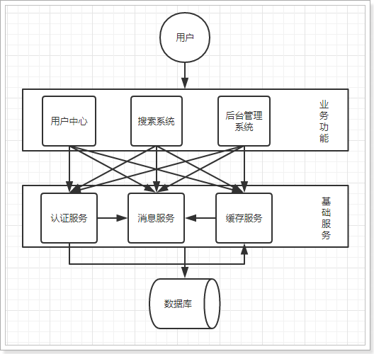

优点：

- 将基础服务进行了抽取，系统间相互调用，提高了代码复用和开发效率

缺点：

- 系统间耦合度变高，调用关系错综复杂，难以维护


## 1.4.流动计算架构（SOA）

SOA ：面向服务的架构

当服务越来越多，容量的评估，小服务资源的浪费等问题逐渐显现，此时需增加一个调度中心基于访问压力实时管理集群容量，提高集群利用率。此时，用于提高机器利用率的资源调度和治理中心(SOA)是关键

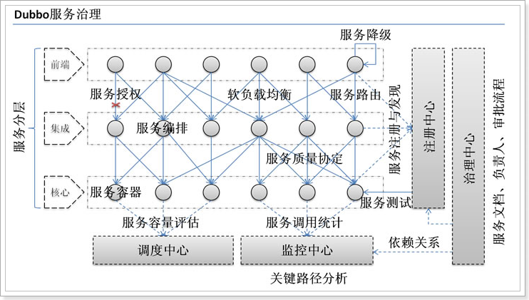

以前出现了什么问题？

- 服务越来越多，需要管理每个服务的地址
- 调用关系错综复杂，难以理清依赖关系
- 服务过多，服务状态难以管理，无法根据服务情况动态管理

服务治理要做什么？

- 服务注册中心，实现服务自动注册和发现，无需人为记录服务地址
- 服务自动订阅，服务列表自动推送，服务调用透明化，无需关心依赖关系
-  动态监控服务状态监控报告，人为控制服务状态

缺点：

- 服务间会有依赖关系，一旦某个环节出错会影响较大
- 服务关系复杂，运维、测试部署困难，不符合DevOps思想

## 1.5.微服务

前面说的SOA，英文翻译过来是面向服务。微服务，似乎也是服务，都是对系统进行拆分。因此两者非常容易混淆，但其实缺有一些差别：

微服务的特点：

- 单一职责：微服务中每一个服务都对应唯一的业务能力，做到单一职责
- 微：微服务的服务拆分粒度很小，例如一个用户管理就可以作为一个服务。每个服务虽小，但“五脏俱全”。
- 面向服务：面向服务是说每个服务都要对外暴露Rest风格服务接口API。并不关心服务的技术实现，做到与平台和语言无关，也不限定用什么技术实现，只要提供Rest的接口即可。
- 自治：自治是说服务间互相独立，互不干扰
  - 团队独立：每个服务都是一个独立的开发团队，人数不能过多。
  - 技术独立：因为是面向服务，提供Rest接口，使用什么技术没有别人干涉
  - 前后端分离：采用前后端分离开发，提供统一Rest接口，后端不用再为PC、移动段开发不同接口
  - 数据库分离：每个服务都使用自己的数据源
  - 部署独立，服务间虽然有调用，但要做到服务重启不影响其它服务。有利于持续集成和持续交付。每个服务都是独立的组件，可复用，可替换，降低耦合，易维护


微服务结构图：


# 2.服务调用方式

## 2.1.RPC和HTTP

无论是微服务还是SOA，都面临着服务间的远程调用。那么服务间的远程调用方式有哪些呢？

常见的远程调用方式有以下2种：

- RPC：Remote Produce Call远程过程调用，类似的还有RMI。自定义数据格式，基于原生TCP通信，速度快，效率高。早期的webservice，现在热门的dubbo，都是RPC的典型代表

- Http：http其实是一种网络传输协议，基于TCP，规定了数据传输的格式。现在客户端浏览器与服务端通信基本都是采用Http协议，也可以用来进行远程服务调用。缺点是消息封装臃肿，优势是对服务的提供和调用方没有任何技术限定，自由灵活，更符合微服务理念。

  现在热门的Rest风格，就可以通过http协议来实现。


如果你们公司全部采用Java技术栈，那么使用Dubbo作为微服务架构是一个不错的选择。

相反，如果公司的技术栈多样化，而且你更青睐Spring家族，那么SpringCloud搭建微服务是不二之选。在我们的项目中，我们会选择SpringCloud套件，因此我们会使用Http方式来实现服务间调用。


## 2.2.Http客户端工具

既然微服务选择了Http，那么我们就需要考虑自己来实现对请求和响应的处理。不过开源世界已经有很多的http客户端工具，能够帮助我们做这些事情，例如：

- HttpClient
- OKHttp
- URLConnection

接下来，不过这些不同的客户端，API各不相同，


## 2.3.Spring的RestTemplate

Spring提供了一个RestTemplate模板工具类，对基于Http的客户端进行了封装，并且实现了对象与json的序列化和反序列化，非常方便。RestTemplate并没有限定Http的客户端类型，而是进行了抽象，目前常用的3种都有支持：

- HttpClient
- OkHttp
- JDK原生的URLConnection（默认的）


我们导入课前资料提供的demo工程：

 


首先在项目中注册一个`RestTemplate`对象，可以在启动类位置注册：

```java
@SpringBootApplication
public class HttpDemoApplication {

	public static void main(String[] args) {
		SpringApplication.run(HttpDemoApplication.class, args);
	}

	@Bean
	public RestTemplate restTemplate() {
   
		return new RestTemplate();
	}
}
```


在测试类中直接`@Autowired`注入：

```java
@RunWith(SpringRunner.class)
@SpringBootTest(classes = HttpDemoApplication.class)
public class HttpDemoApplicationTests {

	@Autowired
	private RestTemplate restTemplate;

	@Test
	public void httpGet() {
		User user = this.restTemplate.getForObject("http://localhost/user/8", User.class);
		System.out.println(user);
	}
}
```

- 通过RestTemplate的getForObject()方法，传递url地址及实体类的字节码，RestTemplate会自动发起请求，接收响应，并且帮我们对响应结果进行反序列化。


学习完了Http客户端工具，接下来就可以正式学习微服务了。

# 4.初始SpringCloud

微服务是一种架构方式，最终肯定需要技术架构去实施。

微服务的实现方式很多，但是最火的莫过于Spring Cloud了。为什么？

- 后台硬：作为Spring家族的一员，有整个Spring全家桶靠山，背景十分强大。
- 技术强：Spring作为Java领域的前辈，可以说是功力深厚。有强力的技术团队支撑，一般人还真比不了
- 群众基础好：可以说大多数程序员的成长都伴随着Spring框架，试问：现在有几家公司开发不用Spring？SpringCloud与Spring的各个框架无缝整合，对大家来说一切都是熟悉的配方，熟悉的味道。
- 使用方便：相信大家都体会到了SpringBoot给我们开发带来的便利，而SpringCloud完全支持SpringBoot的开发，用很少的配置就能完成微服务框架的搭建


## 4.1.简介

SpringCloud是Spring旗下的项目之一，[官网地址：http://projects.spring.io/spring-cloud/](http://projects.spring.io/spring-cloud/)

Spring最擅长的就是集成，把世界上最好的框架拿过来，集成到自己的项目中。

SpringCloud也是一样，它将现在非常流行的一些技术整合到一起，实现了诸如：配置管理，服务发现，智能路由，负载均衡，熔断器，控制总线，集群状态等等功能。其主要涉及的组件包括：

Netflix

- Eureka：注册中心
- Zuul：服务网关
- Ribbon：负载均衡
- Feign：服务调用
- Hystix：熔断器

以上只是其中一部分，架构图：


## 4.2.版本

SpringCloud的版本命名比较特殊，因为它不是一个组件，而是许多组件的集合，它的命名是以A到Z的为首字母的一些单词（其实是伦敦地铁站的名字）组成：

 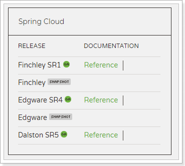

我们在项目中，会是以Finchley的版本。

其中包含的组件，也都有各自的版本，如下表：

| Component                 | Edgware.SR4    | Finchley.SR1  | Finchley.BUILD-SNAPSHOT |
| ------------------------- | -------------- | ------------- | ----------------------- |
| spring-cloud-aws          | 1.2.3.RELEASE  | 2.0.0.RELEASE | 2.0.1.BUILD-SNAPSHOT    |
| spring-cloud-bus          | 1.3.3.RELEASE  | 2.0.0.RELEASE | 2.0.1.BUILD-SNAPSHOT    |
| spring-cloud-cli          | 1.4.1.RELEASE  | 2.0.0.RELEASE | 2.0.1.BUILD-SNAPSHOT    |
| spring-cloud-commons      | 1.3.4.RELEASE  | 2.0.1.RELEASE | 2.0.2.BUILD-SNAPSHOT    |
| spring-cloud-contract     | 1.2.5.RELEASE  | 2.0.1.RELEASE | 2.0.2.BUILD-SNAPSHOT    |
| spring-cloud-config       | 1.4.4.RELEASE  | 2.0.1.RELEASE | 2.0.2.BUILD-SNAPSHOT    |
| spring-cloud-netflix      | 1.4.5.RELEASE  | 2.0.1.RELEASE | 2.0.2.BUILD-SNAPSHOT    |
| spring-cloud-security     | 1.2.3.RELEASE  | 2.0.0.RELEASE | 2.0.1.BUILD-SNAPSHOT    |
| spring-cloud-cloudfoundry | 1.1.2.RELEASE  | 2.0.0.RELEASE | 2.0.1.BUILD-SNAPSHOT    |
| spring-cloud-consul       | 1.3.4.RELEASE  | 2.0.1.RELEASE | 2.0.2.BUILD-SNAPSHOT    |
| spring-cloud-sleuth       | 1.3.4.RELEASE  | 2.0.1.RELEASE | 2.0.2.BUILD-SNAPSHOT    |
| spring-cloud-stream       | Ditmars.SR4    | Elmhurst.SR1  | Elmhurst.BUILD-SNAPSHOT |
| spring-cloud-zookeeper    | 1.2.2.RELEASE  | 2.0.0.RELEASE | 2.0.1.BUILD-SNAPSHOT    |
| spring-boot               | 1.5.14.RELEASE | 2.0.4.RELEASE | 2.0.4.BUILD-SNAPSHOT    |
| spring-cloud-task         | 1.2.3.RELEASE  | 2.0.0.RELEASE | 2.0.1.BUILD-SNAPSHOT    |
| spring-cloud-vault        | 1.1.1.RELEASE  | 2.0.1.RELEASE | 2.0.2.BUILD-SNAPSHOT    |
| spring-cloud-gateway      | 1.0.2.RELEASE  | 2.0.1.RELEASE | 2.0.2.BUILD-SNAPSHOT    |
| spring-cloud-openfeign    |                | 2.0.1.RELEASE | 2.0.2.BUILD-SNAPSHOT    |
| spring-cloud-function     | 1.0.0.RELEASE  | 1.0.0.RELEASE | 1.0.1.BUILD-SNAPSHOT    |

接下来，我们就一一学习SpringCloud中的重要组件。

# 5.微服务场景模拟

首先，我们需要模拟一个服务调用的场景。方便后面学习微服务架构

## 5.1.创建父工程

微服务中需要同时创建多个项目，为了方便课堂演示，我们先创建一个父工程，然后后续的工程都以这个工程为父，实现maven的聚合。这样可以在一个窗口看到所有工程，方便我们讲解。**在实际开发中，应该是每个微服务独立一个工程。**


编写项目信息：

 

编写保存位置：


然后将Pom修改成这样：

```xml
<?xml version="1.0" encoding="UTF-8"?>
<project xmlns="http://maven.apache.org/POM/4.0.0"
         xmlns:xsi="http://www.w3.org/2001/XMLSchema-instance"
         xsi:schemaLocation="http://maven.apache.org/POM/4.0.0 http://maven.apache.org/xsd/maven-4.0.0.xsd">
    <modelVersion>4.0.0</modelVersion>

    <groupId>cn.itcast.demo</groupId>
    <artifactId>cloud-demo</artifactId>
    <version>1.0-SNAPSHOT</version>

    <parent>
        <groupId>org.springframework.boot</groupId>
        <artifactId>spring-boot-starter-parent</artifactId>
        <version>2.0.4.RELEASE</version>
        <relativePath/>
    </parent>

    <properties>
        <project.build.sourceEncoding>UTF-8</project.build.sourceEncoding>
        <project.reporting.outputEncoding>UTF-8</project.reporting.outputEncoding>
        <java.version>1.8</java.version>
        <spring-cloud.version>Finchley.SR1</spring-cloud.version>
        <mapper.starter.version>2.0.3</mapper.starter.version>
        <mysql.version>5.1.32</mysql.version>
        <pageHelper.starter.version>1.2.5</pageHelper.starter.version>
    </properties>

    <dependencyManagement>
        <dependencies>
            <!-- springCloud -->
            <dependency>
                <groupId>org.springframework.cloud</groupId>
                <artifactId>spring-cloud-dependencies</artifactId>
                <version>${spring-cloud.version}</version>
                <type>pom</type>
                <scope>import</scope>
            </dependency>
            <!-- 通用Mapper启动器 -->
            <dependency>
                <groupId>tk.mybatis</groupId>
                <artifactId>mapper-spring-boot-starter</artifactId>
                <version>${mapper.starter.version}</version>
            </dependency>
            <!-- 分页助手启动器 -->
            <dependency>
                <groupId>com.github.pagehelper</groupId>
                <artifactId>pagehelper-spring-boot-starter</artifactId>
                <version>${pageHelper.starter.version}</version>
            </dependency>
            <!-- mysql驱动 -->
            <dependency>
                <groupId>mysql</groupId>
                <artifactId>mysql-connector-java</artifactId>
                <version>${mysql.version}</version>
            </dependency>
        </dependencies>
    </dependencyManagement>
    <dependencies>
        <dependency>
            <groupId>org.projectlombok</groupId>
            <artifactId>lombok</artifactId>
        </dependency>
    </dependencies>

    <build>
        <plugins>
            <plugin>
                <groupId>org.springframework.boot</groupId>
                <artifactId>spring-boot-maven-plugin</artifactId>
            </plugin>
        </plugins>
    </build>
</project>
```

这里已经对大部分要用到的依赖的版本进行了 管理，方便后续使用


## 5.2.服务提供者

我们新建一个项目，对外提供查询用户的服务。

### 5.2.1.创建module

选中父工程：cloud-demo

 

填写module信息：


注意，子模块要在父工程的下级目录：

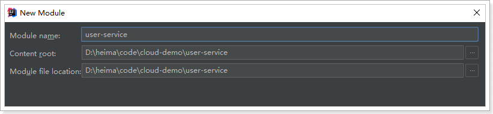

### 5.2.2.依赖

```xml
<?xml version="1.0" encoding="UTF-8"?>
<project xmlns="http://maven.apache.org/POM/4.0.0"
         xmlns:xsi="http://www.w3.org/2001/XMLSchema-instance"
         xsi:schemaLocation="http://maven.apache.org/POM/4.0.0 http://maven.apache.org/xsd/maven-4.0.0.xsd">
    <parent>
        <artifactId>cloud-demo</artifactId>
        <groupId>cn.itcast.demo</groupId>
        <version>1.0-SNAPSHOT</version>
    </parent>
    <modelVersion>4.0.0</modelVersion>

    <artifactId>user-service</artifactId>
    <version>1.0-SNAPSHOT</version>

    <dependencies>
        <dependency>
            <groupId>org.springframework.boot</groupId>
            <artifactId>spring-boot-starter-web</artifactId>
        </dependency>
        <dependency>
            <groupId>mysql</groupId>
            <artifactId>mysql-connector-java</artifactId>
        </dependency>
        <dependency>
            <groupId>tk.mybatis</groupId>
            <artifactId>mapper-spring-boot-starter</artifactId>
        </dependency>
    </dependencies>
</project>
```


项目结构：

 


### 5.1.2.编写代码

属性文件,这里我们采用了yaml语法，而不是properties：

```yaml
server:
  port: 8081
spring:
  datasource:
    url: jdbc:mysql://localhost:3306/mydb01
    username: root
    password: 123
mybatis:
  type-aliases-package: cn.itcast.user.pojo
```

启动类：

```java
@SpringBootApplication
@MapperScan("cn.itcast.user.mapper")
public class UserApplication {
    public static void main(String[] args) {
        SpringApplication.run(UserApplication.class, args);
    }
}
```

实体类：

```java
@Table(name = "tb_user")
@Data
public class User {

    @Id
    @KeySql(useGeneratedKeys = true)
    private Long id;

    private String userName; // 用户名

    private String password; // 密码

    private String name;// 姓名

    private Integer age;// 年龄

    private Integer sex;// 性别，1男性，2女性

    private Date birthday;// 出生日期

    private Date created;// 创建时间

    private Date updated;// 更新时间

    private String note;// 备注
}

```

mapper:

```java
public interface UserMapper extends Mapper<User>{
}
```

Service：

```java
@Service
public class UserService {

    @Autowired
    private UserMapper userMapper;

    public User queryById(Long id) {
        return userMapper.selectByPrimaryKey(id);
    }
}
```


添加一个对外查询的接口：

```java
@RestController
@RequestMapping("user")
public class UserController {

    @Autowired
    private UserService userService;

    @GetMapping("/{id}")
    public User queryById(@PathVariable("id") Long id) {
        return userService.queryById(id);
    }
}
```


项目结构：

 

### 5.1.3.启动并测试：

启动项目，访问接口：http://localhost:8081/user/7

 


## 5.2.服务调用者

### 5.2.1.创建工程

与上面类似，这里不再赘述，需要注意的是，我们调用user-service的功能，因此不需要mybatis相关依赖了。


pom：

```xml
<?xml version="1.0" encoding="UTF-8"?>
<project xmlns="http://maven.apache.org/POM/4.0.0"
         xmlns:xsi="http://www.w3.org/2001/XMLSchema-instance"
         xsi:schemaLocation="http://maven.apache.org/POM/4.0.0 http://maven.apache.org/xsd/maven-4.0.0.xsd">
    <parent>
        <artifactId>cloud-demo</artifactId>
        <groupId>cn.itcast.demo</groupId>
        <version>1.0-SNAPSHOT</version>
    </parent>
    <modelVersion>4.0.0</modelVersion>

    <artifactId>consumer-demo</artifactId>
    <version>1.0-SNAPSHOT</version>

    <dependencies>
        <dependency>
            <groupId>org.springframework.boot</groupId>
            <artifactId>spring-boot-starter-web</artifactId>
        </dependency>
    </dependencies>
</project>
```


结构：

 


### 5.2.2.编写代码

首先在启动类中注册`RestTemplate`：

```java
@SpringBootApplication
public class ConsumerApplication {

    @Bean
    public RestTemplate restTemplate() {
        return new RestTemplate();
    }

    public static void main(String[] args) {
        SpringApplication.run(ConsumerApplication.class, args);
    }
}
```

实体类：

```java
@Data
public class User {

    private Long id;

    private String userName; // 用户名

    private String password; // 密码

    private String name;// 姓名

    private Integer age;// 年龄

    private Integer sex;// 性别，1男性，2女性

    private Date birthday;// 出生日期

    private Date created;// 创建时间

    private Date updated;// 更新时间

    private String note;// 备注

}
```


编写controller，在controller中直接调用RestTemplate，远程访问user-service的服务接口：

```java
@RestController
@RequestMapping("consumer")
public class ConsumerController {

    @Autowired
    private RestTemplate restTemplate;

    @GetMapping("{id}")
    public User queryById(@PathVariable("id") Long id){
        String url = "http://localhost:8081/user/" + id;
        User user = restTemplate.getForObject(url, User.class);
        return user;
    }
}
```

项目结构：

 

### 5.2.3.启动测试：

因为我们没有配置端口，那么默认就是8080，我们访问：http://localhost:8080/consumer/8

 

一个简单的远程服务调用案例就实现了。

## 5.3.有没有问题？

简单回顾一下，刚才我们写了什么：

user-service：对外提供了查询用户的接口

consumer：通过RestTemplate访问`http://locahost:8081/user/{id}`接口，查询用户数据

存在什么问题？

- 在consumer中，我们把url地址硬编码到了代码中，不方便后期维护
- consumer需要记忆user-service的地址，如果出现变更，可能得不到通知，地址将失效
- consumer不清楚user-service的状态，服务宕机也不知道
- user-service只有1台服务，不具备高可用性
- 即便user-service形成集群，consumer还需自己实现负载均衡

其实上面说的问题，概括一下就是分布式服务必然要面临的问题：

- 服务管理
  - 如何自动注册和发现
  - 如何实现状态监管
  - 如何实现动态路由
- 服务如何实现负载均衡
- 服务如何解决容灾问题
- 服务如何实现统一配置

以上的问题，我们都将在SpringCloud中得到答案。


# 6.Eureka注册中心

## 6.1.认识Eureka

首先我们来解决第一问题，服务的管理。

> 问题分析

在刚才的案例中，user-service对外提供服务，需要对外暴露自己的地址。而consumer（调用者）需要记录服务提供者的地址。将来地址出现变更，还需要及时更新。这在服务较少的时候并不觉得有什么，但是在现在日益复杂的互联网环境，一个项目肯定会拆分出十几，甚至数十个微服务。此时如果还人为管理地址，不仅开发困难，将来测试、发布上线都会非常麻烦，这与DevOps的思想是背道而驰的。

> 网约车

这就好比是 网约车出现以前，人们出门叫车只能叫出租车。一些私家车想做出租却没有资格，被称为黑车。而很多人想要约车，但是无奈出租车太少，不方便。私家车很多却不敢拦，而且满大街的车，谁知道哪个才是愿意载人的。一个想要，一个愿意给，就是缺少引子，缺乏管理啊。

此时滴滴这样的网约车平台出现了，所有想载客的私家车全部到滴滴注册，记录你的车型（服务类型），身份信息（联系方式）。这样提供服务的私家车，在滴滴那里都能找到，一目了然。

此时要叫车的人，只需要打开APP，输入你的目的地，选择车型（服务类型），滴滴自动安排一个符合需求的车到你面前，为你服务，完美！

> Eureka做什么？

Eureka就好比是滴滴，负责管理、记录服务提供者的信息。服务调用者无需自己寻找服务，而是把自己的需求告诉Eureka，然后Eureka会把符合你需求的服务告诉你。

同时，服务提供方与Eureka之间通过`“心跳”`机制进行监控，当某个服务提供方出现问题，Eureka自然会把它从服务列表中剔除。

这就实现了服务的自动注册、发现、状态监控。

## 6.2.原理图

> 基本架构：

 


- Eureka：就是服务注册中心（可以是一个集群），对外暴露自己的地址
- 提供者：启动后向Eureka注册自己信息（地址，提供什么服务）
- 消费者：向Eureka订阅服务，Eureka会将对应服务的所有提供者地址列表发送给消费者，并且定期更新
- 心跳(续约)：提供者定期通过http方式向Eureka刷新自己的状态


## 6.3.入门案例

### 6.3.1.编写EurekaServer

接下来我们创建一个项目，启动一个EurekaServer：

 

 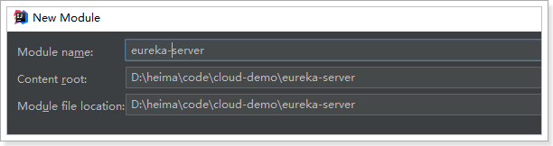

依赖：

```xml
<?xml version="1.0" encoding="UTF-8"?>
<project xmlns="http://maven.apache.org/POM/4.0.0"
         xmlns:xsi="http://www.w3.org/2001/XMLSchema-instance"
         xsi:schemaLocation="http://maven.apache.org/POM/4.0.0 http://maven.apache.org/xsd/maven-4.0.0.xsd">
    <parent>
        <artifactId>cloud-demo</artifactId>
        <groupId>cn.itcast.demo</groupId>
        <version>1.0-SNAPSHOT</version>
    </parent>
    <modelVersion>4.0.0</modelVersion>

    <groupId>cn.itcast.demo</groupId>
    <artifactId>eureka-server</artifactId>
    <version>1.0-SNAPSHOT</version>

    <dependencies>
        <dependency>
            <groupId>org.springframework.cloud</groupId>
            <artifactId>spring-cloud-starter-netflix-eureka-server</artifactId>
        </dependency>
    </dependencies>
</project>
```


编写启动类：

```java
@SpringBootApplication
@EnableEurekaServer // 声明这个应用是一个EurekaServer
public class EurekaServer {

	public static void main(String[] args) {
		SpringApplication.run(EurekaServer.class, args);
	}
}
```

编写配置：

```yaml
server:
  port: 10086
spring:
  application:
    name: eureka-server # 应用名称，会在Eureka中作为服务的id标识（serviceId）
eureka:
  client:
    service-url: # EurekaServer的地址，现在是自己的地址，如果是集群，需要写其它Server的地址。
      defaultZone: http://127.0.0.1:10086/eureka

```

启动服务，并访问：http://127.0.0.1:10086/eureka


### 6.3.2.服务注册

注册服务，就是在服务上添加Eureka的客户端依赖，客户端代码会自动把服务注册到EurekaServer中。


> 我们在user-service-demo中添加Eureka客户端依赖：

```xml
<!-- Eureka客户端 -->
<dependency>
    <groupId>org.springframework.cloud</groupId>
    <artifactId>spring-cloud-starter-netflix-eureka-client</artifactId>
</dependency>
```


> 在启动类上开启Eureka客户端功能

通过添加`@EnableDiscoveryClient`来开启Eureka客户端功能

```java
@SpringBootApplication
@MapperScan("cn.itcast.user.mapper")
@EnableDiscoveryClient // 开启Eureka客户端发现功能
public class UserServiceDemoApplication {
	public static void main(String[] args) {
		SpringApplication.run(UserServiceDemoApplication.class, args);
	}
}
```


> 编写配置

```yaml
server:
  port: 8081
spring:
  datasource:
    url: jdbc:mysql://localhost:3306/mydb01
    username: root
    password: 123
  application:
    name: user-service # 应用名称
mybatis:
  type-aliases-package: com.leyou.userservice.pojo
eureka:
  client:
    service-url: # EurekaServer地址
      defaultZone: http://127.0.0.1:10086/eureka
```

注意：

- 这里我们添加了spring.application.name属性来指定应用名称，将来会作为服务的id使用。


> 重启项目，访问[Eureka监控页面](http://127.0.0.1:10086/eureka)查看


我们发现user-service服务已经注册成功了


### 6.3.3.服务发现

接下来我们修改consumer-demo，尝试从EurekaServer获取服务。

方法与消费者类似，只需要在项目中添加EurekaClient依赖，就可以通过服务名称来获取信息了！

1）添加依赖：

```xml
<!-- Eureka客户端 -->
<dependency>
    <groupId>org.springframework.cloud</groupId>
    <artifactId>spring-cloud-starter-netflix-eureka-client</artifactId>
</dependency>
```


2）在启动类开启Eureka客户端

```java
@SpringBootApplication
@EnableDiscoveryClient // 开启Eureka客户端
public class ConsumerApplication {
    @Bean
    public RestTemplate restTemplate() {
        return new RestTemplate();
    }
    public static void main(String[] args) {
        SpringApplication.run(ConsumerApplication.class, args);
    }
}

```

3）修改配置：

```yaml
server:
  port: 8080
spring:
  application:
    name: consumer # 应用名称
eureka:
  client:
    service-url: # EurekaServer地址
      defaultZone: http://127.0.0.1:10086/eureka
```

4）修改代码，用DiscoveryClient类的方法，根据服务名称，获取服务实例：

```java
@RestController
@RequestMapping("consumer")
public class ConsumerController {

    @Autowired
    private RestTemplate restTemplate;

    @Autowired
    private DiscoveryClient discoveryClient;

    @GetMapping("{id}")
    public User queryById(@PathVariable("id") Long id){
        // 根据服务id(spring.application.name)，获取服务实例列表
        List<ServiceInstance> instances = discoveryClient.getInstances("user-service");
        // 取出一个服务实例
        ServiceInstance instance = instances.get(0);
        // 从实例中获取host和port，组成url
        String url = String.format("http://%s:%s/user/%s", instance.getHost(), instance.getPort(), id);
        // 查询
        User user = restTemplate.getForObject(url, User.class);
        return user;
    }
}

```


5）Debug跟踪运行：

生成的URL：

 

这里的ip是本机的局域网ip。

访问结果：

 


## 6.4.Eureka详解

接下来我们详细讲解Eureka的原理及配置。

### 6.4.1.基础架构

Eureka架构中的三个核心角色：

- 服务注册中心

  Eureka的服务端应用，提供服务注册和发现功能，就是刚刚我们建立的eureka-server

- 服务提供者

  提供服务的应用，可以是SpringBoot应用，也可以是其它任意技术实现，只要对外提供的是Rest风格服务即可。本例中就是我们实现的user-service

- 服务消费者

  消费应用从注册中心获取服务列表，从而得知每个服务方的信息，知道去哪里调用服务方。本例中就是我们实现的consumer

### 6.4.2.高可用的Eureka Server

Eureka Server即服务的注册中心，在刚才的案例中，我们只有一个EurekaServer，事实上EurekaServer也可以是一个集群，形成高可用的Eureka中心。

> 服务同步

多个Eureka Server之间也会互相注册为服务，当服务提供者注册到Eureka Server集群中的某个节点时，该节点会把服务的信息同步给集群中的每个节点，从而实现**数据同步**。因此，无论客户端访问到Eureka Server集群中的任意一个节点，都可以获取到完整的服务列表信息。

而作为客户端，需要把信息注册到每个Eureka中：

 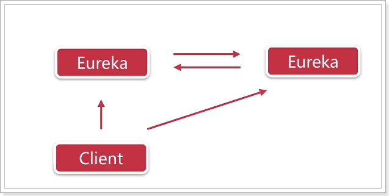

如果有三个Eureka，则每一个EurekaServer都需要注册到其它几个Eureka服务中，例如：有三个分别为10086、10087、10088，则：

- 10086要注册到10087和10088上
- 10087要注册到10086和10088上
- 10088要注册到10086和10087上

> 动手搭建高可用的EurekaServer

我们假设要搭建两条EurekaServer的集群，端口分别为：10086和10087

1）我们修改原来的EurekaServer配置：

```yaml
server:
  port: 10086 # 端口
spring:
  application:
    name: eureka-server # 应用名称，会在Eureka中显示
eureka:
  client:
    service-url: # 配置其他Eureka服务的地址，而不是自己，比如10087
      defaultZone: http://127.0.0.1:10087/eureka

```

所谓的高可用注册中心，其实就是把EurekaServer自己也作为一个服务，注册到其它EurekaServer上，这样多个EurekaServer之间就能互相发现对方，从而形成集群。因此我们做了以下修改：

- 把service-url的值改成了另外一台EurekaServer的地址，而不是自己

2）另外一台配置恰好相反：

```yaml
server:
  port: 10087 # 端口
spring:
  application:
    name: eureka-server # 应用名称，会在Eureka中显示
eureka:
  client:
    service-url: 
      defaultZone: http://127.0.0.1:10086/eureka

```

注意：idea中一个应用不能启动两次，我们需要重新配置一个启动器：

 

 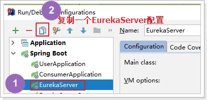

 

然后启动即可。

3）启动测试：


4）客户端注册服务到集群

因为EurekaServer不止一个，因此注册服务的时候，service-url参数需要变化：

```yaml
eureka:
  client:
    service-url: # EurekaServer地址,多个地址以','隔开
      defaultZone: http://127.0.0.1:10086/eureka,http://127.0.0.1:10087/eureka
```


### 6.4.3.Eureka客户端

服务提供者要向EurekaServer注册服务，并且完成服务续约等工作。

> 服务注册

服务提供者在启动时，会检测配置属性中的：`eureka.client.register-with-erueka=true`参数是否正确，事实上默认就是true。如果值确实为true，则会向EurekaServer发起一个Rest请求，并携带自己的元数据信息，Eureka Server会把这些信息保存到一个双层Map结构中。

- 第一层Map的Key就是服务id，一般是配置中的`spring.application.name`属性
- 第二层Map的key是服务的实例id。一般host+ serviceId + port，例如：`locahost:user-service:8081`
- 值则是服务的实例对象，也就是说一个服务，可以同时启动多个不同实例，形成集群。

> 服务续约

在注册服务完成以后，服务提供者会维持一个心跳（定时向EurekaServer发起Rest请求），告诉EurekaServer：“我还活着”。这个我们称为服务的续约（renew）；

有两个重要参数可以修改服务续约的行为：

```yaml
eureka:
  instance:
    lease-expiration-duration-in-seconds: 90
    lease-renewal-interval-in-seconds: 30
```

- lease-renewal-interval-in-seconds：服务续约(renew)的间隔，默认为30秒
- lease-expiration-duration-in-seconds：服务失效时间，默认值90秒

也就是说，默认情况下每个30秒服务会向注册中心发送一次心跳，证明自己还活着。如果超过90秒没有发送心跳，EurekaServer就会认为该服务宕机，会从服务列表中移除，这两个值在生产环境不要修改，默认即可。


> 获取服务列表

当服务消费者启动是，会检测`eureka.client.fetch-registry=true`参数的值，如果为true，则会从Eureka Server服务的列表只读备份，然后缓存在本地。并且`每隔30秒`会重新获取并更新数据。我们可以通过下面的参数来修改：

```yaml
eureka:
  client:
    registry-fetch-interval-seconds: 30
```


### 6.4.5.失效剔除和自我保护

> 服务下线

当服务进行正常关闭操作时，它会触发一个服务下线的REST请求给Eureka Server，告诉服务注册中心：“我要下线了”。服务中心接受到请求之后，将该服务置为下线状态。

> 失效剔除

有时我们的服务可能由于内存溢出或网络故障等原因使得服务不能正常的工作，而服务注册中心并未收到“服务下线”的请求。相对于服务提供者的“服务续约”操作，服务注册中心在启动时会创建一个定时任务，默认每隔一段时间（默认为60秒）将当前清单中超时（默认为90秒）没有续约的服务剔除，这个操作被称为失效剔除。

可以通过`eureka.server.eviction-interval-timer-in-ms`参数对其进行修改，单位是毫秒。


> 自我保护

我们关停一个服务，就会在Eureka面板看到一条警告：


这是触发了Eureka的自我保护机制。当服务未按时进行心跳续约时，Eureka会统计服务实例最近15分钟心跳续约的比例是否低于了85%。在生产环境下，因为网络延迟等原因，心跳失败实例的比例很有可能超标，但是此时就把服务剔除列表并不妥当，因为服务可能没有宕机。Eureka在这段时间内不会剔除任何服务实例，直到网络恢复正常。生产环境下这很有效，保证了大多数服务依然可用，不过也有可能获取到失败的服务实例，因此服务调用者必须做好服务的失败容错。

我们可以通过下面的配置来关停自我保护：

```yaml
eureka:
  server:
    enable-self-preservation: false # 关闭自我保护模式（缺省为打开）
```


# 7.负载均衡Ribbon

在刚才的案例中，我们启动了一个user-service，然后通过DiscoveryClient来获取服务实例信息，然后获取ip和端口来访问。

但是实际环境中，我们往往会开启很多个user-service的集群。此时我们获取的服务列表中就会有多个，到底该访问哪一个呢？

一般这种情况下我们就需要编写负载均衡算法，在多个实例列表中进行选择。

不过Eureka中已经帮我们集成了负载均衡组件：Ribbon，简单修改代码即可使用。

什么是Ribbon：


接下来，我们就来使用Ribbon实现负载均衡。


## 7.1.启动两个服务实例

首先我们启动两个user-service实例，一个8081，一个8082。

 

Eureka监控面板：


## 7.2.开启负载均衡

因为Eureka中已经集成了Ribbon，所以我们无需引入新的依赖。直接修改代码：

在RestTemplate的配置方法上添加`@LoadBalanced`注解：

```java
@Bean
@LoadBalanced
public RestTemplate restTemplate() {
    return new RestTemplate();
}
```


修改调用方式，不再手动获取ip和端口，而是直接通过服务名称调用：

```java
@GetMapping("{id}")
public User queryById(@PathVariable("id") Long id){
    String url = "http://user-service/user/" + id;
    User user = restTemplate.getForObject(url, User.class);
    return user;
}
```

访问页面，查看结果：

 

完美！

## 7.3.源码跟踪

为什么我们只输入了service名称就可以访问了呢？之前还要获取ip和端口。

显然有人帮我们根据service名称，获取到了服务实例的ip和端口。它就是`LoadBalancerInterceptor`，这个类会在对RestTemplate的请求进行拦截，然后从Eureka根据服务id获取服务列表，随后利用负载均衡算法得到真实的服务地址信息，替换服务id。

我们进行源码跟踪：


继续跟入execute方法：发现获取了8082端口的服务


再跟下一次，发现获取的是8081：

 

果然实现了负载均衡。


## 7.4.负载均衡策略

Ribbon默认的负载均衡策略是简单的轮询，我们可以测试一下：

编写测试类，在刚才的源码中我们看到拦截中是使用RibbonLoadBalanceClient来进行负载均衡的，其中有一个choose方法，是这样介绍的：

 

现在这个就是负载均衡获取实例的方法。

我们对注入这个类的对象，然后对其测试：

```java
@RunWith(SpringRunner.class)
@SpringBootTest(classes = UserConsumerDemoApplication.class)
public class LoadBalanceTest {

    @Autowired
    RibbonLoadBalancerClient client;

    @Test
    public void test(){
        for (int i = 0; i < 100; i++) {
            ServiceInstance instance = this.client.choose("user-service");
            System.out.println(instance.getHost() + ":" + instance.getPort());
        }
    }
}
```

结果：

 

符合了我们的预期推测，确实是轮询方式。


我们是否可以修改负载均衡的策略呢？

我们注入的RibbonLoadBalancerClient的choose方法如下：


它会调用getServer方法：


getServer中，会先获取一个IloadBalancer对象，然后调用其chooseServer方法。IloadBalancer是一个接口，这里通过端点得知，这里是其中一个实现：BaseLoadBalancer。

继续跟踪源码，发现这么一段代码：

 

我们看看这个rule是谁：

 

这里的rule默认值是一个`RoundRobinRule`，看类的介绍：

 

这不就是轮询的意思嘛。

我们注意到，这个类其实是实现了接口IRule的，查看一下：

 

定义负载均衡的规则接口。

它有以下实现：

 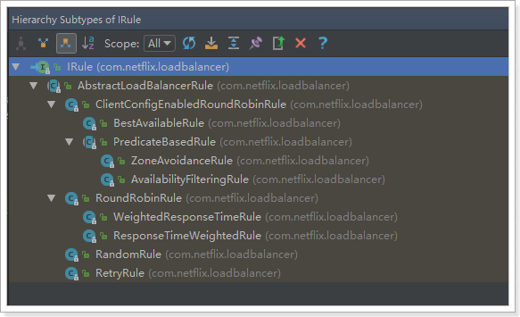

SpringBoot也帮我们提供了修改负载均衡规则的配置入口：

```yaml
user-service:
  ribbon:
    NFLoadBalancerRuleClassName: com.netflix.loadbalancer.RandomRule
```

格式是：`{服务名称}.ribbon.NFLoadBalancerRuleClassName`，值就是IRule的实现类。


再次测试，发现结果变成了随机：

 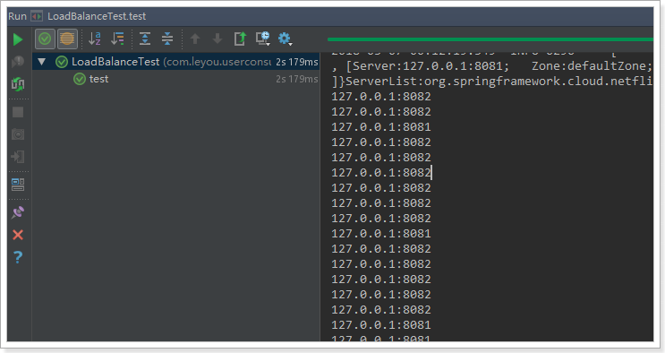


# 8.Hystrix

## 8.1.简介

Hystix,英文意思是豪猪，全身是刺，看起来就不好惹，是一种保护机制。

Hystrix也是Netflix公司的一款组件。

主页：https://github.com/Netflix/Hystrix/


那么Hystix的作用是什么呢？具体要保护什么呢？

Hystix是Netflix开源的一个延迟和容错库，用于隔离访问远程服务、第三方库，防止出现级联失败。

## 8.2.雪崩问题

微服务中，服务间调用关系错综复杂，一个请求，可能需要调用多个微服务接口才能实现，会形成非常复杂的调用链路：

 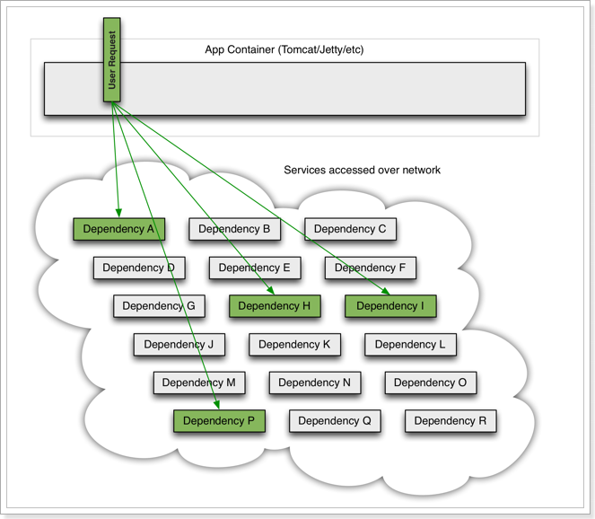

如图，一次业务请求，需要调用A、P、H、I四个服务，这四个服务又可能调用其它服务。

如果此时，某个服务出现异常：

 

例如微服务I发生异常，请求阻塞，用户不会得到响应，则tomcat的这个线程不会释放，于是越来越多的用户请求到来，越来越多的线程会阻塞：

 

服务器支持的线程和并发数有限，请求一直阻塞，会导致服务器资源耗尽，从而导致所有其它服务都不可用，形成雪崩效应。

这就好比，一个汽车生产线，生产不同的汽车，需要使用不同的零件，如果某个零件因为种种原因无法使用，那么就会造成整台车无法装配，陷入等待零件的状态，直到零件到位，才能继续组装。  此时如果有很多个车型都需要这个零件，那么整个工厂都将陷入等待的状态，导致所有生产都陷入瘫痪。一个零件的波及范围不断扩大。 


Hystix解决雪崩问题的手段有两个：

- 线程隔离
- 服务熔断

## 8.3.线程隔离，服务降级

### 8.3.1.原理

线程隔离示意图：

 

解读：

Hystrix为每个依赖服务调用分配一个小的线程池，如果线程池已满调用将被立即拒绝，默认不采用排队.加速失败判定时间。

用户的请求将不再直接访问服务，而是通过线程池中的空闲线程来访问服务，如果**线程池已满**，或者**请求超时**，则会进行降级处理，什么是服务降级？

> 服务降级：优先保证核心服务，而非核心服务不可用或弱可用。

用户的请求故障时，不会被阻塞，更不会无休止的等待或者看到系统崩溃，至少可以看到一个执行结果（例如返回友好的提示信息） 。

服务降级虽然会导致请求失败，但是不会导致阻塞，而且最多会影响这个依赖服务对应的线程池中的资源，对其它服务没有响应。

触发Hystix服务降级的情况：

- 线程池已满
- 请求超时

### 8.3.2.动手实践

#### 引入依赖：

```xml
<dependency>
    <groupId>org.springframework.cloud</groupId>
    <artifactId>spring-cloud-starter-netflix-hystrix</artifactId>
</dependency>
```

#### 开启熔断：

在启动类上添加注解：@EnableCircuitBreaker

```java
@SpringBootApplication
@EnableDiscoveryClient
@EnableCircuitBreaker
public class ConsumerApplication {
	// ...
}
```

可以看到，我们类上的注解越来越多，在微服务中，经常会引入上面的三个注解，于是Spring就提供了一个组合注解：@SpringCloudApplication

  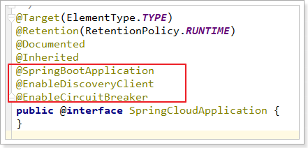

因此，我们可以使用这个组合注解来代替之前的3个注解。

```java
@SpringCloudApplication
public class ConsumerApplication {
    // ...
}
```


#### 编写降级逻辑

当目标服务的调用出现故障，我们希望快速失败，给用户一个友好提示。因此需要提前编写好失败时的降级处理逻辑，要使用HystixCommond来完成：

```java
@GetMapping("{id}")
@HystrixCommand(fallbackMethod = "queryByIdFallBack")
public String queryById(@PathVariable("id") Long id){
    String url = "http://user-service/user/" + id;
    String user = restTemplate.getForObject(url, String.class);
    return user;
}

public String queryByIdFallBack(Long id){
    log.error("查询用户信息失败，id：{}", id);
    return "对不起，网络太拥挤了！";
}
```

要注意，因为熔断的降级逻辑方法必须跟正常逻辑方法保证：**相同的参数列表和返回值声明**。失败逻辑中返回User对象没有太大意义，一般会返回友好提示。所以我们把queryById的方法改造为返回String，反正也是Json数据。这样失败逻辑中返回一个错误说明，会比较方便。

说明：

- @HystrixCommand(fallbackMethod = "queryByIdFallBack")：用来声明一个降级逻辑的方法

测试：

当user-service正常提供服务时，访问与以前一致。但是当我们将user-service停机时，会发现页面返回了降级处理信息：


#### 默认的Fallback

我们刚才把fallback写在了某个业务方法上，如果这样的方法很多，那岂不是要写很多。所以我们可以把Fallback配置加在类上，实现默认fallback：

```java
@RestController
@RequestMapping("consumer")
@DefaultProperties(defaultFallback = "defaultFallBack")
public class ConsumerController {

    @Autowired
    private RestTemplate restTemplate;

    @GetMapping("{id}")
    @HystrixCommand
    public String queryById(@PathVariable("id") Long id){
        String url = "http://user-service/user/" + id;
        String user = restTemplate.getForObject(url, String.class);
        return user;
    }

    public String defaultFallBack(){
        return "默认提示：对不起，网络太拥挤了！";
    }
}
```

- @DefaultProperties(defaultFallback = "defaultFallBack")：在类上指明统一的失败降级方法


#### 超时设置：

在之前的案例中，请求在超过1秒后都会返回错误信息，这是因为Hystix的默认超时时长为1，我们可以通过配置修改这个值：

```yaml
hystrix:
  command:
    default:
      execution:
        isolation:
          thread:
            timeoutInMilliseconds: 2000
```

这个配置会作用于全局所有方法。

为了触发超时，我们可以在user-service中休眠2秒：

```java
@Service
public class UserService {

    @Autowired
    private UserMapper userMapper;

    public User queryById(Long id) {
        try {
            Thread.sleep(2000);
        } catch (InterruptedException e) {
            e.printStackTrace();
        }
        return userMapper.selectByPrimaryKey(id);
    }
}
```

测试：


可以发现，请求的时长已经到了2.01s，证明配置生效了。

如果把修改时间修改到2秒以下，又可以正常访问了。


## 8.4.服务熔断：

### 8.4.1.熔断原理

熔断器，也叫断路器，其英文单词为：Circuit Breaker 


Hystix的熔断状态机模型：

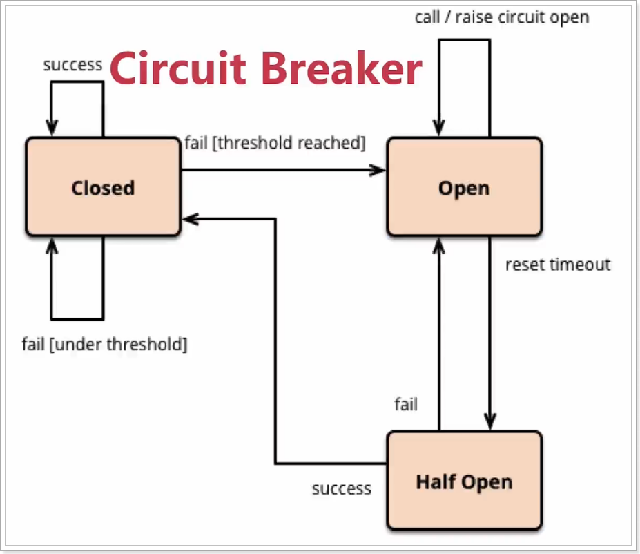

状态机有3个状态：

- Closed：关闭状态（断路器关闭），所有请求都正常访问。
- Open：打开状态（断路器打开），所有请求都会被降级。Hystix会对请求情况计数，当一定时间内失败请求百分比达到阈值，则触发熔断，断路器会完全关闭。默认失败比例的阈值是50%，请求次数最少不低于20次。
- Half Open：半开状态，Closed状态不是永久的，关闭后会进入休眠时间（默认是5S）。随后断路器会自动进入半开状态。此时会释放部分请求通过，若这些请求都是健康的，则会完全打开断路器，否则继续保持关闭，再次进行休眠计时

### 8.4.2.动手实践

为了能够精确控制请求的成功或失败，我们在consumer的调用业务中加入一段逻辑：

```java
@GetMapping("{id}")
@HystrixCommand
public String queryById(@PathVariable("id") Long id){
    if(id == 1){
        throw new RuntimeException("太忙了");
    }
    String url = "http://user-service/user/" + id;
    String user = restTemplate.getForObject(url, String.class);
    return user;
}
```

这样如果参数是id为1，一定失败，其它情况都成功。（不要忘了清空user-service中的休眠逻辑）

我们准备两个请求窗口：

- 一个请求：http://localhost:8080/consumer/1，注定失败
- 一个请求：http://localhost:8080/consumer/2，肯定成功

当我们疯狂访问id为1的请求时（超过20次），就会触发熔断。断路器会端口，一切请求都会被降级处理。

此时你访问id为2的请求，会发现返回的也是失败，而且失败时间很短，只有20毫秒左右：

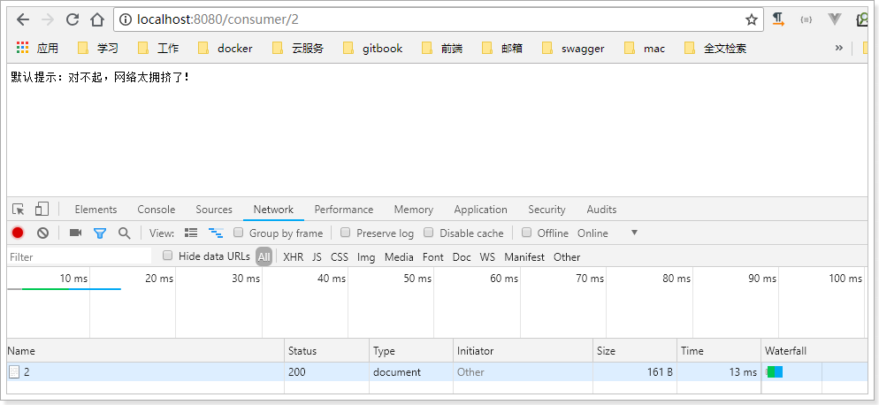


不过，默认的熔断触发要求较高，休眠时间窗较短，为了测试方便，我们可以通过配置修改熔断策略：

```properties
circuitBreaker.requestVolumeThreshold=10
circuitBreaker.sleepWindowInMilliseconds=10000
circuitBreaker.errorThresholdPercentage=50
```

解读：

- requestVolumeThreshold：触发熔断的最小请求次数，默认20
- errorThresholdPercentage：触发熔断的失败请求最小占比，默认50%
- sleepWindowInMilliseconds：休眠时长，默认是5000毫秒