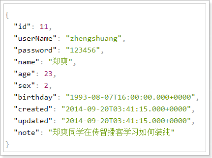
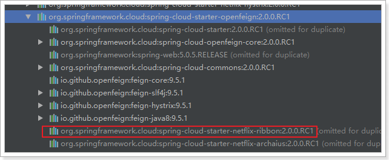
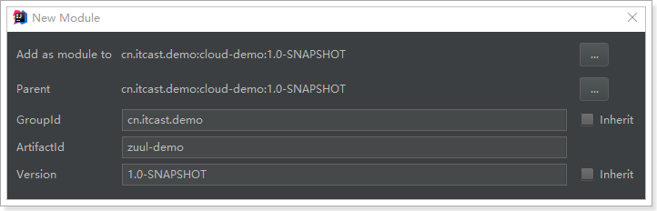
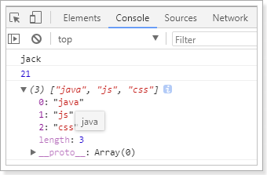
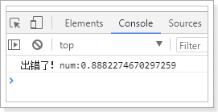

# 0.学习目标

- 会使用Feign进行远程调用
- 能独立搭建Zuul网关
- 能编写Zuul的拦截器


# 1.Feign

在前面的学习中，我们使用了Ribbon的负载均衡功能，大大简化了远程调用时的代码：

```java
String baseUrl = "http://user-service/user/";
User user = this.restTemplate.getForObject(baseUrl + id, User.class)
```

如果就学到这里，你可能以后需要编写类似的大量重复代码，格式基本相同，无非参数不一样。有没有更优雅的方式，来对这些代码再次优化呢？

这就是我们接下来要学的Feign的功能了。

## 1.1.简介

有道词典的英文解释：

​	

为什么叫伪装？

Feign可以把Rest的请求进行隐藏，伪装成类似SpringMVC的Controller一样。你不用再自己拼接url，拼接参数等等操作，一切都交给Feign去做。


项目主页：https://github.com/OpenFeign/feign


## 1.2.快速入门

### 1.2.1.导入依赖

```xml
<dependency>
    <groupId>org.springframework.cloud</groupId>
    <artifactId>spring-cloud-starter-openfeign</artifactId>
</dependency>
```

### 1.2.2.Feign的客户端

```java
@FeignClient("user-service")
public interface UserClient {

    @GetMapping("/user/{id}")
    User queryById(@PathVariable("id") Long id);
}
```

- 首先这是一个接口，Feign会通过动态代理，帮我们生成实现类。这点跟mybatis的mapper很像
- `@FeignClient`，声明这是一个Feign客户端，同时通过`value`属性指定服务名称
- 接口中的定义方法，完全采用SpringMVC的注解，Feign会根据注解帮我们生成URL，并访问获取结果

改造原来的调用逻辑，使用UserClient访问：

```java
@RestController
@RequestMapping("consumer")
@Slf4j
public class ConsumerController {

    @Autowired
    private UserClient userClient;

    @GetMapping("{id}")
    public User queryById(@PathVariable("id") Long id){
        return userClient.queryById(id);
    }
}
```

### 1.2.3.开启Feign功能

我们在启动类上，添加注解，开启Feign功能

```java
@SpringCloudApplication
@EnableFeignClients // 开启Feign功能
public class ConsumerDemoApplication {
    public static void main(String[] args) {
        SpringApplication.run(UserConsumerDemoApplication.class, args);
    }
}
```

- 你会发现RestTemplate的注册被我删除了。Feign中已经自动集成了Ribbon负载均衡，因此我们不需要自己定义RestTemplate了

### 1.2.4.启动测试：

访问接口：

 

正常获取到了结果。

## 1.3.负载均衡

Feign中本身已经集成了Ribbon依赖和自动配置：

​	

因此我们不需要额外引入依赖，也不需要再注册`RestTemplate`对象。


## 1.4.Hystix支持

Feign默认也有对Hystix的集成：

​	

只不过，默认情况下是关闭的。我们需要通过下面的参数来开启：

```yaml
feign:
  hystrix:
    enabled: true # 开启Feign的熔断功能
```

但是，Feign中的Fallback配置不像Ribbon中那样简单了。

1）首先，我们要定义一个类，实现刚才编写的UserFeignClient，作为fallback的处理类

```java
@Component
public class UserClientFallback implements UserClient {
    @Override
    public User queryById(Long id) {
        User user = new User();
        user.setId(id);
        user.setName("用户查询出现异常！");
        return user;
    }
}
```

2）然后在UserFeignClient中，指定刚才编写的实现类

```java
@FeignClient(value = "user-service", fallback = UserFeignClientFallback.class)
public interface UserClient {

    @GetMapping("/user/{id}")
    User queryById(@PathVariable("id") Long id);
}

```

3）重启测试：

我们关闭user-service服务，然后在页面访问：

 

## 1.5.请求压缩(了解)

Spring Cloud Feign 支持对请求和响应进行GZIP压缩，以减少通信过程中的性能损耗。通过下面的参数即可开启请求与响应的压缩功能：

```yaml
feign:
  compression:
    request:
      enabled: true # 开启请求压缩
    response:
      enabled: true # 开启响应压缩
```

同时，我们也可以对请求的数据类型，以及触发压缩的大小下限进行设置：

```yaml
feign:
  compression:
    request:
      enabled: true # 开启请求压缩
      mime-types: text/html,application/xml,application/json # 设置压缩的数据类型
      min-request-size: 2048 # 设置触发压缩的大小下限
```

注：上面的数据类型、压缩大小下限均为默认值。


## 1.6.日志级别(了解)

前面讲过，通过`logging.level.xx=debug`来设置日志级别。然而这个对Fegin客户端而言不会产生效果。因为`@FeignClient`注解修改的客户端在被代理时，都会创建一个新的Fegin.Logger实例。我们需要额外指定这个日志的级别才可以。

1）设置cn.itcast包下的日志级别都为debug

```yaml
logging:
  level:
    cn.itcast: debug
```

2）编写配置类，定义日志级别

```java
@Configuration
public class FeignConfig {
    @Bean
    Logger.Level feignLoggerLevel(){
        return Logger.Level.FULL;
    }
}
```

这里指定的Level级别是FULL，Feign支持4种级别：

​	

- NONE：不记录任何日志信息，这是默认值。
- BASIC：仅记录请求的方法，URL以及响应状态码和执行时间
- HEADERS：在BASIC的基础上，额外记录了请求和响应的头信息
- FULL：记录所有请求和响应的明细，包括头信息、请求体、元数据。


3）在FeignClient中指定配置类：

```java
@FeignClient(value = "user-service", fallback = UserClientFallback.class, configuration = FeignConfig.class)
public interface UserClient {
    @GetMapping("/user/{id}")
    User queryById(@PathVariable("id") Long id);
}
```

4）重启项目，即可看到每次访问的日志：


# 2.Zuul网关

## 2.1.简介

官网：https://github.com/Netflix/zuul

​	

Zuul：维基百科：

电影《捉鬼敢死队》中的怪兽，Zuul，在纽约引发了巨大骚乱。

事实上，在微服务架构中，Zuul就是守门的大Boss！一夫当关，万夫莫开！


网关的核心功能是：过滤和路由


## 2.2.Zuul加入后的架构


- 不管是来自于客户端（PC或移动端）的请求，还是服务内部调用。一切对服务的请求都会经过Zuul这个网关，然后再由网关来实现 鉴权、动态路由等等操作。Zuul就是我们服务的统一入口。

## 2.3.快速入门

### 2.3.1.新建工程

填写基本信息：



添加Zuul依赖：

```xml
<?xml version="1.0" encoding="UTF-8"?>
<project xmlns="http://maven.apache.org/POM/4.0.0"
         xmlns:xsi="http://www.w2.org/2001/XMLSchema-instance"
         xsi:schemaLocation="http://maven.apache.org/POM/4.0.0 http://maven.apache.org/xsd/maven-4.0.0.xsd">
    <parent>
        <artifactId>cloud-demo</artifactId>
        <groupId>cn.itcast.demo</groupId>
        <version>1.0-SNAPSHOT</version>
    </parent>
    <modelVersion>4.0.0</modelVersion>

    <groupId>cn.itcast.demo</groupId>
    <artifactId>zuul-demo</artifactId>
    <version>1.0-SNAPSHOT</version>

    <dependencies>
        <dependency>
            <groupId>org.springframework.cloud</groupId>
            <artifactId>spring-cloud-starter-netflix-zuul</artifactId>
        </dependency>
    </dependencies>
</project>
```


### 2.3.2.编写启动类

通过`@EnableZuulProxy `注解开启Zuul的功能：

```java
@SpringBootApplication
@EnableZuulProxy // 开启Zuul的网关功能
public class ZuulApplication {

	public static void main(String[] args) {
		SpringApplication.run(ZuulApplication.class, args);
	}
}
```

### 2.3.2.编写配置

```yaml
server:
  port: 10010 #服务端口
spring: 
  application:  
    name: api-gateway #指定服务名
```

### 2.3.4.编写路由规则

我们需要用Zuul来代理user-service服务，先看一下控制面板中的服务状态：


- ip为：127.0.0.1
- 端口为：8081

映射规则：

```yaml
zuul:
  routes:
    user-service: # 这里是路由id，随意写
      path: /user-service/** # 这里是映射路径
      url: http://127.0.0.1:8081 # 映射路径对应的实际url地址
```

我们将符合`path` 规则的一切请求，都代理到 `url`参数指定的地址

本例中，我们将 `/user-service/**`开头的请求，代理到http://127.0.0.1:8081

### 2.3.5.启动测试：

访问的路径中需要加上配置规则的映射路径，我们访问：http://127.0.0.1:8081/user-service/user/10

​	


## 2.4.面向服务的路由

在刚才的路由规则中，我们把路径对应的服务地址写死了！如果同一服务有多个实例的话，这样做显然就不合理了。

我们应该根据服务的名称，去Eureka注册中心查找 服务对应的所有实例列表，然后进行动态路由才对！


### 2.4.1.添加Eureka客户端依赖

```xml
<dependency>
    <groupId>org.springframework.cloud</groupId>
    <artifactId>spring-cloud-starter-netflix-eureka-client</artifactId>
</dependency>
```


### 2.4.2.开启Eureka客户端发现功能

```java
@SpringBootApplication
@EnableZuulProxy // 开启Zuul的网关功能
@EnableDiscoveryClient
public class ZuulApplication {

	public static void main(String[] args) {
		SpringApplication.run(ZuulApplication.class, args);
	}
}
```

### 2.4.3.添加Eureka配置，获取服务信息

```yaml
eureka:
  client:
    service-url:
      defaultZone: http://127.0.0.1:10086/eureka
  instance:
    prefer-ip-address: true
    ip-address: 127.0.0.1
```

### 2.4.4.修改映射配置，通过服务名称获取

因为已经有了Eureka客户端，我们可以从Eureka获取服务的地址信息，因此映射时无需指定IP地址，而是通过服务名称来访问，而且Zuul已经集成了Ribbon的负载均衡功能。

```yaml
zuul:
  routes:
    user-service: # 这里是路由id，随意写
      path: /user-service/** # 这里是映射路径
      serviceId: user-service # 指定服务名称
```


### 2.4.5.启动测试

再次启动，这次Zuul进行代理时，会利用Ribbon进行负载均衡访问：

​	

日志中可以看到使用了负载均衡器：


## 2.5.简化的路由配置

在刚才的配置中，我们的规则是这样的：

- `zuul.routes.<route>.path=/xxx/**`： 来指定映射路径。`<route>`是自定义的路由名
- `zuul.routes.<route>.serviceId=/user-service`：来指定服务名。

而大多数情况下，我们的`<route>`路由名称往往和 服务名会写成一样的。因此Zuul就提供了一种简化的配置语法：`zuul.routes.<serviceId>=<path>`

比方说上面我们关于user-service的配置可以简化为一条：

```yaml
zuul:
  routes:
    user-service: /user-service/** # 这里是映射路径
```

省去了对服务名称的配置。

## 2.6.默认的路由规则

在使用Zuul的过程中，上面讲述的规则已经大大的简化了配置项。但是当服务较多时，配置也是比较繁琐的。因此Zuul就指定了默认的路由规则：

- 默认情况下，一切服务的映射路径就是服务名本身。
  - 例如服务名为：`user-service`，则默认的映射路径就是：`/user-service/**`

也就是说，刚才的映射规则我们完全不配置也是OK的，不信就试试看。

如果想要禁用某个路由规则，可以这样：

```yaml
zuul:
  ignored-services:
    - user-service
    - consumer
```


## 2.7.路由前缀

配置示例：

```yaml
zuul:
  prefix: /api # 添加路由前缀
  routes:
    user-service: /user-service/** # 这里是映射路径
```

我们通过`zuul.prefix=/api`来指定了路由的前缀，这样在发起请求时，路径就要以/api开头。

路径`/api/user-service/user/1`将会被代理到`/user-service/user/1`


## 2.8.过滤器

Zuul作为网关的其中一个重要功能，就是实现请求的鉴权。而这个动作我们往往是通过Zuul提供的过滤器来实现的。

### 2.8.1.ZuulFilter

ZuulFilter是过滤器的顶级父类。在这里我们看一下其中定义的4个最重要的方法：

```java
public abstract ZuulFilter implements IZuulFilter{

    abstract public String filterType();

    abstract public int filterOrder();
    
    boolean shouldFilter();// 来自IZuulFilter

    Object run() throws ZuulException;// IZuulFilter
}
```

- `shouldFilter`：返回一个`Boolean`值，判断该过滤器是否需要执行。返回true执行，返回false不执行。
- `run`：过滤器的具体业务逻辑。
- `filterType`：返回字符串，代表过滤器的类型。包含以下4种：
  - `pre`：请求在被路由之前执行
  - `routing`：在路由请求时调用
  - `post`：在routing和errror过滤器之后调用
  - `error`：处理请求时发生错误调用
- `filterOrder`：通过返回的int值来定义过滤器的执行顺序，数字越小优先级越高。


### 2.8.2.过滤器执行生命周期：

这张是Zuul官网提供的请求生命周期图，清晰的表现了一次请求在各个过滤器的执行顺序。


- 正常流程：
  - 请求到达首先会经过pre类型过滤器，而后到达routing类型，进行路由，请求就到达真正的服务提供者，执行请求，返回结果后，会到达post过滤器。而后返回响应。
- 异常流程：
  - 整个过程中，pre或者routing过滤器出现异常，都会直接进入error过滤器，再error处理完毕后，会将请求交给POST过滤器，最后返回给用户。
  - 如果是error过滤器自己出现异常，最终也会进入POST过滤器，而后返回。
  - 如果是POST过滤器出现异常，会跳转到error过滤器，但是与pre和routing不同的时，请求不会再到达POST过滤器了。

所有内置过滤器列表：

​	

### 2.8.3.使用场景

场景非常多：

- 请求鉴权：一般放在pre类型，如果发现没有访问权限，直接就拦截了
- 异常处理：一般会在error类型和post类型过滤器中结合来处理。
- 服务调用时长统计：pre和post结合使用。

## 2.9.自定义过滤器

接下来我们来自定义一个过滤器，模拟一个登录的校验。基本逻辑：如果请求中有access-token参数，则认为请求有效，放行。


### 2.9.1.定义过滤器类

```java
@Component
public class LoginFilter extends ZuulFilter {
    @Override
    public String filterType() {
        return FilterConstants.PRE_TYPE;
    }

    @Override
    public int filterOrder() {
        return FilterConstants.PRE_DECORATION_FILTER_ORDER - 1;
    }

    @Override
    public boolean shouldFilter() {
        return true;
    }

    @Override
    public Object run() throws ZuulException {
        // 获取请求上下文
        RequestContext ctx = RequestContext.getCurrentContext();
        // 获取request对象
        HttpServletRequest request = ctx.getRequest();
        // 获取请求参数
        String token = request.getParameter("access-token");
        // 判断是否存在
        if(StringUtils.isBlank(token)){
            // 不存在，未登录，拦截
            ctx.setSendZuulResponse(false);
            // 设置返回状态码
            ctx.setResponseStatusCode(HttpStatus.UNAUTHORIZED.value());
        }
        return null;
    }
}

```


### 2.9.2.测试

没有token参数时，访问失败：

​	

添加token参数后：

​	

## 2.10.负载均衡和熔断

Zuul中默认就已经集成了Ribbon负载均衡和Hystix熔断机制。但是所有的超时策略都是走的默认值，比如熔断超时时间只有1S，很容易就触发了。因此建议我们手动进行配置：

```yaml
hystrix:
  command:
    default:
      execution:
        isolation:
          thread:
            timeoutInMilliseconds: 6000
```


## 2.11.Zuul的高可用

启动多个Zuul服务，自动注册到Eureka，形成集群。如果是服务内部访问，你访问Zuul，自动负载均衡，没问题。

但是，Zuul更多是外部访问，PC端、移动端等。他们无法通过Eureka进行负载均衡，那么该怎么办？

此时，我们会使用其它的服务网关，来对Zuul进行代理。比如：Nginx


Eureka、Ribbon、Hystix、Feign、Zuul

spring-cloud-config：统一配置中心，自动去Git拉取最新的配置，缓存。使用Git的Webhook钩子，去通知配置中心，说配置发生了变化，配置中心会通过消息总线去通知所有的微服务，更新配置。

spring-cloud-bus：消息总线

Spring-cloud-stream：消息通信

spring-cloud-hystrix-dashboard：容错统计，形成图形化界面

spring-cloud-sleuth：链路追踪 结合Zipkin


# 3.ES6 语法指南

后端项目搭建完毕，接下来就是前端页面了。不过在这之前需要一些准备工作。我们需要学习ES6的语法标准。

什么是ES6？就是ECMAScript第6版标准。

## 3.1.什么是ECMAScript？

来看下前端的发展历程：

> web1.0时代：

- 最初的网页以HTML为主，是纯静态的网页。网页是只读的，信息流只能从服务的到客户端单向流通。**开发人员也只关心页面的样式和内容**即可。

> web2.0时代：

- 1995年，网景工程师Brendan Eich 花了10天时间设计了JavaScript语言。
- 1996年，微软发布了JScript，其实是JavaScript的逆向工程实现。
- 1997年，为了统一各种不同script脚本语言，ECMA（欧洲计算机制造商协会）以JavaScript为基础，制定了`ECMAscript`标准规范。JavaScript和JScript都是`ECMAScript`的标准实现者，随后各大浏览器厂商纷纷实现了`ECMAScript`标准。

所以，ECMAScript是浏览器脚本语言的规范，而各种我们熟知的js语言，如JavaScript则是规范的具体实现。

## 3.2.ECMAScript的快速发展

而后，ECMAScript就进入了快速发展期。

- 1998年6月，ECMAScript 2.0 发布。

- 1999年12月，ECMAScript 3.0 发布。这时，ECMAScript 规范本身也相对比较完善和稳定了，但是接下来的事情，就比较悲剧了。

- 2007年10月。。。。ECMAScript 4.0 草案发布。

  这次的新规范，历时颇久，规范的新内容也有了很多争议。在制定ES4的时候，是分成了两个工作组同时工作的。

  - 一边是以 Adobe, Mozilla, Opera 和 Google为主的 ECMAScript 4 工作组。
  - 一边是以 Microsoft 和 Yahoo 为主的 ECMAScript 3.1 工作组。

  ECMAScript 4 的很多主张比较激进，改动较大。而 ECMAScript 3.1 则主张小幅更新。最终经过 TC39 的会议，决定将一部分不那么激进的改动保留发布为 ECMAScript 3.1，而ES4的内容，则延续到了后来的ECMAScript5和6版本中

- 2009年12月，ECMAScript 5 发布。

- 2011年6月，ECMAScript 5.1 发布。

- 2015年6月，ECMAScript 6，也就是 ECMAScript 2015 发布了。 并且从 ECMAScript 6 开始，开始采用年号来做版本。即 ECMAScript 2015，就是ECMAScript6。 


## 3.3.ES5和6的一些新特性

我们这里只把一些常用的进行学习，更详细的大家参考：[阮一峰的ES6教程](http://es6.ruanyifeng.com/?search=reduce&x=0&y=0#README)

### 3.3.1.let 和 const 命令

> var

之前，js定义变量只有一个关键字：`var`

`var`有一个问题，就是定义的变量有时会莫名奇妙的成为全局变量。

例如这样的一段代码：

```js
for(var i = 0; i < 5; i++){
    console.log(i);
}
console.log("循环外：" + i)
```

你猜下打印的结果是什么？

 


> let

`let`所声明的变量，只在`let`命令所在的代码块内有效。

我们把刚才的`var`改成`let`试试：

```js
for(let i = 0; i < 5; i++){
    console.log(i);
}
console.log("循环外：" + i)
```

结果：

 

> const

`const`声明的变量是常量，不能被修改

 


### 3.3.2.解构表达式

> 数组解构

比如有一个数组：

```js
let arr = [1,2,3]
```

我想获取其中的值，只能通过角标。ES6可以这样：

```js
const [x,y,z] = arr;// x，y，z将与arr中的每个位置对应来取值
// 然后打印
console.log(x,y,z);
```

结果：

 


> 对象解构

例如有个person对象：

```js
const person = {
    name:"jack",
    age:21,
    language: ['java','js','css']
}
```

我们可以这么做：

```js
// 解构表达式获取值
const {name,age,language} = person;
// 打印
console.log(name);
console.log(age);
console.log(language);
```

结果：

 


如过想要用其它变量接收，需要额外指定别名：

 

- `{name:n}`：name是person中的属性名，冒号后面的n是解构后要赋值给的变量。


> 解构表达式拷贝对象属性：

比如我们有一个person对象：

```js
const person = {
    name:"jack",
    age:21,
    language: ['java','js','css']
}
```

我想获取它的`name`和`age`属性，封装到新的对象，该怎么办？

 

我们在解构表达式中，通过`language`接收到语言，剩下的所有属性用 `... obj`方式，可以一起接收，这样`obj`就是一个新的对象，包含了`person`中，除了`language`外的所有其它属性

数组也可以采用类似操作。

### 3.3.4.函数优化

> 箭头函数

ES6中定义函数的简写方式：

一个参数时：

```js
var print = function (obj) {
    console.log(obj);
}
// 简写为：
var print2 = obj => console.log(obj);
```

多个参数：

```js
// 两个参数的情况：
var sum = function (a , b) {
    return a + b;
}
// 简写为：
var sum2 = (a,b) => a+b;
```

代码不止一行，可以用`{}`括起来

```js
var sum3 = (a,b) => {
    return a + b;
}
```


> 对象的函数属性简写

比如一个Person对象，里面有eat方法：

```js
let person = {
    name: "jack",
    // 以前：
    eat: function (food) {
        console.log(this.name + "在吃" + food);
    },
    // 箭头函数版：
    eat2: food => console.log(person.name + "在吃" + food),// 这里拿不到this
    // 简写版：
    eat3(food){
        console.log(this.name + "在吃" + food);
    }
}
```


> 箭头函数结合解构表达式

比如有一个函数：

```js
const person = {
    name:"jack",
    age:21,
    language: ['java','js','css']
}

function hello(person) {
    console.log("hello," + person.name)
}
```

如果用箭头函数和解构表达式

```js
var hi = ({name}) =>  console.log("hello," + name);
```

### 3.3.5.map和reduce

数组中新增了map和reduce方法。

> map

`map()`：接收一个函数，将原数组中的所有元素用这个函数处理后放入新数组返回。

举例：有一个字符串数组，我们希望转为int数组

```js
let arr = ['1','20','-5','3'];
console.log(arr)

arr = arr.map(s => parseInt(s));

console.log(arr)
```

  


> reduce

`reduce()`：接收一个函数（必须）和一个初始值（可选），该函数接收两个参数：

- 第一个参数是上一次reduce处理的结果
- 第二个参数是数组中要处理的下一个元素

`reduce()`会从左到右依次把数组中的元素用reduce处理，并把处理的结果作为下次reduce的第一个参数。如果是第一次，会把前两个元素作为计算参数，或者把用户指定的初始值作为起始参数

举例：

```
const arr = [1,20,-5,3]
```

没有初始值：

 

指定初始值：

 

### 3.3.6.promise

所谓Promise，简单说就是一个容器，里面保存着某个未来才会结束的事件（通常是一个异步操作）的结果。从语法上说，Promise 是一个对象，从它可以获取异步操作的消息。Promise 提供统一的 API，各种异步操作都可以用同样的方法进行处理。

感觉跟java的Future类很像啊，有木有！

我们可以通过Promise的构造函数来创建Promise对象，并在内部封装一个异步执行的结果。

语法：

```js
const promise = new Promise(function(resolve, reject) {
  // ... 执行异步操作

  if (/* 异步操作成功 */){
    resolve(value);// 调用resolve，代表Promise将返回成功的结果
  } else {
    reject(error);// 调用reject，代表Promise会返回失败结果
  }
});
```

这样，在promise中就封装了一段异步执行的结果。


如果我们想要等待异步执行完成，做一些事情，我们可以通过promise的then方法来实现,语法：

```js
promise.then(function(value){
    // 异步执行成功后的回调
});
```

如果想要处理promise异步执行失败的事件，还可以跟上catch：

```js
promise.then(function(value){
    // 异步执行成功后的回调
}).catch(function(error){
    // 异步执行失败后的回调
})
```

示例：

```
const p = new Promise(function (resolve, reject) {
    // 这里我们用定时任务模拟异步
    setTimeout(() => {
        const num = Math.random();
        // 随机返回成功或失败
        if (num < 0.5) {
            resolve("成功！num:" + num)
        } else {
            reject("出错了！num:" + num)
        }
    }, 300)
})

// 调用promise
p.then(function (msg) {
    console.log(msg);
}).catch(function (msg) {
    console.log(msg);
})
```

结果：

 

 


### 3.3.7.对象扩展

ES6给Object拓展了许多新的方法，如：

- keys(obj)：获取对象的所有key形成的数组
- values(obj)：获取对象的所有value形成的数组
- entries(obj)：获取对象的所有key和value形成的二维数组。格式：`[[k1,v1],[k2,v2],...]`
- assian(dest, ...src) ：将多个src对象的值 拷贝到 dest中（浅拷贝）。

 


### 3.3.8.数组扩展

ES6给数组新增了许多方法：

- find(callback)：把数组中的元素逐个传递给函数callback执行，如果返回true，则返回该元素
- findIndex(callback)：与find类似，不过返回的是品牌到的元素的索引
- includes（element）：判断指定元素是否存在

 