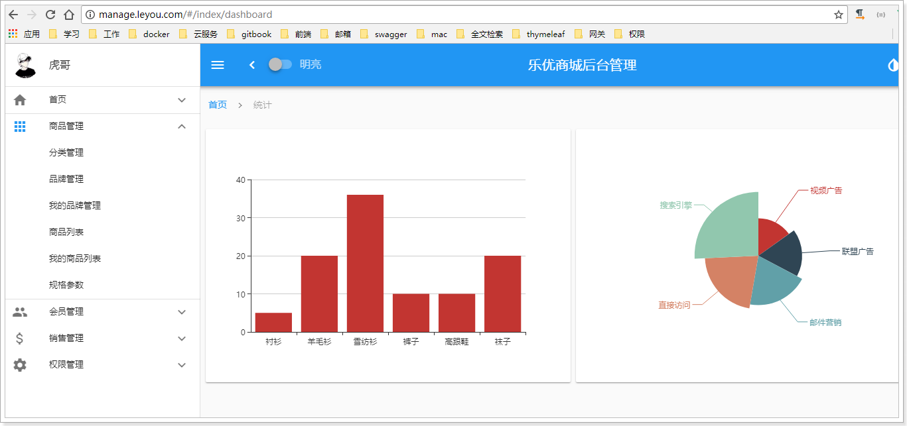
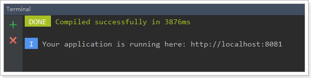
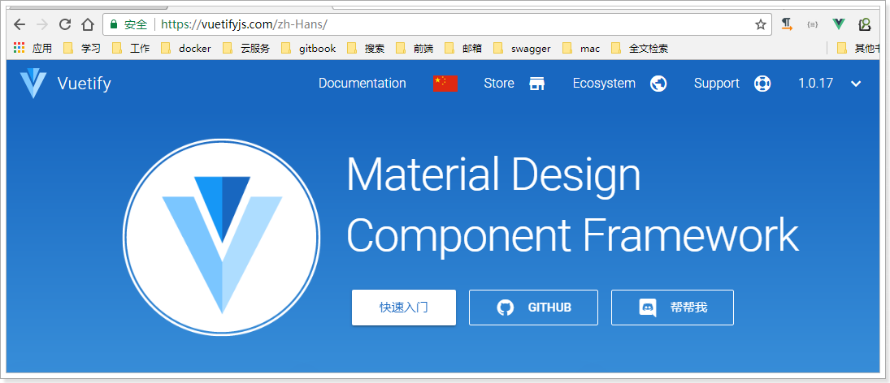
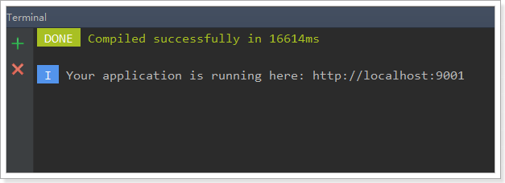
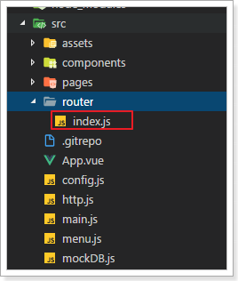
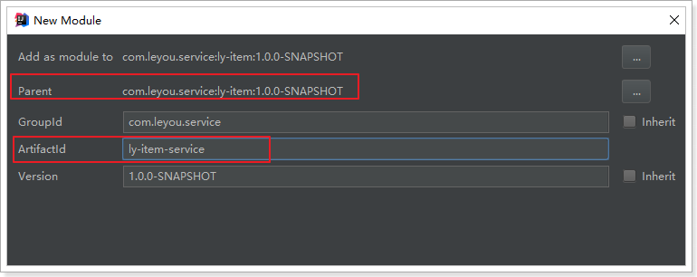
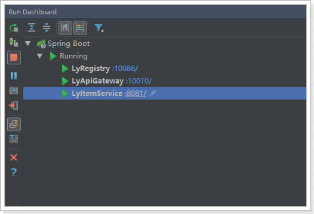

# 0.学习目标

- 了解vue-router使用
- 了解webpack使用
- 会使用vue-cli搭建项目
- 独立搭建后台管理系统
- 了解系统基本结构


# 1.了解电商行业

学习电商项目，自然要先了解这个行业，所以我们首先来聊聊电商行业

## 1.1.项目分类

主要从需求方、盈利模式、技术侧重点这三个方面来看它们的不同

### 1.1.1.传统项目

各种企业里面用的管理系统（ERP、HR、OA、CRM、物流管理系统。。。。。。。）

- 需求方：公司、企业内部
- 盈利模式：项目本身卖钱
- 技术侧重点：业务功能

 

### 1.1.2.互联网项目

门户网站、电商网站：baidu.com、qq.com、taobao.com、jd.com  ...... 

- 需求方：广大用户群体
- 盈利模式：虚拟币、增值服务、广告收益......
- 技术侧重点：网站性能、业务功能


而我们今天要聊的就是互联网项目中的重要角色：电商

## 1.2.电商行业的特点

### 1.2.1.谈谈双十一

双十一是电商行业的一个典型代表，从里面我们能看出电商的普遍特点：


2016双11开场30分钟，创造**每秒交易峰值17.5万笔**，**每秒**支付峰值**12万笔**的新纪录。菜鸟单日物流订单量超过**4.67亿**，创历史新高。

### 1.2.2.技术特点

从上面的数据我们不仅要看到钱，更要看到背后的技术实力。正是得益于电商行业的高强度并发压力，促使了BAT等巨头们的技术进步。电商行业有些什么特点呢？

- 技术范围广
- 技术新
- 要求双高：
  - 高并发（分布式、静态化技术、CDN服务、缓存技术、异步并发、池化、队列）
  - 高可用（集群、负载均衡、限流、降级、熔断）
- 数据量大
- 业务复杂


## 1.3.常见电商模式

电商行业的一些常见模式：

- B2C：商家对个人，如：亚马逊、当当等
- C2C平台：个人对个人，如：闲鱼、拍拍网、ebay
- B2B平台：商家对商家，如：阿里巴巴、八方资源网等
- O2O：线上和线下结合，如：饿了么、电影票、团购等
- P2P：在线金融，贷款，如：网贷之家、人人聚财等。
- B2C平台：天猫、京东、一号店等


# 2.乐优商城介绍

## 2.1.项目介绍

- 乐优商城是一个全品类的电商购物网站（B2C）。
- 用户可以在线购买商品、加入购物车、下单、秒杀商品
- 可以*品论已购买商品*
- 管理员可以在后台管理商品的上下架、*促销活动*
- 管理员可以*监控商品销售状况*
- 客服可以在后台处理*退款操作*
- 希望未来3到5年可以支持千万用户的使用


## 2.2.系统架构

### 2.2.1.架构图

乐优商城架构缩略图，大图请参考课前资料：


### 2.2.2.系统架构解读

> #### 前端页面

整个乐优商城从用户角度来看，可以分为两部分：后台管理、前台门户。

- 后台管理：

  - 后台系统主要包含以下功能：
    - 商品管理，包括商品分类、品牌、商品规格等信息的管理
    - 销售管理，包括订单统计、订单退款处理、促销活动生成等
    - 用户管理，包括用户控制、冻结、解锁等
    - 权限管理，整个网站的权限控制，采用JWT鉴权方案，对用户及API进行权限控制
    - 统计，各种数据的统计分析展示
    - ...
  - 后台系统会采用前后端分离开发，而且整个后台管理系统会使用Vue.js框架搭建出单页应用（SPA）。
  - 预览图：

  

- 前台门户

  - 前台门户面向的是客户，包含与客户交互的一切功能。例如：
    - 搜索商品
    - 加入购物车
    - 下单
    - 评价商品等等
  - 前台系统我们会使用Nuxt(服务端渲染)结合Vue完成页面开发。出于SEO优化的考虑，我们将不采用单页应用。

  


无论是前台门户、还是后台管理页面，都是前端页面，我们的系统采用前后端分离方式，因此前端会独立部署，不会在后端服务出现静态资源。


> #### 后端微服务

无论是前台还是后台系统，都共享相同的微服务集群，包括：

- 商品微服务：商品及商品分类、品牌、库存等的服务
- 搜索微服务：实现搜索功能
- 订单微服务：实现订单相关
- 购物车微服务：实现购物车相关功能
- 用户服务：用户的登录注册、用户信息管理等功能
- 短信服务：完成各种短信的发送任务
- 支付服务：对接各大支付平台
- 授权服务：完成对用户的授权、鉴权等功能
- Eureka注册中心
- Zuul网关服务
- Spring Cloud Config配置中心
- ...


# 3.商城管理系统前端页面

我们的后台管理系统采用前后端分离开发，而且整个后台管理系统会使用Vue.js框架搭建出单页应用（SPA）。

## 3.1.什么是SPA

SPA，并不是去洗澡按摩，而是Single Page Application，即单页应用。整个后台管理系统只会出现一个HTML页面，剩余一切页面的内容都是通过Vue组件来实现。

这些Vue组件其实就是许多的JS文件。不过前端项目除了js，还有css、image、font等，甚至前端还开发出各种不同类型的拓展语言，这么多东西在打包、构建的过程中，人工来操作非常麻烦，因此就会有一些工具来帮助搭建前端项目。例如：webpack、vue-cli等

## 3.2.webpack

### 3.2.1.介绍

Webpack 是一个前端资源的打包工具，它可以将js、image、css等资源当成一个模块进行打包。

中文官方网站：https://www.webpackjs.com/


export：导出

import：导入（文件的地址）


官网给出的解释：


为什么需要打包？

- 将许多碎小文件打包成一个整体，减少单页面内的衍生请求次数，提高网站效率。
- 将ES6的高级语法进行转换编译，以兼容老版本的浏览器。
- 将代码打包的同时进行混淆，提高代码的安全性。


### 3.2.2.四个核心概念

学习Webpack，你需要先理解四个**核心概念**：

- 入口(entry)

  webpack打包的启点，可以有一个或多个，一般是js文件。webpack会从启点文件开始，寻找启点直接或间接依赖的其它所有的依赖，包括JS、CSS、图片资源等，作为将来打包的原始数据

- 输出(output)

  出口一般包含两个属性：path和filename。用来告诉webpack打包的目标文件夹，以及文件的名称。目的地也可以有多个。

- 加载器（loader）

  webpack本身只识别Js文件，如果要加载非JS文件，必须指定一些额外的加载器（loader），例如css-loader。然后将这些文件转为webpack能处理的有效模块，最后利用webpack的打包能力去处理。

- 插件(plugins)

  插件可以扩展webpack的功能，让webpack不仅仅是完成打包，甚至各种更复杂的功能，或者是对打包功能进行优化、压缩，提高效率。

  

自己去构建webpack的所有配置，完成打包会比较麻烦，还好，Vue官方给出了一个工具，叫做vue-cli，可以帮我们快速搭建Vue项目，里面已经内置了webpack。


## 3.3.vue-cli

### 3.3.1.介绍和安装

在开发中，需要打包的东西不止是js、css、html。还有更多的东西要处理，这些插件和加载器如果我们一一去添加就会比较麻烦。

幸好，vue官方提供了一个快速搭建vue项目的脚手架：vue-cli

使用它能快速的构建一个web工程模板。

Git官网：https://github.com/vuejs/vue-cli

官网：https://cli.vuejs.org/zh/

安装命令：

```
npm install -g vue-cli
```


### 3.3.2.快速上手

我们新建一个module：

 

打开终端并进入目录：

 

用vue-cli命令，快速搭建一个webpack的项目：

```
vue init webpack
```


 

前面几项都走默认或yes

下面这些我们选no

 

最后，再选yes，使用 npm安装

 


### 3.3.3.项目结构

安装好的项目结构：

 


### 3.3.4.单文件组件

需要注意的是，我们看到有一类后缀名为.vue的文件，我们称为单文件组件


每一个.vue文件，就是一个独立的vue组件。类似于我们之前自定义的Vue全局组件。

只不过，我们在js中编写 html模板和样式非常的不友好，而且没有语法提示和高亮。


而单文件组件中包含三部分内容：

- template：模板，支持html语法高亮和提示
- script：js脚本，
  - 这里编写的就是vue的组件对象，看到上面的data(){}了吧
  - export：导出，这个是ES6中的模块化语法，导出后，其它组件才能import导入使用。类似java中的导包
- style：样式，支持CSS语法高亮和提示

每个组件都有自己独立的html、JS、CSS，互不干扰，真正做到可独立复用。


### 3.3.5.运行

看看生成的package.json：


- 可以看到这引入了非常多的依赖
  - dependencies：这里是运行期依赖，会随代码一起打包的
  - devDependencies：开发期依赖，开发时用的一些插件，生成运行时用不到，因此不会被打包。
- scripts：代表运行脚本，运行这里的脚步，使用：`npm run '脚本名'`执行，例如`npm run dev`会执行dev脚本
  - dev脚本：使用了webpack-dev-server命令，会启动一个热加载服务器，动态对资源进行加载，修改页面无需重启。
  - start脚本：使用了npm run dev命令，与上面的dev效果完全一样
  - build脚本：使用了webpack的打包功能，会把所有代码打包，存储到项目dist目录下。

我们执行`npm run dev` 或者 `npm start` 都可以启动项目：

 


页面：


## 3.4.Vuetify框架

Vuetify是一个基于Vue的UI框架，可以利用预定义的页面组件快速构建页面。有点类似BootStrap框架。

### 3.4.1.为什么要学习UI框架

Vue负责的是虽然会帮我们进行视图的渲染，但是样式是有我们自己来完成。这显然不是我们的强项，因此后端开发人员一般都喜欢使用一些现成的UI组件，拿来即用，常见的例如：

- BootStrap
- LayUI
- EasyUI
- ZUI

然而这些UI组件的基因天生与Vue不合，因为他们更多的是利用DOM操作，借助于jQuery实现，而不是MVVM的思想。

而目前与Vue吻合的UI框架也非常的多，国内比较知名的如：

- element-ui：饿了么出品
- i-view：某公司出品

然而我们都不用，我们今天推荐的是一款国外的框架：Vuetify

官方网站：https://vuetifyjs.com/zh-Hans/




### 3.4.2.为什么是Vuetify

有中国的为什么还要用外国的？原因如下：

- Vuetify几乎不需要任何CSS代码，而element-ui许多布局样式需要我们来编写
- Vuetify从底层构建起来的语义化组件。简单易学，容易记住。
- Vuetify基于Material Design（谷歌推出的多平台设计规范），更加美观，动画效果酷炫，且风格统一

这是官网的说明：


缺陷：

- 目前官网虽然有中文文档，但因为翻译问题，几乎不太能看。


### 3.4.3.怎么用？

基于官方网站的文档进行学习：


我们重点关注`UI components`即可，里面有大量的UI组件，我们要用的时候再查看，不用现在学习，先看下有什么：

 


 

以后用到什么组件，就来查询即可。

## 3.5.后台管理页面

我们的后台管理系统就是基于Vue，并使用Vuetify的UI组件来编写的。

### 3.5.1.导入已有资源

后台项目相对复杂，为了有利于教学，我们不再从0搭建项目，而是直接使用课前资料中给大家准备好的源码：

 

我们解压缩，放到工作目录中：

 


然后在IDE中导入新的工程：

 

选中我们的工程：

 


这正是一个用vue-cli构建的webpack工程，是不是与我们之前构建的一样：

 

如果有同学运行失败，可能是依赖不全，试下执行命令：`npm install`来重新安装项目依赖

 

大概需要1分钟。

### 3.5.2.运行一下看看

输入命令：

```
npm run dev
```

 

发现默认的端口是9001。访问：http://localhost:9001

会自动进行跳转：


### 3.5.3.项目结构

开始编码前，我们先了解下项目的结构：

#### 目录结构

首先是目录结构图：


#### 页面菜单项

页面的左侧是我们的导航菜单：

 

这个菜单的文字信息，在项目的src目录下，有一个menu.js文件，是页面的左侧菜单目录：

 

内容：

 

#### 菜单的组件

每一个菜单都对应一个组件，这些组件在项目的`src/pages/`目录下：

 

那么，菜单是如何与页面组件对应的呢？src目录下有一个router/index.js，里面保存了页面路径与页面组件的对应关系：

 

核心部分代码：


当我们点击对应按钮，对应的组件就会展示在页面。


# 4.搭建基础服务

先准备后台微服务集群的基本架构

## 4.1.技术选型

前端技术：

- 基础的HTML、CSS、JavaScript（基于ES6标准）
- JQuery
- Vue.js 2.0以及基于Vue的UI框架：Vuetify
- 前端构建工具：WebPack
- 前端安装包工具：NPM
- Vue脚手架：Vue-cli
- Vue路由：vue-router
- ajax框架：axios
- 基于Vue的富文本框架：quill-editor

后端技术：

- 基础的SpringMVC、Spring 5.0和MyBatis3
- Spring Boot 2.0.4版本
- Spring Cloud 最新版 Finchley.SR1
- Redis-4.0
- RabbitMQ-3.4
- Elasticsearch-5.6.8
- nginx-1.10.2
- FastDFS - 5.0.8
- MyCat
- Thymeleaf
- JWT

## 4.2.开发环境

为了保证开发环境的统一，希望每个人都按照我的环境来配置：

- IDE：我们使用Idea 2017.3 版本
- JDK：统一使用JDK1.8.151
- 项目构建：maven3.3.x以上版本即可

idea大家可以在我的课前资料中找到。另外，使用帮助大家可以参考课前资料的《idea使用指南.md》


## 4.4.域名

我们在开发的过程中，为了保证以后的生产、测试环境统一。尽量都采用域名来访问项目。

一级域名：www.leyou.com

二级域名：manage.leyou.com , api.leyou.com

我们可以通过switchhost工具来修改自己的host对应的地址，只要把这些域名指向127.0.0.1，那么跟你用localhost的效果是完全一样的。

switchhost可以去课前资料寻找。


## 4.4.创建父工程

创建统一的父工程：leyou，用来管理依赖及其版本，注意是创建project，而不是moudle


填写工程信息：

 

保存的位置信息：


然后将pom文件修改成我这个样子：

```xml
<?xml version="1.0" encoding="UTF-8"?>
<project xmlns="http://maven.apache.org/POM/4.0.0"
         xmlns:xsi="http://www.w3.org/2001/XMLSchema-instance"
         xsi:schemaLocation="http://maven.apache.org/POM/4.0.0 http://maven.apache.org/xsd/maven-4.0.0.xsd">
    <modelVersion>4.0.0</modelVersion>

    <groupId>com.leyou.parent</groupId>
    <artifactId>leyou</artifactId>
    <version>1.0.0-SNAPSHOT</version>
    <packaging>pom</packaging>

    <name>leyou</name>
    <description>Demo project for Spring Boot</description>

    <parent>
        <groupId>org.springframework.boot</groupId>
        <artifactId>spring-boot-starter-parent</artifactId>
        <version>2.0.4.RELEASE</version>
        <relativePath/>
    </parent>

    <properties>
        <project.build.sourceEncoding>UTF-8</project.build.sourceEncoding>
        <project.reporting.outputEncoding>UTF-8</project.reporting.outputEncoding>
        <java.version>1.8</java.version>
        <spring-cloud.version>Finchley.SR1</spring-cloud.version>
        <mapper.starter.version>2.0.3</mapper.starter.version>
        <mysql.version>5.1.32</mysql.version>
        <pageHelper.starter.version>1.2.5</pageHelper.starter.version>
        <leyou.latest.version>1.0.0-SNAPSHOT</leyou.latest.version>
        <fastDFS.client.version>1.26.1-RELEASE</fastDFS.client.version>
    </properties>

    <dependencyManagement>
        <dependencies>
            <!-- springCloud -->
            <dependency>
                <groupId>org.springframework.cloud</groupId>
                <artifactId>spring-cloud-dependencies</artifactId>
                <version>${spring-cloud.version}</version>
                <type>pom</type>
                <scope>import</scope>
            </dependency>
            <!-- 通用Mapper启动器 -->
            <dependency>
                <groupId>tk.mybatis</groupId>
                <artifactId>mapper-spring-boot-starter</artifactId>
                <version>${mapper.starter.version}</version>
            </dependency>
            <!-- 分页助手启动器 -->
            <dependency>
                <groupId>com.github.pagehelper</groupId>
                <artifactId>pagehelper-spring-boot-starter</artifactId>
                <version>${pageHelper.starter.version}</version>
            </dependency>
            <!-- mysql驱动 -->
            <dependency>
                <groupId>mysql</groupId>
                <artifactId>mysql-connector-java</artifactId>
                <version>${mysql.version}</version>
            </dependency>
            <!--FastDFS客户端-->
            <dependency>
                <groupId>com.github.tobato</groupId>
                <artifactId>fastdfs-client</artifactId>
                <version>${fastDFS.client.version}</version>
            </dependency>
        </dependencies>
    </dependencyManagement>
    <dependencies>
        <dependency>
            <groupId>org.apache.commons</groupId>
            <artifactId>commons-lang3</artifactId>
            <version>3.4</version>
        </dependency>
        <dependency>
            <groupId>org.projectlombok</groupId>
            <artifactId>lombok</artifactId>
        </dependency>
    </dependencies>

    <build>
        <plugins>
            <plugin>
                <groupId>org.springframework.boot</groupId>
                <artifactId>spring-boot-maven-plugin</artifactId>
            </plugin>
        </plugins>
    </build>
</project>

```

可以发现，我们在父工程中引入了SpringCloud等很多以后需要用到的依赖，以后创建的子工程就不需要自己引入了。

## 4.5.创建EurekaServer

### 4.5.1.创建工程

这个大家应该比较熟悉了。

我们的注册中心，起名为：ly-registry，直接创建maven项目，自然会继承父类的依赖：

选择新建module：

​	

选择maven安装，但是不要选择骨架：


然后填写项目坐标，我们的项目名称为ly-registry:


选择安装目录，因为是聚合项目，目录应该是在父工程leyou的下面：


### 4.5.2.添加依赖

添加EurekaServer的依赖：

```xml
<?xml version="1.0" encoding="UTF-8"?>
<project xmlns="http://maven.apache.org/POM/4.0.0"
         xmlns:xsi="http://www.w4.org/2001/XMLSchema-instance"
         xsi:schemaLocation="http://maven.apache.org/POM/4.0.0 http://maven.apache.org/xsd/maven-4.0.0.xsd">
    <parent>
        <artifactId>leyou</artifactId>
        <groupId>com.leyou.parent</groupId>
        <version>1.0.0-SNAPSHOT</version>
    </parent>
    <modelVersion>4.0.0</modelVersion>

    <groupId>com.leyou.common</groupId>
    <artifactId>ly-registry</artifactId>
    <version>1.0.0-SNAPSHOT</version>

    <dependencies>
        <dependency>
            <groupId>org.springframework.cloud</groupId>
            <artifactId>spring-cloud-starter-netflix-eureka-server</artifactId>
        </dependency>
    </dependencies>
</project>
```

### 4.5.4.编写启动类

创建一个包：com.leyou，然后新建一个启动类：

```java
@SpringBootApplication
@EnableEurekaServer
public class LyRegistry {
    public static void main(String[] args) {
        SpringApplication.run(LyRegistry.class, args);
    }
}
```

### 4.5.4.配置文件

```yaml
server:
  port: 10086
spring:
  application:
    name: ly-registry
eureka:
  client:
    fetch-registry: false
    register-with-eureka: false
    service-url:
      defaultZone: http://127.0.0.1:10086/eureka
```

### 4.5.5.项目的结构：

目前，整个项目的结构如图：

 


## 4.6.创建Zuul网关

### 4.6.1.创建工程

与上面类似，选择maven方式创建Module，然后填写项目名称，我们命名为：ly-api-gateway


填写保存的目录：


### 4.6.2.添加依赖

这里我们需要添加Zuul和EurekaClient的依赖：

```xml
<?xml version="1.0" encoding="UTF-8"?>
<project xmlns="http://maven.apache.org/POM/4.0.0"
         xmlns:xsi="http://www.w4.org/2001/XMLSchema-instance"
         xsi:schemaLocation="http://maven.apache.org/POM/4.0.0 http://maven.apache.org/xsd/maven-4.0.0.xsd">
    <parent>
        <artifactId>leyou</artifactId>
        <groupId>com.leyou.parent</groupId>
        <version>1.0.0-SNAPSHOT</version>
    </parent>
    <modelVersion>4.0.0</modelVersion>

    <groupId>com.leyou.common</groupId>
    <artifactId>ly-api-gateway</artifactId>
    <version>1.0.0-SNAPSHOT</version>

    <dependencies>
        <dependency>
            <groupId>org.springframework.cloud</groupId>
            <artifactId>spring-cloud-starter-netflix-zuul</artifactId>
        </dependency>
        <dependency>
            <groupId>org.springframework.cloud</groupId>
            <artifactId>spring-cloud-starter-netflix-eureka-client</artifactId>
        </dependency>
    </dependencies>
</project>
```

### 4.6.4.编写启动类

创建一个包：com.leyou.gateway，然后新建一个启动类：

```java
@SpringCloudApplication
@EnableZuulProxy
public class LyApiGateway {
    public static void main(String[] args) {
        SpringApplication.run(LyApiGateway.class, args);
    }
}
```


### 4.6.4.配置文件

```yaml
server:
  port: 10010
spring:
  application:
    name: api-gateway
eureka:
  client:
    service-url:
      defaultZone: http://127.0.0.1:10086/eureka
zuul:
  prefix: /api # 添加路由前缀
hystrix:
  command:
    default:
      execution:
        isolation:
          thread:
            timeoutInMilliseconds: 5000 # 熔断超时时长：5000ms
ribbon:
  ConnectTimeout: 500
  ReadTimeout: 4000
```

### 4.6.5.项目结构

目前，leyou下有两个子模块：

- ly-registry：服务的注册中心（EurekaServer）
- ly-api-gateway：服务网关（Zuul）

目前，服务的结构如图所示：

 	


截止到这里，我们已经把基础服务搭建完毕，为了便于开发，统一配置中心（ConfigServer）我们留待以后添加。


## 4.7.创建商品微服务

既然是一个全品类的电商购物平台，那么核心自然就是商品。因此我们要搭建的第一个服务，就是商品微服务。其中会包含对于商品相关的一系列内容的管理，包括：

- 商品分类管理
- 品牌管理
- 商品规格参数管理
- 商品管理
- 库存管理

我们先完成项目的搭建：

### 4.7.1.微服务的结构

因为与商品的品类相关，我们的工程命名为`ly-item`.

需要注意的是，我们的ly-item是一个微服务，那么将来肯定会有其它系统需要来调用服务中提供的接口，因此肯定也会使用到接口中关联的实体类。

因此这里我们需要使用聚合工程，将要提供的接口及相关实体类放到独立子工程中，以后别人引用的时候，只需要知道坐标即可。

我们会在ly-item中创建两个子工程：

- ly-item-interface：主要是相关实体类
- ly-item-service：所有业务逻辑及内部使用接口

调用关系如图所示：


### 4.7.2.创建父工程ly-item

依然是使用maven构建：


保存的位置：


不需要任何依赖，我们可以把项目打包方式设置为pom

```xml
<?xml version="1.0" encoding="UTF-8"?>
<project xmlns="http://maven.apache.org/POM/4.0.0"
         xmlns:xsi="http://www.w4.org/2001/XMLSchema-instance"
         xsi:schemaLocation="http://maven.apache.org/POM/4.0.0 http://maven.apache.org/xsd/maven-4.0.0.xsd">
    <parent>
        <artifactId>leyou</artifactId>
        <groupId>com.leyou.parent</groupId>
        <version>1.0.0-SNAPSHOT</version>
    </parent>
    <modelVersion>4.0.0</modelVersion>

    <groupId>com.leyou.service</groupId>
    <artifactId>ly-item</artifactId>
    <version>1.0.0-SNAPSHOT</version>
    <!-- 打包方式为pom -->
    <packaging>pom</packaging>
</project>
```


### 4.7.4.创建ly-item-interface

在ly-item工程上点击右键，选择new > module:

 

依然是使用maven构建，注意父工程是ly-item：


**注意**：接下来填写的目录结构需要自己手动完成，保存到`ly-item`下的`ly-item-interface`目录中：


点击Finish完成。

此时的项目结构：

​	

### 4.7.4.创建ly-item-service

与`ly-item-interface`类似，我们选择在`ly-item`上右键，新建module，然后填写项目信息：



填写存储位置，是在`/ly-item/ly-item-service`目录


点击Finish完成。

### 4.7.5.整个微服务结构

如图所示：

​	

我们打开ly-item的pom查看，会发现ly-item-interface和ly-item-service都已经称为module了：

​	

### 4.7.6.添加依赖

接下来我们给`ly-item-service`中添加依赖：

思考一下我们需要什么？

- Eureka客户端
- web启动器
- 通用mapper启动器
- 分页助手启动器
- 连接池，我们用默认的Hykira，引入jdbc启动器
- mysql驱动
- 千万不能忘了，我们自己也需要`ly-item-interface`中的实体类

这些依赖，我们在顶级父工程：leyou中已经添加好了。所以直接引入即可：

```xml
<?xml version="1.0" encoding="UTF-8"?>
<project xmlns="http://maven.apache.org/POM/4.0.0"
         xmlns:xsi="http://www.w4.org/2001/XMLSchema-instance"
         xsi:schemaLocation="http://maven.apache.org/POM/4.0.0 http://maven.apache.org/xsd/maven-4.0.0.xsd">
    <parent>
        <artifactId>ly-item</artifactId>
        <groupId>com.leyou.service</groupId>
        <version>1.0.0-SNAPSHOT</version>
    </parent>
    <modelVersion>4.0.0</modelVersion>

    <groupId>com.leyou.service</groupId>
    <artifactId>ly-item-service</artifactId>
    <version>1.0.0-SNAPSHOT</version>

    <dependencies>
        <!--Eureka客户端-->
        <dependency>
            <groupId>org.springframework.cloud</groupId>
            <artifactId>spring-cloud-starter-netflix-eureka-client</artifactId>
        </dependency>
        <!--web启动器-->
        <dependency>
            <groupId>org.springframework.boot</groupId>
            <artifactId>spring-boot-starter-web</artifactId>
        </dependency>
        <!-- 通用Mapper启动器 -->
        <dependency>
            <groupId>tk.mybatis</groupId>
            <artifactId>mapper-spring-boot-starter</artifactId>
        </dependency>
        <!-- 分页助手启动器 -->
        <dependency>
            <groupId>com.github.pagehelper</groupId>
            <artifactId>pagehelper-spring-boot-starter</artifactId>
        </dependency>
        <!-- mysql驱动 -->
        <dependency>
            <groupId>mysql</groupId>
            <artifactId>mysql-connector-java</artifactId>
        </dependency>
    </dependencies>
</project>
```


ly-item-interface中需要什么依赖我们暂时不清楚，所以先不管。


### 4.7.7.编写启动和配置

在整个`ly-item工程`中，只有`ly-item-service`是需要启动的。因此在其中编写启动类即可：

```java
@SpringBootApplication
@EnableDiscoveryClient
public class LyItemApplication {
    public static void main(String[] args) {
        SpringApplication.run(LyItemApplication.class, args);
    }
}
```


然后是全局属性文件：

```yaml
server:
  port: 8081
spring:
  application:
    name: item-service
  datasource:
    url: jdbc:mysql://localhost:3306/heima
    username: root
    password: 123
eureka:
  client:
    service-url:
      defaultZone: http://127.0.0.1:10086/eureka
```


整个结构：

  

### 4.7.8.添加商品微服务的路由规则

既然商品微服务已经创建，接下来肯定要添加路由规则到Zuul中，我们不使用默认的路由规则。

```yaml
zuul:
  prefix: /api # 添加路由前缀
  routes:
    item-service: /item/** # 将商品微服务映射到/item/**
```


### 4.7.9.启动测试

我们分别启动：ly-registry，ly-api-gateway，ly-item-service

 

查看Eureka面板：


## 4.8.通用工具模块

有些工具或通用的约定内容，我们希望各个服务共享，因此需要创建一个工具模块：`ly-common`

### 4.8.1.创建common工程

使用maven来构建module：


位置信息：


结构：

 

### 4.8.2.引入工具类

然后把课前资料提供的工具类引入：

 

 

然后引入依赖：

```xml
<?xml version="1.0" encoding="UTF-8"?>
<project xmlns="http://maven.apache.org/POM/4.0.0"
         xmlns:xsi="http://www.w4.org/2001/XMLSchema-instance"
         xsi:schemaLocation="http://maven.apache.org/POM/4.0.0 http://maven.apache.org/xsd/maven-4.0.0.xsd">
    <parent>
        <artifactId>leyou</artifactId>
        <groupId>com.leyou.parent</groupId>
        <version>1.0.0-SNAPSHOT</version>
    </parent>
    <modelVersion>4.0.0</modelVersion>

    <groupId>com.leyou.common</groupId>
    <artifactId>ly-common</artifactId>
    <version>1.0.0-SNAPSHOT</version>

    <dependencies>
        <dependency>
            <groupId>com.fasterxml.jackson.core</groupId>
            <artifactId>jackson-databind</artifactId>
        </dependency>
        <dependency>
            <groupId>org.springframework.boot</groupId>
            <artifactId>spring-boot-starter-logging</artifactId>
        </dependency>
        <dependency>
            <groupId>org.apache.tomcat.embed</groupId>
            <artifactId>tomcat-embed-core</artifactId>
        </dependency>
    </dependencies>
</project>
```


### 4.8.3.Json工具类

我们在项目中，经常有需求对对象进行JSON的序列化或者反序列化，所以我们定义了一个工具类，JsonUtils：

```java
package com.leyou.common.utils;

import com.fasterxml.jackson.core.JsonProcessingException;
import com.fasterxml.jackson.core.type.TypeReference;
import com.fasterxml.jackson.databind.ObjectMapper;
import org.slf4j.Logger;
import org.slf4j.LoggerFactory;

import java.io.IOException;
import java.util.List;
import java.util.Map;
import java.util.Optional;

/**
 * @author: HuYi.Zhang
 * @create: 2018-04-24 17:20
 **/
public class JsonUtils {

    public static final ObjectMapper mapper = new ObjectMapper();

    private static final Logger logger = LoggerFactory.getLogger(JsonUtils.class);

    public static Optional<String> toString(Object obj) {
        if (obj == null) {
            return Optional.empty();
        }
        if (obj.getClass() == String.class) {
            return Optional.of(obj.toString());
        }
        try {
            return Optional.ofNullable(mapper.writeValueAsString(obj));
        } catch (JsonProcessingException e) {
            logger.error("json序列化出错：" + obj, e);
            return Optional.empty();
        }
    }

    public static <T> Optional<T> toBean(String json, Class<T> tClass) {
        try {
            return Optional.ofNullable(mapper.readValue(json, tClass));
        } catch (IOException e) {
            logger.error("json解析出错：" + json, e);
            return Optional.empty();
        }
    }

    public static <E> Optional<List<E>> toList(String json, Class<E> eClass) {
        try {
            return Optional.ofNullable(mapper.readValue(json, mapper.getTypeFactory().constructCollectionType(List.class, eClass)));
        } catch (IOException e) {
            logger.error("json解析出错：" + json, e);
            return Optional.empty();
        }
    }

    public static <K, V> Optional<Map<K, V>> toMap(String json, Class<K> kClass, Class<V> vClass) {
        try {
            return Optional.ofNullable(mapper.readValue(json, mapper.getTypeFactory().constructMapType(Map.class, kClass, vClass)));
        } catch (IOException e) {
            logger.error("json解析出错：" + json, e);
            return Optional.empty();
        }
    }

    public static <T> Optional<T> nativeRead(String json, TypeReference<T> type) {
        try {
            return Optional.ofNullable(mapper.readValue(json, type));
        } catch (IOException e) {
            logger.error("json解析出错：" + json, e);
            return Optional.empty();
        }
    }
}

```


里面包含四个方法：

- toString：把一个对象序列化为String类型，包含1个参数：

  - Object obj：原始java对象

- toList：把一个json反序列化为List类型，需要指定集合中元素类型，包含两个参数：

  - String json：要反序列化的json字符串
  - Class eClass：集合中元素类型

- toMap：把一个json反序列化为Map类型，需要指定集合中key和value类型，包含三个参数：

  - String json：要反序列化的json字符串
  - Class kClass：集合中key的类型
  - Class vClass：集合中value的类型

-  nativeRead：把json字符串反序列化，当反序列化的结果比较复杂时，通过这个方法转换，参数：

  - String json：要反序列化的json字符串

  - TypeReference<T> type：在传参时，需要传递TypeReference的匿名内部类，把要返回的类型写在TypeReference的泛型中，则返回的就是泛型中类型

  - 例如：

    ```java
    List<User> users = JsonUtils.nativeRead(json, new TypeReference<List<User>>() {});
    ```


## 4.9.日志配置

SpringBoot默认采用的日志框架是：slf4j + logback的组合，因此我们可以在common中定义日志配置，所有项目就可以共享日志配置了：

在课前资料中有这样的一个文件：logback-spring.xml

 

我们在生产环境下，可以按照这个来配置，它会按照天为单位记录日志，每天创建一个新的日志文件。当然， 如果文件大小超过一定值，也会分离出新的日志文件：

```xml
<?xml version="1.0" encoding="UTF-8"?>
<configuration>
    <appender name="consoleLog" class="ch.qos.logback.core.ConsoleAppender">
        <encoder>
            <pattern>
                %d{yyyy-MM-dd HH:mm:ss.SSS} [%thread] %-5level %logger{50} - %msg%n
            </pattern>
        </encoder>
    </appender>
    <appender name="fileInfoLog" class="ch.qos.logback.core.rolling.RollingFileAppender">
        <filter class="ch.qos.logback.classic.filter.LevelFilter">
            <level>ERROR</level>
            <onMatch>DENY</onMatch>
            <onMismatch>ACCEPT</onMismatch>
        </filter>
        <encoder>
            <pattern>
                %d{yyyy-MM-dd HH:mm:ss.SSS} [%thread] %-5level %logger{50} - %msg%n
            </pattern>
        </encoder>
        <rollingPolicy class="ch.qos.logback.core.rolling.TimeBasedRollingPolicy">
            <fileNamePattern>D:/heima/log/info.%d.log</fileNamePattern>
        </rollingPolicy>
        <!--日志文件最大的大小-->
        <triggeringPolicy class="ch.qos.logback.core.rolling.SizeBasedTriggeringPolicy">
            <MaxFileSize>20MB</MaxFileSize>
        </triggeringPolicy>
    </appender>
    <appender name="fileErrorLog" class="ch.qos.logback.core.rolling.RollingFileAppender">
        <filter class="ch.qos.logback.classic.filter.ThresholdFilter">
            <level>ERROR</level>
        </filter>
        <encoder>
            <pattern>
                %d{yyyy-MM-dd HH:mm:ss.SSS} [%thread] %-5level %logger{50} - %msg%n
            </pattern>
        </encoder>
        <rollingPolicy class="ch.qos.logback.core.rolling.TimeBasedRollingPolicy">
            <fileNamePattern>D:/heima/log/error.%d.log</fileNamePattern>
        </rollingPolicy>
        <!--日志文件最大的大小-->
        <triggeringPolicy class="ch.qos.logback.core.rolling.SizeBasedTriggeringPolicy">
            <MaxFileSize>20MB</MaxFileSize>
        </triggeringPolicy>
    </appender>
    <root level="info">
        <appender-ref ref="consoleLog" />
        <!--<appender-ref ref="fileErrorLog" />
        <appender-ref ref="fileInfoLog" />-->
    </root>
</configuration>
```

注意：

在配置文件的最下面的`<root>`标签中，我们注释了两行代码，开发阶段只输出到控制台即可，在生产环境下，再打开注释，即可写到文件。

我们把这个文件引入到`ly-common`中，所有引入了该项目的模块都会使用该配置。

 


# 5.通用异常处理

在项目中出现异常是在所难免的，但是出现异常后怎么做，做的姿势如何，做的效果如何，这就很有学问了。

## 5.1.场景预设

### 5.1.1.场景

我们预设这样一个场景，假如我们做新增商品，需要接收下面的参数：

```
price：价格
name：名称
```

然后对数据做简单校验：

- 价格不能为空

新增时，自动形成ID，然后随商品对象一起返回

### 5.1.2.代码

实体类：

```java
@Data
public class Item {
    private Integer id;
    private String name;
    private Long price;
}
```

service：

```java
@Service
public class ItemService {
    
    public Item saveItem(Item item){
        int id = new Random().nextInt(100);
        item.setId(id);
        return item;
    }
}

```

- 这里临时使用随机生成id，然后直接返回，没有做数据库操作

controller：

```java
@RestController
public class ItemController {

    @Autowired
    private ItemService itemService;

    @PostMapping("item")
    public ResponseEntity<Item> saveItem(Item item){
        if(item.getPrice() == null || StringUtils.isBlank(item.getName())){
            return ResponseEntity.status(HttpStatus.BAD_REQUEST).body(null);
        }
        Item result = itemService.saveItem(item);
        return ResponseEntity.ok(result);
    }
}
```

## 5.2.统一异常处理

### 5.2.1初步测试

现在我们启动项目，做下测试：

通过RestClient去访问：


发现参数不正确时，返回了400。看起来没问题

### 5.2.2.问题分析

虽然上面返回结果正确，但是没有任何有效提示，这样是不是不太友好呢？

我们在返回错误信息时，使用了这样的代码：

```java
return ResponseEntity.status(HttpStatus.BAD_REQUEST).body(null);
```

响应体是null，因此返回结果才只有状态码。

如果我们在body中加入错误信息，会出现新的问题：


这个错误显然是返回类型不匹配造成的，我们返回值类型中要的是`ResponseEntity<Item>`，因此body中必须是Item对象，不能是字符串。

如何解决？

大家可能会想到：我们把返回值改成String就好了，返回对象的时候，手动进行Json序列化。

这确实能达到目的，但是不是给开发带来了不必要的麻烦呢？


上面的问题，通过ResponseEntity是无法完美解决的，那么我们需要转换一下思考问题的方式，

既然不能统一返回一样的内容，干脆在出现问题的地方就不要返回，而是转为异常，然后再统一处理异常。这样就问题从返回值类型，转移到了异常的处理了。


那么问题来了：具体该怎么操作呢？

### 5.2.3.统一异常处理

我们先修改controller的代码，把异常抛出：

```java
@PostMapping("item")
public ResponseEntity<Item> saveItem(Item item){
    if(item.getPrice() == null){
        throw new RuntimeException("价格不能为空");
    }
    Item result = itemService.saveItem(item);
    return ResponseEntity.ok(result);
}
```

接下来，我们使用SpringMVC提供的统一异常拦截器，因为是统一处理，我们放到`ly-common`项目中：

新建一个类，名为：BasicExceptionHandler

 

然后代码如下：

```java
@ControllerAdvice
@Slf4j
public class BasicExceptionHandler {

    @ExceptionHandler(RuntimeException.class)
    public ResponseEntity<String> handleException(RuntimeException e) {
        // 记录异常信息
        log.error(e.getMessage(), e);
        // 我们暂定返回状态码为400， 然后从异常中获取友好提示信息
        return ResponseEntity.status(400).body(e.getMessage());
    }
}
```

解读：

- `@ControllerAdvice`：默认情况下，会拦截所有加了`@Controller`的类

  

- `@ExceptionHandler(RuntimeException.class)`：作用在方法上，声明要处理的异常类型，可以有多个，这里指定的是`RuntimeException`。被声明的方法可以看做是一个SpringMVC的`Handler`：

  - 参数是要处理的异常，类型必须要匹配
  - 返回结果可以是`ModelAndView`、`ResponseEntity`等，基本与`handler`类似

- 这里等于从新定义了返回结果，我们可以随意指定想要的返回类型。此处使用了String


然后在ly-item-service中引入ly-common：

```xml
<dependency>
    <groupId>com.leyou.common</groupId>
    <artifactId>ly-common</artifactId>
    <version>1.0.0-SNAPSHOT</version>
</dependency>
```

重启项目测试：


成功返回了错误信息！


### 5.2.4.自定义异常

刚才的处理看似完美，但是仔细想想，我们在通用的异常处理中，把返回状态码写死为400了：

 

这样显然不太合理。


但是，仅凭用户抛出的异常，我们根本无法判断到底该返回怎样的状态码，可能是参数有误、数据库异常、没有权限，等等各种情况。


因此，用户抛出异常时，就必须传递两个内容：

- 异常信息
- 异常状态码

我们必须自定义异常，来获取封装这些数据。

在ly-common中定义自定义异常类：

 

代码：

```java
@Getter
public class LyException extends RuntimeException{

    /*响应状态对象*/
    private HttpStatus status;

    /* 响应状态码*/
    private int statusCode;

    public LyException(HttpStatus status, String message) {
        super(message);
        this.status = status;
    }

    public LyException(int statusCode, String message) {
        super(message);
        this.statusCode = statusCode;
    }
}
```

- status：响应状态对象，借用了SpringMVC中提供的`HttpStatus`状态对象
- statusCode：int类型，如果没有传HttpStatus，则使用这个自定义code返回


修改controller代码：

```java
@PostMapping("item")
public ResponseEntity<Item> saveItem(Item item){
    if(item.getPrice() == null){
        throw new LyException(HttpStatus.BAD_REQUEST, "价格不能为空");
    }
    Item result = itemService.saveItem(item);
    return ResponseEntity.ok(result);
}
```

修改异常处理逻辑：

```java
@ControllerAdvice
@Slf4j
public class BasicExceptionHandler {

    @ExceptionHandler(Exception.class)
    public ResponseEntity<String> handleException(Exception e) {
        // 记录异常信息
        log.error(e.getMessage(), e);
        // 判断是否是自定义异常
        if(e instanceof LyException){
            LyException e2 = (LyException) e;
            int code = e2.getStatus() == null ? e2.getStatusCode() : e2.getStatus().value();
            return ResponseEntity.status(code).body(e.getMessage());
        }
        // 其它情况，返回500
        return ResponseEntity.status(500).body("未知错误！");
    }
}
```

再次测试：


以后，我们无论controller还是service层的业务处理，出现异常情况，都抛出自定义异常，方便统一处理。


