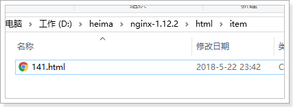
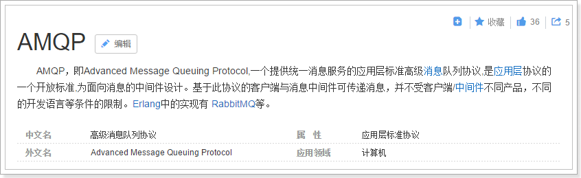
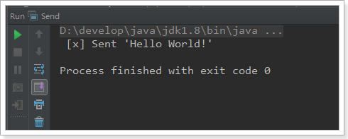
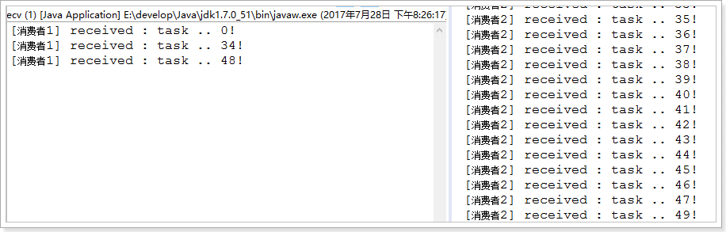
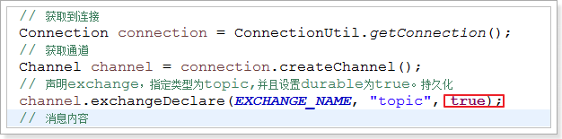
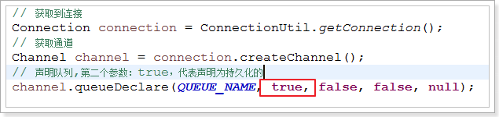
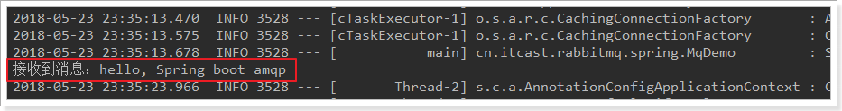

# 0.学习目标

- 了解Thymeleaf的基本使用
- 实现商品详情页面
- 实现页面静态化功能
- 了解RabbitMQ的基本使用


# 1.商品详情

当用户搜索到商品，肯定会点击查看，就会进入商品详情页，接下来我们完成商品详情页的展示，商品详情页在leyou-portal中对应的页面是：item.html

但是不同的商品，到达item.html需要展示的内容不同，该怎么做呢？

- 思路1：统一跳转到item.html页面，然后异步加载商品数据，渲染页面
- 思路2：将请求交给tomcat处理，在后天完成数据渲染，给不同商品生成不同页面后，返回给用户

我们该选哪一种思路？

思路1：

- 优点：页面加载快，异步处理，用户体验好
- 缺点：会向后天发起多次数据请求，增加服务端压力

思路2：

- 优点：后台处理页面后返回，用户拿到是最终数据，不会再次向后天发起数据请求。
- 缺点：在后台处理页面，服务端压力过大，tomcat并发能力差


此处我们选择思路2，现在用tomcat来处理请求，完成服务端的页面渲染，不过后期我们对此进行优化。


以前服务端渲染我们都使用的JSP，不过在SpringBoot中已经不推荐使用Jsp了，因此我们会使用另外的模板引擎技术：Thymeleaf


## 1.1.Thymeleaf

在商品详情页中，我们会使用到Thymeleaf来渲染页面，如果需要先了解Thymeleaf的语法。详见课前资料中《Thymeleaf语法入门.md》


## 1.2.商品详情页服务

我们创建一个微服务，用来完成商品详情页的渲染。

### 1.2.1.创建module

商品的详情页服务，命名为：`ly-page`

  

目录：

 

### 1.2.2.pom依赖

```XML
<?xml version="1.0" encoding="UTF-8"?>
<project xmlns="http://maven.apache.org/POM/4.0.0"
         xmlns:xsi="http://www.w3.org/2001/XMLSchema-instance"
         xsi:schemaLocation="http://maven.apache.org/POM/4.0.0 http://maven.apache.org/xsd/maven-4.0.0.xsd">
    <parent>
        <artifactId>leyou</artifactId>
        <groupId>com.leyou.parent</groupId>
        <version>1.0.0-SNAPSHOT</version>
    </parent>
    <modelVersion>4.0.0</modelVersion>

    <groupId>com.leyou.service</groupId>
    <artifactId>ly-page</artifactId>
    <version>1.0.0-SNAPSHOT</version>

    <dependencies>
        <dependency>
            <groupId>org.springframework.cloud</groupId>
            <artifactId>spring-cloud-starter-netflix-eureka-client</artifactId>
        </dependency>
        <dependency>
            <groupId>org.springframework.boot</groupId>
            <artifactId>spring-boot-starter-web</artifactId>
        </dependency>
        <dependency>
            <groupId>org.springframework.boot</groupId>
            <artifactId>spring-boot-starter-thymeleaf</artifactId>
        </dependency>
        <dependency>
            <groupId>org.springframework.cloud</groupId>
            <artifactId>spring-cloud-starter-openfeign</artifactId>
        </dependency>
        <dependency>
            <groupId>com.leyou.service</groupId>
            <artifactId>ly-item-interface</artifactId>
            <version>1.0.0-SNAPSHOT</version>
        </dependency>
    </dependencies>
</project>
```

### 1.2.3.编写启动类：

```java
@EnableDiscoveryClient
@EnableFeignClients
@SpringBootApplication
public class LyPageApplication {
    public static void main(String[] args) {
        SpringApplication.run(LyPageApplication.class, args);
    }
}
```

### 1.2.4.application.yml文件

```yaml
server:
  port: 8084

spring:
  application:
    name: page-service
  thymeleaf:
    cache: false
eureka:
  client:
    service-url:
      defaultZone: http://127.0.0.1:10086/eureka
```


### 1.2.5.页面模板：

我们从课前资料中复制item.html模板：

 

到当前项目resource目录下的template中：

  


## 1.3.页面跳转

### 1.3.1.修改页面跳转路径

首先我们需要修改搜索结果页的商品地址，目前所有商品的地址都是：http://www.leyou.com/item.html

 

我们应该跳转到对应的商品的详情页才对。

那么问题来了：商品详情页是一个SKU？还是多个SKU的集合？


通过详情页的预览，我们知道它是多个SKU的集合，即SPU。

所以，页面跳转时，我们应该携带SPU的id信息。

例如：http://www.leyou.com/item/2314123.html

这里就采用了路径占位符的方式来传递spu的id，我们打开`search.html`，修改其中的商品路径：

 

刷新页面后在看：

 

### 1.3.2.nginx反向代理

接下来，我们要把这个地址指向我们刚刚创建的服务：`ly-page`，其端口为8084

我们在nginx.conf中添加一段逻辑：

 

把以/item开头的请求，代理到我们的8084端口

### 1.3.3.编写跳转controller

在`ly-page`中编写controller，接收请求，并跳转到商品详情页：

```java
@Controller
public class PageController {

    /**
     * 跳转到商品详情页
     * @param model
     * @param id
     * @return
     */
    @GetMapping("item/{id}.html")
    public String toItemPage(Model model, @PathVariable("id")Long id){

        return "item";
    }
}
```


### 1.3.4.测试

启动`ly-page`，点击搜索页面商品，看是能够正常跳转：


现在看到是500，因为Thymeleaf模板渲染失败了，缺少模型数据：


## 1.4.封装模型数据

首先我们一起来分析一下，在这个页面中需要哪些数据.

我们已知的条件是传递来的spu的id，通过对页面分析可以知道，我们需要根据spu的id查询到下面的数据：

- spu信息
- spu的详情
- spu下的所有sku
- 品牌
- 商品三级分类
- 商品规格参数、规格参数组

### 1.4.1.商品微服务提供接口

#### 查询spu接口

以上所需数据中，查询spu的接口目前还没有，我们需要在商品微服务中提供这个接口：

> GoodsApi

```java
/**
 * 根据spu的id查询spu
 * @param id
 * @return
 */
@GetMapping("spu/{id}")
ResponseEntity<Spu> querySpuById(@PathVariable("id") Long id);
```

> GoodsController

```java
@GetMapping("spu/{id}")
public ResponseEntity<Spu> querySpuById(@PathVariable("id") Long id){
    Spu spu = this.goodsService.querySpuById(id);
    if(spu == null){
        return new ResponseEntity<>(HttpStatus.NOT_FOUND);
    }
    return ResponseEntity.ok(spu);
}
```

> GoodsService

```java
    public Spu querySpuById(Long id) {
        // 查询spu
        Spu spu = spuMapper.selectByPrimaryKey(id);
        // 查询spu下的sku集合
        spu.setSkus(querySkuBySpuId(id));
        // 查询detail
        spu.setSpuDetail(queryDetailBySpuId(id));
        return spu;
    }
```

#### 查询规格参数组

我们在页面展示规格时，需要按组展示：

 

组内有多个参数，为了方便展示。我们提供一个接口，查询规格组，同时在规格组中持有组内的所有参数。

> 拓展`SpecGroup`类：

我们在`SpecGroup`中添加一个`SpecParam`的集合，保存改组下所有规格参数

```java
@Table(name = "tb_spec_group")
public class SpecGroup {

    @Id
    @KeySql(useGeneratedKeys=true)
    private Long id;

    private Long cid;

    private String name;

    @Transient
    private List<SpecParam> params; // 该组下的所有规格参数集合
}
```

然后提供查询接口：

> SpecificationAPI：

```java
@RequestMapping("spec")
public interface SpecificationApi {

    // 查询规格参数组，及组内参数
    @GetMapping("{cid}")
    List<SpecGroup> querySpecsByCid(@PathVariable("cid") Long cid);

    @GetMapping("/params")
    List<SpecParam> querySpecParam(
            @RequestParam(value = "gid", required = false) Long gid,
            @RequestParam(value = "cid", required = false) Long cid,
            @RequestParam(value = "searching", required = false) Boolean searching,
            @RequestParam(value = "generic", required = false) Boolean generic
    );
}
```

> SpecificationController

```java
@GetMapping("{cid}")
public ResponseEntity<List<SpecGroup>> querySpecsByCid(@PathVariable("cid") Long cid){
    List<SpecGroup> list = this.specificationService.querySpecsByCid(cid);
    if(list == null || list.size() == 0){
        return new ResponseEntity<>(HttpStatus.NOT_FOUND);
    }
    return ResponseEntity.ok(list);
}
```

> SpecificationService

```java
public List<SpecGroup> querySpecsByCid(Long cid) {
    // 先查询组
    List<SpecGroup> groups = queryGroupByCid(cid);
    // 查询当前分类下的所有参数
    List<SpecParam> params = queryParam(null, cid, null, null);
    // 把param放入一个Map中，key是组id，值是组内的所有参数
    Map<Long, List<SpecParam>> map = new HashMap<>();
    for (SpecParam param : params) {
        // 判断当前参数所属的组在map中是否存在
        if (!map.containsKey(param.getGroupId())) {
            map.put(param.getGroupId(), new ArrayList<>());
        }
        // 存param到集合
        map.get(param.getGroupId()).add(param);
    }
    // 循环存储param数据
    for (SpecGroup group : groups) {
        group.setParams(map.get(group.getId()));
    }
    return groups;
}
```

在service中，我们调用之前编写过的方法，查询规格组，和规格参数，然后封装返回。


### 1.4.2.创建FeignClient

我们在`ly-page`服务中，创建FeignClient：

 

BrandClient：

```java
@FeignClient("item-service")
public interface BrandClient extends BrandApi {
}
```

CategoryClient

```java
@FeignClient("item-service")
public interface CategoryClient extends CategoryApi {
}
```

GoodsClient:

```java
@FeignClient("item-service")
public interface GoodsClient extends GoodsApi {
}
```

SpecificationClient：

```java
@FeignClient(value = "item-service")
public interface SpecificationClient extends SpecificationApi{
}
```


### 1.4.3.封装数据模型

我们创建一个GoodsService，在里面来封装数据模型。

这里要查询的数据：

- Spu：商品
- spuDetail：商品详情
- Skus：sku集合
- categories：商品分类
- brand：品牌
- specs：规格组及组内参数
  - 查询规格组的时候，把规格组下所有的参数也一并查出，上面提供的接口中已经实现该功能，我们直接调


> Service代码

```java
@Service
@Slf4j
public class GoodsService {
    @Autowired
    private GoodsClient goodsClient;

    @Autowired
    private CategoryClient categoryClient;

    @Autowired
    private BrandClient brandClient;

    @Autowired
    private SpecificationClient specificationClient;

	public Map<String, Object> loadData(Long spuId) {
        // 查询spu
        Spu spu = goodsClient.querySpuById(spuId);
        // 查询分类
        List<Category> categories = categoryClient.queryCategoryByIds(
                Arrays.asList(spu.getCid1(), spu.getCid2(), spu.getCid3()));
        // 查询品牌
        Brand brand = brandClient.queryBrandById(spu.getBrandId());
        // 查询规格参数
        List<SpecGroup> specs = specClient.querySpecs(spu.getCid3());

        // 封装数据
        Map<String, Object> data = new HashMap<>();
        data.put("specs", specs);
        data.put("brand", brand);
        data.put("categories", categories);
        data.put("skus", spu.getSkus());
        data.put("detail", spu.getSpuDetail());

        // 防止重复数据
        spu.setSkus(null);
        spu.setSpuDetail(null);
        data.put("spu", spu);
        return data;
    }
}
```


然后在controller中把数据放入model：

```java
@Controller
@RequestMapping("item")
public class GoodsController {


    @Autowired
    private GoodsService goodsService;
    /**
     * 跳转到商品详情页
     * @param model
     * @param id
     * @return
     */
    @GetMapping("{id}.html")
    public String toItemPage(Model model, @PathVariable("id")Long id){
        // 加载所需的数据
        Map<String, Object> modelMap = this.goodsService.loadModel(id);
        // 放入模型
        model.addAllAttributes(modelMap);
        return "item";
    }
}
```

### 1.4.4.页面测试数据

页面的数据渲染代码已经帮大家写好了，因此启动项目可以直接看到最终的效果：


# 2.页面静态化

## 2.1.简介

### 2.1.1.问题分析

现在，我们的页面是通过Thymeleaf模板引擎渲染后返回到客户端。在后台需要大量的数据查询，而后渲染得到HTML页面。会对数据库造成压力，并且请求的响应时间过长，并发能力不高。

大家能想到什么办法来解决这个问题？

首先我们能想到的就是缓存技术，比如之前学习过的Redis。不过Redis适合数据规模比较小的情况。假如数据量比较大，例如我们的商品详情页。每个页面如果10kb，100万商品，就是10GB空间，对内存占用比较大。此时就给缓存系统带来极大压力，如果缓存崩溃，接下来倒霉的就是数据库了。

所以缓存并不是万能的，某些场景需要其它技术来解决，比如静态化。

### 2.1.2.什么是静态化

静态化是指把动态生成的HTML页面变为静态内容保存，以后用户的请求到来，直接访问静态页面，不再经过服务的渲染。

而静态的HTML页面可以部署在nginx中，从而大大提高并发能力，减小tomcat压力。


### 2.1.3.如何实现静态化

目前，静态化页面都是通过模板引擎来生成，而后保存到nginx服务器来部署。常用的模板引擎比如：

- Freemarker
- Velocity
- Thymeleaf

我们之前就使用的Thymeleaf，来渲染html返回给用户。Thymeleaf除了可以把渲染结果写入Response，也可以写到本地文件，从而实现静态化。

## 2.2.Thymeleaf实现静态化

### 2.2.1.概念

先说下Thymeleaf中的几个概念：

- Context：运行上下文
- TemplateResolver：模板解析器
- TemplateEngine：模板引擎

> Context

上下文： 用来保存模型数据，当模板引擎渲染时，可以从Context上下文中获取数据用于渲染。

当与SpringBoot结合使用时，我们放入Model的数据就会被处理到Context，作为模板渲染的数据使用。

> TemplateResolver

模板解析器：用来读取模板相关的配置，例如：模板存放的位置信息，模板文件名称，模板文件的类型等等。

当与SpringBoot结合时，TemplateResolver已经由其创建完成，并且各种配置也都有默认值，比如模板存放位置，其默认值就是：templates。比如模板文件类型，其默认值就是html。

> TemplateEngine

模板引擎：用来解析模板的引擎，需要使用到上下文、模板解析器。分别从两者中获取模板中需要的数据，模板文件。然后利用内置的语法规则解析，从而输出解析后的文件。来看下模板引起进行处理的函数：

```java
templateEngine.process("模板名", context, writer);
```

三个参数：

- 模板名称
- 上下文：里面包含模型数据
- writer：输出目的地的流

在输出时，我们可以指定输出的目的地，如果目的地是Response的流，那就是网络响应。如果目的地是本地文件，那就实现静态化了。

而在SpringBoot中已经自动配置了模板引擎，因此我们不需要关心这个。现在我们做静态化，就是把输出的目的地改成本地文件即可！

### 2.2.2.具体实现

Service代码：

```java
@Service
@Slf4j
public class PageService {
    private static final ExecutorService es = Executors.newFixedThreadPool(20);

    @Autowired
    private CategoryClient categoryClient;

    @Autowired
    private BrandClient brandClient;

    @Autowired
    private GoodsClient goodsClient;

    @Autowired
    private SpecificationClient specClient;

    @Value("${ly.page.destPath}")
    public String destPath;

    @Autowired
    private TemplateEngine templateEngine;

    public Map<String, Object> loadData(Long spuId) {
        // 查询spu
        Spu spu = goodsClient.querySpuById(spuId);
        // 查询分类
        List<Category> categories = categoryClient.queryCategoryByIds(
                Arrays.asList(spu.getCid1(), spu.getCid2(), spu.getCid3()));
        // 查询品牌
        Brand brand = brandClient.queryBrandById(spu.getBrandId());
        // 查询规格参数
        List<SpecGroup> specs = specClient.querySpecs(spu.getCid3());

        // 封装数据
        Map<String, Object> data = new HashMap<>();
        data.put("specs", specs);
        data.put("brand", brand);
        data.put("categories", categories);
        data.put("skus", spu.getSkus());
        data.put("detail", spu.getSpuDetail());

        // 防止重复数据
        spu.setSkus(null);
        spu.setSpuDetail(null);
        data.put("spu", spu);
        return data;
    }

    public void createHtml(Long spuId) throws FileNotFoundException {
        createHtml(spuId, loadData(spuId));
    }

    public void createHtml(Long spuId, Map<String, Object> data) throws FileNotFoundException {
        // 准备上下文
        Context context = new Context();
        context.setVariables(data);

        // 获取目标文件路径
        File dest = getDestFile(spuId);

        // 判断目标文件是否存在
        if (dest.exists()) {
            dest.delete();
        }

        // 准备流
        try (PrintWriter writer = new PrintWriter(dest)) {
            templateEngine.process("item", context, writer);
        }
    }

    public void asyncCreateHtml(Long spuId){
        es.execute(() -> {
            try {
                createHtml(spuId);
            } catch (FileNotFoundException e) {
                log.error("生成静态页面失败，{}" , e.getMessage(), e);
            }
        });
    }
    public void asyncCreateHtml(Long spuId, Map<String, Object> data){
        es.execute(() -> {
            try {
                createHtml(spuId, data);
            } catch (FileNotFoundException e) {
                log.error("生成静态页面失败，{}" , e.getMessage(), e);
            }
        });
    }

    private File getDestFile(Long spuId) {
        // 目标目录
        File dir = new File(destPath);
        if (!dir.exists()) dir.mkdirs();
        // 返回文件地址
        return new File(dir, spuId + ".html");
    }
}

```

在application.yml中配置生成静态文件的目录：

```yaml
ly:
  page:
    destPath: D:/heima/nginx-1.12.2/html/item
```


### 2.2.3.什么时候创建静态文件

我们编写好了创建静态文件的service，那么问题来了：什么时候去调用它呢

想想这样的场景：

假如大部分的商品都有了静态页面。那么用户的请求都会被nginx拦截下来，根本不会到达我们的`ly-page`服务。只有那些还没有页面的请求，才可能会到达这里。

因此，如果请求到达了这里，我们除了返回页面视图外，还应该创建一个静态页面，那么下次就不会再来麻烦我们了。

所以，我们在GoodsController中添加逻辑，去生成静态html文件：

```java
@GetMapping("{id}.html")
public String toItemPage(Model model, @PathVariable("id")Long id){
    // 加载所需的数据
    Map<String, Object> modelMap = this.goodsService.loadModel(id);
    // 放入模型
    model.addAllAttributes(modelMap);
    // 判断是否需要生成新的页面
    if(!this.fileService.exists(id)){
        this.fileService.syncCreateHtml(id);
    }
    return "item";
}
```

注意：生成html 的代码不能对用户请求产生影响，所以这里我们使用额外的线程进行异步创建。


### 2.2.4.重启测试：

访问一个商品详情，然后查看nginx目录：

 


## 2.3.nginx代理静态页面

接下来，我们修改nginx，让它对商品请求进行监听，指向本地静态页面，如果本地没找到，才进行反向代理：

```nginx
server {
    listen       80;
    server_name  www.leyou.com;

    proxy_set_header X-Forwarded-Host $host;
    proxy_set_header X-Forwarded-Server $host;
    proxy_set_header X-Forwarded-For $proxy_add_x_forwarded_for;

    location /item {
        # 先找本地
        root html;
        if (!-f $request_filename) { #请求的文件不存在，就反向代理
            proxy_pass http://127.0.0.1:8084;
            break;
        }
    }

    location / {
        proxy_pass http://127.0.0.1:9002;
        proxy_connect_timeout 600;
        proxy_read_timeout 600;
    }
}
```

重启测试：

发现请求速度得到了极大提升：


## 2.4.静态页面的同步

在本节开始，我们问了这样的问题，什么时候创建静态页更合适？当时我们思考的答案是在请求到达tomcat后，此时证明页面一定是不存在的，那么我们可以去生成新的静态页面。

但是除了这个时候，在下面的情况我们也需要对静态页进行修改：

- 需要新增静态页的情况：
  - 新增并上架一个商品时
  - 上架一个商品时
- 需要修改静态页的情况：
  - 修改一个商品数据时
- 需要删除静态页的情况：
  - 删除一件商品时
  - 下架一件商品时

那么问题来了，我们如何能得知商品的操作行为？这些行为都是在ly-item即商品微服务中完成的。大家思考一下。


# 3.RabbitMQ

## 3.1.搜索与商品服务的问题

目前我们已经完成了商品详情和搜索系统的开发。我们思考一下，是否存在问题？

- 商品的原始数据保存在数据库中，增删改查都在数据库中完成。
- 搜索服务数据来源是索引库，如果数据库商品发生变化，索引库数据不能及时更新。
- 商品详情做了页面静态化，静态页面数据也不会随着数据库商品发生变化。

如果我们在后台修改了商品的价格，搜索页面和商品详情页显示的依然是旧的价格，这样显然不对。该如何解决？


这里有两种解决方案：

- 方案1：每当后台对商品做增删改操作，同时要修改索引库数据及静态页面

- 方案2：搜索服务和商品页面服务对外提供操作接口，后台在商品增删改后，调用接口


以上两种方式都有同一个严重问题：就是代码耦合，后台服务中需要嵌入搜索和商品页面服务，违背了微服务的`独立`原则。

所以，我们会通过另外一种方式来解决这个问题：消息队列

## 3.2.消息队列（MQ）

### 3.2.1.什么是消息队列

消息队列，即MQ，Message Queue。


消息队列是典型的：生产者、消费者模型。生产者不断向消息队列中生产消息，消费者不断的从队列中获取消息。因为消息的生产和消费都是异步的，而且只关心消息的发送和接收，没有业务逻辑的侵入，这样就实现了生产者和消费者的解耦。

结合前面所说的问题：

- 商品服务对商品增删改以后，无需去操作索引库或静态页面，只是发送一条消息，也不关心消息被谁接收。
- 搜索服务和静态页面服务接收消息，分别去处理索引库和静态页面。

如果以后有其它系统也依赖商品服务的数据，同样监听消息即可，商品服务无需任何代码修改。


### 3.2.2.AMQP和JMS

MQ是消息通信的模型，并发具体实现。现在实现MQ的有两种主流方式：AMQP、JMS。




两者间的区别和联系：

- JMS是定义了统一的接口，来对消息操作进行统一；AMQP是通过规定协议来统一数据交互的格式
- JMS限定了必须使用Java语言；AMQP只是协议，不规定实现方式，因此是跨语言的。
- JMS规定了两种消息模型；而AMQP的消息模型更加丰富


### 3.2.3.常见MQ产品


- ActiveMQ：基于JMS， Apache

- RabbitMQ：基于AMQP协议，erlang语言开发，稳定性好
- RocketMQ：基于JMS，阿里巴巴产品，目前交由Apache基金会
- Kafka：分布式消息系统，高吞吐量

### 3.2.4.RabbitMQ

RabbitMQ是基于AMQP的一款消息管理系统

官网： http://www.rabbitmq.com/

官方教程：http://www.rabbitmq.com/getstarted.html


 

RabbitMQ基于Erlang语言开发：


## 3.3.下载和安装

### 3.3.1.下载

官网下载地址：http://www.rabbitmq.com/download.html

 

目前最新版本是：3.7.5

我们的课程中使用的是：3.4.1版本

课前资料提供了安装包：

  

### 3.3.2.安装

详见课前资料中的：

 

## 3.4.五种消息模型

RabbitMQ提供了6种消息模型，但是第6种其实是RPC，并不是MQ，因此不予学习。那么也就剩下5种。

但是其实3、4、5这三种都属于订阅模型，只不过进行路由的方式不同。


### 3.4.1.导入demo工程

我们通过一个demo工程来了解下RabbitMQ的工作方式：

导入工程：

 

导入后：

 


### 3.4.2.基本消息模型

#### 说明

官方文档说明：

> RabbitMQ是一个消息的代理者（Message Broker）：它接收消息并且传递消息。
>
> 你可以认为它是一个邮局：当你投递邮件到一个邮箱，你很肯定邮递员会终究会将邮件递交给你的收件人。与此类似，RabbitMQ 可以是一个邮箱、邮局、同时还有邮递员。
>
> 不同之处在于：RabbitMQ不是传递纸质邮件，而是二进制的数据

基本消息模型图：

 

在上图的模型中，有以下概念：

- P：生产者，也就是要发送消息的程序
- C：消费者：消息的接受者，会一直等待消息到来。
- queue：消息队列，图中红色部分。类似一个邮箱，可以缓存消息；生产者向其中投递消息，消费者从其中取出消息。

#### 生产者

连接工具类：

```java
public class ConnectionUtil {
    /**
     * 建立与RabbitMQ的连接
     * @return
     * @throws Exception
     */
    public static Connection getConnection() throws Exception {
        //定义连接工厂
        ConnectionFactory factory = new ConnectionFactory();
        //设置服务地址
        factory.setHost("192.168.56.101");
        //端口
        factory.setPort(5672);
        //设置账号信息，用户名、密码、vhost
        factory.setVirtualHost("/leyou");
        factory.setUsername("leyou");
        factory.setPassword("leyou");
        // 通过工程获取连接
        Connection connection = factory.newConnection();
        return connection;
    }
}
```


生产者发送消息：

```java
public class Send {

    private final static String QUEUE_NAME = "simple_queue";

    public static void main(String[] argv) throws Exception {
        // 获取到连接
        Connection connection = ConnectionUtil.getConnection();
        // 从连接中创建通道，使用通道才能完成消息相关的操作
        Channel channel = connection.createChannel();
        // 声明（创建）队列
        channel.queueDeclare(QUEUE_NAME, false, false, false, null);
        // 消息内容
        String message = "Hello World!";
        // 向指定的队列中发送消息
        channel.basicPublish("", QUEUE_NAME, null, message.getBytes());
        
        System.out.println(" [x] Sent '" + message + "'");

        //关闭通道和连接
        channel.close();
        connection.close();
    }
}
```

控制台：

 

#### web控制台查看消息

进入队列页面，可以看到新建了一个队列：simple_queue


点击队列名称，进入详情页，可以查看消息：

 

在控制台查看消息并不会将消息消费，所以消息还在。


#### 消费者获取消息

```java
public class Recv {
    private final static String QUEUE_NAME = "simple_queue";

    public static void main(String[] argv) throws Exception {
        // 获取到连接
        Connection connection = ConnectionUtil.getConnection();
        // 创建通道
        Channel channel = connection.createChannel();
        // 声明队列
        channel.queueDeclare(QUEUE_NAME, false, false, false, null);
        // 定义队列的消费者
        DefaultConsumer consumer = new DefaultConsumer(channel) {
            // 获取消息，并且处理，这个方法类似事件监听，如果有消息的时候，会被自动调用
            @Override
            public void handleDelivery(String consumerTag, Envelope envelope, BasicProperties properties,
                    byte[] body) throws IOException {
                // body 即消息体
                String msg = new String(body);
                System.out.println(" [x] received : " + msg + "!");
            }
        };
        // 监听队列，第二个参数：是否自动进行消息确认。
        channel.basicConsume(QUEUE_NAME, true, consumer);
    }
}
```

控制台：

 

这个时候，队列中的消息就没了：


#### 消费者的消息确认机制

通过刚才的案例可以看出，消息一旦被消费者接收，队列中的消息就会被删除。

那么问题来了：RabbitMQ怎么知道消息被接收了呢？

这就要通过消息确认机制（Acknowlege）来实现了。当消费者获取消息后，会向RabbitMQ发送回执ACK，告知消息已经被接收。不过这种回执ACK分两种情况：

- 自动ACK：消息一旦被接收，消费者自动发送ACK
- 手动ACK：消息接收后，不会发送ACK，需要手动调用

大家觉得哪种更好呢？

这需要看消息的重要性：

- 如果消息不太重要，丢失也没有影响，那么自动ACK会比较方便
- 如果消息非常重要，不容丢失。那么最好在消费完成后手动ACK，否则接收消息后就自动ACK，RabbitMQ就会把消息从队列中删除。如果此时消费者宕机，那么消息就丢失了。

我们之前的测试都是自动ACK的，如果要手动ACK，需要改动我们的代码：

```java
public class Recv2 {
    private final static String QUEUE_NAME = "simple_queue";

    public static void main(String[] argv) throws Exception {
        // 获取到连接
        Connection connection = ConnectionUtil.getConnection();
        // 创建通道
        final Channel channel = connection.createChannel();
        // 声明队列
        channel.queueDeclare(QUEUE_NAME, false, false, false, null);
        // 定义队列的消费者
        DefaultConsumer consumer = new DefaultConsumer(channel) {
            // 获取消息，并且处理，这个方法类似事件监听，如果有消息的时候，会被自动调用
            @Override
            public void handleDelivery(String consumerTag, Envelope envelope, BasicProperties properties,
                    byte[] body) throws IOException {
                // body 即消息体
                String msg = new String(body);
                System.out.println(" [x] received : " + msg + "!");
                // 手动进行ACK
                channel.basicAck(envelope.getDeliveryTag(), false);
            }
        };
        // 监听队列，第二个参数false，手动进行ACK
        channel.basicConsume(QUEUE_NAME, false, consumer);
    }
}
```

注意到最后一行代码：

```java
channel.basicConsume(QUEUE_NAME, false, consumer);
```

如果第二个参数为true，则会自动进行ACK；如果为false，则需要手动ACK。方法的声明：


### 3.4.3.work消息模型

#### 说明

在刚才的基本模型中，一个生产者，一个消费者，生产的消息直接被消费者消费。比较简单。

Work queues，也被称为（Task queues），任务模型。

当消息处理比较耗时的时候，可能生产消息的速度会远远大于消息的消费速度。长此以往，消息就会堆积越来越多，无法及时处理。此时就可以使用work 模型：**让多个消费者绑定到一个队列，共同消费队列中的消息**。队列中的消息一旦消费，就会消失，因此任务是不会被重复执行的。

 

角色：

- P：生产者：任务的发布者
- C1：消费者，领取任务并且完成任务，假设完成速度较慢
- C2：消费者2：领取任务并完成任务，假设完成速度快


#### 生产者

生产者与案例1中的几乎一样：

```java
public class Send {
    private final static String QUEUE_NAME = "test_work_queue";

    public static void main(String[] argv) throws Exception {
        // 获取到连接
        Connection connection = ConnectionUtil.getConnection();
        // 获取通道
        Channel channel = connection.createChannel();
        // 声明队列
        channel.queueDeclare(QUEUE_NAME, false, false, false, null);
        // 循环发布任务
        for (int i = 0; i < 50; i++) {
            // 消息内容
            String message = "task .. " + i;
            channel.basicPublish("", QUEUE_NAME, null, message.getBytes());
            System.out.println(" [x] Sent '" + message + "'");

            Thread.sleep(i * 2);
        }
        // 关闭通道和连接
        channel.close();
        connection.close();
    }
}
```

不过这里我们是循环发送50条消息。

#### 消费者1


#### 消费者2


与消费者1基本类似，就是没有设置消费耗时时间。

这里是模拟有些消费者快，有些比较慢。


接下来，两个消费者一同启动，然后发送50条消息：


可以发现，两个消费者各自消费了25条消息，而且各不相同，这就实现了任务的分发。


#### 能者多劳

刚才的实现有问题吗？

- 消费者1比消费者2的效率要低，一次任务的耗时较长
- 然而两人最终消费的消息数量是一样的
- 消费者2大量时间处于空闲状态，消费者1一直忙碌

现在的状态属于是把任务平均分配，正确的做法应该是消费越快的人，消费的越多。

怎么实现呢？

我们可以修改设置，让消费者同一时间只接收一条消息，这样处理完成之前，就不会接收更多消息，就可以让处理快的人，接收更多消息 ：


再次测试：




### 3.4.4.订阅模型分类

订阅模型示意图：

 

前面2个案例中，只有3个角色：

- P：生产者，也就是要发送消息的程序
- C：消费者：消息的接受者，会一直等待消息到来。
- queue：消息队列，图中红色部分。类似一个邮箱，可以缓存消息；生产者向其中投递消息，消费者从其中取出消息。

而在订阅模型中，多了一个exchange角色，而且过程略有变化：

- P：生产者，也就是要发送消息的程序，但是不再发送到队列中，而是发给X（交换机）
- C：消费者，消息的接受者，会一直等待消息到来。
- Queue：消息队列，接收消息、缓存消息。
-  Exchange：交换机，图中的X。一方面，接收生产者发送的消息。另一方面，知道如何处理消息，例如递交给某个特别队列、递交给所有队列、或是将消息丢弃。到底如何操作，取决于Exchange的类型。Exchange有以下3种类型：
  - Fanout：广播，将消息交给所有绑定到交换机的队列
  - Direct：定向，把消息交给符合指定routing key 的队列
  - Topic：通配符，把消息交给符合routing pattern（路由模式） 的队列

**Exchange（交换机）只负责转发消息，不具备存储消息的能力**，因此如果没有任何队列与Exchange绑定，或者没有符合路由规则的队列，那么消息会丢失！


### 3.4.5.订阅模型-Fanout

Fanout，也称为广播。

#### 流程说明

流程图：

 

在广播模式下，消息发送流程是这样的：

- 1）  可以有多个消费者
- 2）  每个**消费者有自己的queue**（队列）
- 3）  每个**队列都要绑定到Exchange**（交换机）
- 4）  **生产者发送的消息，只能发送到交换机**，交换机来决定要发给哪个队列，生产者无法决定。
- 5）  交换机把消息发送给绑定过的所有队列
- 6）  队列的消费者都能拿到消息。实现一条消息被多个消费者消费


#### 生产者

两个变化：

- 1）  声明Exchange，不再声明Queue
- 2）  发送消息到Exchange，不再发送到Queue

```java
public class Send {

    private final static String EXCHANGE_NAME = "fanout_exchange_test";

    public static void main(String[] argv) throws Exception {
        // 获取到连接
        Connection connection = ConnectionUtil.getConnection();
        // 获取通道
        Channel channel = connection.createChannel();
        
        // 声明exchange，指定类型为fanout
        channel.exchangeDeclare(EXCHANGE_NAME, "fanout");
        
        // 消息内容
        String message = "Hello everyone";
        // 发布消息到Exchange
        channel.basicPublish(EXCHANGE_NAME, "", null, message.getBytes());
        System.out.println(" [生产者] Sent '" + message + "'");

        channel.close();
        connection.close();
    }
}
```

#### 消费者1

```java
public class Recv {
    private final static String QUEUE_NAME = "fanout_exchange_queue_1";

    private final static String EXCHANGE_NAME = "fanout_exchange_test";

    public static void main(String[] argv) throws Exception {
        // 获取到连接
        Connection connection = ConnectionUtil.getConnection();
        // 获取通道
        Channel channel = connection.createChannel();
        // 声明队列
        channel.queueDeclare(QUEUE_NAME, false, false, false, null);

        // 绑定队列到交换机
        channel.queueBind(QUEUE_NAME, EXCHANGE_NAME, "");

        // 定义队列的消费者
        DefaultConsumer consumer = new DefaultConsumer(channel) {
            // 获取消息，并且处理，这个方法类似事件监听，如果有消息的时候，会被自动调用
            @Override
            public void handleDelivery(String consumerTag, Envelope envelope, BasicProperties properties,
                    byte[] body) throws IOException {
                // body 即消息体
                String msg = new String(body);
                System.out.println(" [消费者1] received : " + msg + "!");
            }
        };
        // 监听队列，自动返回完成
        channel.basicConsume(QUEUE_NAME, true, consumer);
    }
}
```

要注意代码中：**队列需要和交换机绑定**

#### 消费者2

```java
public class Recv2 {
    private final static String QUEUE_NAME = "fanout_exchange_queue_2";

    private final static String EXCHANGE_NAME = "fanout_exchange_test";

    public static void main(String[] argv) throws Exception {
        // 获取到连接
        Connection connection = ConnectionUtil.getConnection();
        // 获取通道
        Channel channel = connection.createChannel();
        // 声明队列
        channel.queueDeclare(QUEUE_NAME, false, false, false, null);

        // 绑定队列到交换机
        channel.queueBind(QUEUE_NAME, EXCHANGE_NAME, "");
        
        // 定义队列的消费者
        DefaultConsumer consumer = new DefaultConsumer(channel) {
            // 获取消息，并且处理，这个方法类似事件监听，如果有消息的时候，会被自动调用
            @Override
            public void handleDelivery(String consumerTag, Envelope envelope, BasicProperties properties,
                    byte[] body) throws IOException {
                // body 即消息体
                String msg = new String(body);
                System.out.println(" [消费者2] received : " + msg + "!");
            }
        };
        // 监听队列，手动返回完成
        channel.basicConsume(QUEUE_NAME, true, consumer);
    }
}
```


#### 测试

我们运行两个消费者，然后发送1条消息：

 

### 3.4.6.订阅模型-Direct

#### 说明

在Fanout模式中，一条消息，会被所有订阅的队列都消费。但是，在某些场景下，我们希望不同的消息被不同的队列消费。这时就要用到Direct类型的Exchange。

 在Direct模型下：

- 队列与交换机的绑定，不能是任意绑定了，而是要指定一个`RoutingKey`（路由key）
- 消息的发送方在 向 Exchange发送消息时，也必须指定消息的 `RoutingKey`。
- Exchange不再把消息交给每一个绑定的队列，而是根据消息的`Routing Key`进行判断，只有队列的`Routingkey`与消息的 `Routing key`完全一致，才会接收到消息


流程图：

 

图解：

- P：生产者，向Exchange发送消息，发送消息时，会指定一个routing key。
- X：Exchange（交换机），接收生产者的消息，然后把消息递交给 与routing key完全匹配的队列
- C1：消费者，其所在队列指定了需要routing key 为 error 的消息
- C2：消费者，其所在队列指定了需要routing key 为 info、error、warning 的消息

#### 生产者

此处我们模拟商品的增删改，发送消息的RoutingKey分别是：insert、update、delete

```java
public class Send {
    private final static String EXCHANGE_NAME = "direct_exchange_test";

    public static void main(String[] argv) throws Exception {
        // 获取到连接
        Connection connection = ConnectionUtil.getConnection();
        // 获取通道
        Channel channel = connection.createChannel();
        // 声明exchange，指定类型为direct
        channel.exchangeDeclare(EXCHANGE_NAME, "direct");
        // 消息内容
        String message = "商品新增了， id = 1001";
        // 发送消息，并且指定routing key 为：insert ,代表新增商品
        channel.basicPublish(EXCHANGE_NAME, "insert", null, message.getBytes());
        System.out.println(" [商品服务：] Sent '" + message + "'");

        channel.close();
        connection.close();
    }
}
```

#### 消费者1

我们此处假设消费者1只接收两种类型的消息：更新商品和删除商品。

```java
public class Recv {
    private final static String QUEUE_NAME = "direct_exchange_queue_1";
    private final static String EXCHANGE_NAME = "direct_exchange_test";

    public static void main(String[] argv) throws Exception {
        // 获取到连接
        Connection connection = ConnectionUtil.getConnection();
        // 获取通道
        Channel channel = connection.createChannel();
        // 声明队列
        channel.queueDeclare(QUEUE_NAME, false, false, false, null);
        
        // 绑定队列到交换机，同时指定需要订阅的routing key。假设此处需要update和delete消息
        channel.queueBind(QUEUE_NAME, EXCHANGE_NAME, "update");
        channel.queueBind(QUEUE_NAME, EXCHANGE_NAME, "delete");

        // 定义队列的消费者
        DefaultConsumer consumer = new DefaultConsumer(channel) {
            // 获取消息，并且处理，这个方法类似事件监听，如果有消息的时候，会被自动调用
            @Override
            public void handleDelivery(String consumerTag, Envelope envelope, BasicProperties properties,
                    byte[] body) throws IOException {
                // body 即消息体
                String msg = new String(body);
                System.out.println(" [消费者1] received : " + msg + "!");
            }
        };
        // 监听队列，自动ACK
        channel.basicConsume(QUEUE_NAME, true, consumer);
    }
}
```


#### 消费者2

我们此处假设消费者2接收所有类型的消息：新增商品，更新商品和删除商品。

```java
public class Recv2 {
    private final static String QUEUE_NAME = "direct_exchange_queue_2";
    private final static String EXCHANGE_NAME = "direct_exchange_test";

    public static void main(String[] argv) throws Exception {
        // 获取到连接
        Connection connection = ConnectionUtil.getConnection();
        // 获取通道
        Channel channel = connection.createChannel();
        // 声明队列
        channel.queueDeclare(QUEUE_NAME, false, false, false, null);
        
        // 绑定队列到交换机，同时指定需要订阅的routing key。订阅 insert、update、delete
        channel.queueBind(QUEUE_NAME, EXCHANGE_NAME, "insert");
        channel.queueBind(QUEUE_NAME, EXCHANGE_NAME, "update");
        channel.queueBind(QUEUE_NAME, EXCHANGE_NAME, "delete");

        // 定义队列的消费者
        DefaultConsumer consumer = new DefaultConsumer(channel) {
            // 获取消息，并且处理，这个方法类似事件监听，如果有消息的时候，会被自动调用
            @Override
            public void handleDelivery(String consumerTag, Envelope envelope, BasicProperties properties,
                    byte[] body) throws IOException {
                // body 即消息体
                String msg = new String(body);
                System.out.println(" [消费者2] received : " + msg + "!");
            }
        };
        // 监听队列，自动ACK
        channel.basicConsume(QUEUE_NAME, true, consumer);
    }
}
```


#### 测试

我们分别发送增、删、改的RoutingKey，发现结果：

 


### 3.4.7.订阅模型-Topic

#### 说明

`Topic`类型的`Exchange`与`Direct`相比，都是可以根据`RoutingKey`把消息路由到不同的队列。只不过`Topic`类型`Exchange`可以让队列在绑定`Routing key` 的时候使用通配符！


`Routingkey` 一般都是有一个或多个单词组成，多个单词之间以”.”分割，例如： `item.insert`

 通配符规则：

`#`：匹配一个或多个词

`*`：匹配不多不少恰好1个词


举例：

`audit.#`：能够匹配`audit.irs.corporate` 或者 `audit.irs`

`audit.*`：只能匹配`audit.irs`

     

图示：

 

解释：

- 红色Queue：绑定的是`usa.#` ，因此凡是以 `usa.`开头的`routing key` 都会被匹配到
- 黄色Queue：绑定的是`#.news` ，因此凡是以 `.news`结尾的 `routing key` 都会被匹配

#### 生产者

使用topic类型的Exchange，发送消息的routing key有3种： `item.isnert`、`item.update`、`item.delete`：

```java
public class Send {
    private final static String EXCHANGE_NAME = "topic_exchange_test";

    public static void main(String[] argv) throws Exception {
        // 获取到连接
        Connection connection = ConnectionUtil.getConnection();
        // 获取通道
        Channel channel = connection.createChannel();
        // 声明exchange，指定类型为topic
        channel.exchangeDeclare(EXCHANGE_NAME, "topic");
        // 消息内容
        String message = "新增商品 : id = 1001";
        // 发送消息，并且指定routing key 为：insert ,代表新增商品
        channel.basicPublish(EXCHANGE_NAME, "item.insert", null, message.getBytes());
        System.out.println(" [商品服务：] Sent '" + message + "'");

        channel.close();
        connection.close();
    }
}
```

#### 消费者1

我们此处假设消费者1只接收两种类型的消息：更新商品和删除商品

```java
public class Recv {
    private final static String QUEUE_NAME = "topic_exchange_queue_1";
    private final static String EXCHANGE_NAME = "topic_exchange_test";

    public static void main(String[] argv) throws Exception {
        // 获取到连接
        Connection connection = ConnectionUtil.getConnection();
        // 获取通道
        Channel channel = connection.createChannel();
        // 声明队列
        channel.queueDeclare(QUEUE_NAME, false, false, false, null);
        
        // 绑定队列到交换机，同时指定需要订阅的routing key。需要 update、delete
        channel.queueBind(QUEUE_NAME, EXCHANGE_NAME, "item.update");
        channel.queueBind(QUEUE_NAME, EXCHANGE_NAME, "item.delete");

        // 定义队列的消费者
        DefaultConsumer consumer = new DefaultConsumer(channel) {
            // 获取消息，并且处理，这个方法类似事件监听，如果有消息的时候，会被自动调用
            @Override
            public void handleDelivery(String consumerTag, Envelope envelope, BasicProperties properties,
                    byte[] body) throws IOException {
                // body 即消息体
                String msg = new String(body);
                System.out.println(" [消费者1] received : " + msg + "!");
            }
        };
        // 监听队列，自动ACK
        channel.basicConsume(QUEUE_NAME, true, consumer);
    }
}
```


#### 消费者2

我们此处假设消费者2接收所有类型的消息：新增商品，更新商品和删除商品。

```java
/**
 * 消费者2
 */
public class Recv2 {
    private final static String QUEUE_NAME = "topic_exchange_queue_2";
    private final static String EXCHANGE_NAME = "topic_exchange_test";

    public static void main(String[] argv) throws Exception {
        // 获取到连接
        Connection connection = ConnectionUtil.getConnection();
        // 获取通道
        Channel channel = connection.createChannel();
        // 声明队列
        channel.queueDeclare(QUEUE_NAME, false, false, false, null);
        
        // 绑定队列到交换机，同时指定需要订阅的routing key。订阅 insert、update、delete
        channel.queueBind(QUEUE_NAME, EXCHANGE_NAME, "item.*");

        // 定义队列的消费者
        DefaultConsumer consumer = new DefaultConsumer(channel) {
            // 获取消息，并且处理，这个方法类似事件监听，如果有消息的时候，会被自动调用
            @Override
            public void handleDelivery(String consumerTag, Envelope envelope, BasicProperties properties,
                    byte[] body) throws IOException {
                // body 即消息体
                String msg = new String(body);
                System.out.println(" [消费者2] received : " + msg + "!");
            }
        };
        // 监听队列，自动ACK
        channel.basicConsume(QUEUE_NAME, true, consumer);
    }
}
```

## 3.5.持久化

如何避免消息丢失？

1）  消费者的ACK机制。可以防止消费者丢失消息。

2）  但是，如果在消费者消费之前，MQ就宕机了，消息就没了。


是可以将消息进行持久化呢？

 要将消息持久化，前提是：队列、Exchange都持久化

### 交换机持久化

 

### 队列持久化

 

### 消息持久化


解决消息丢失？

- ack（消费者确认）
- 持久化
- 发送消息前，将消息持久化到数据库，并记录消息状态（可靠消息服务）
- 生产者确认（publisher confirm）


# 4.Spring AMQP

## 4.1.简介

Sprin有很多不同的项目，其中就有对AMQP的支持：


Spring AMQP的页面：<http://projects.spring.io/spring-amqp/> 


注意这里一段描述：

    
         Spring-amqp是对AMQP协议的抽象实现，而spring-rabbit 是对协议的具体实现，也是目前的唯一实现。底层使用的就是RabbitMQ。


## 4.2.依赖和配置

添加AMQP的启动器：

```xml
<dependency>
    <groupId>org.springframework.boot</groupId>
    <artifactId>spring-boot-starter-amqp</artifactId>
</dependency>
```

在`application.yml`中添加RabbitMQ地址：

```yaml
spring:
  rabbitmq:
    host: 192.168.56.101
    username: leyou
    password: leyou
    virtual-host: /leyou
```

## 4.3.监听者

在SpringAmqp中，对消息的消费者进行了封装和抽象，一个普通的JavaBean中的普通方法，只要通过简单的注解，就可以成为一个消费者。

```java
@Component
public class Listener {

    @RabbitListener(bindings = @QueueBinding(
            value = @Queue(value = "spring.test.queue", durable = "true"),
            exchange = @Exchange(
                    value = "spring.test.exchange",
                    ignoreDeclarationExceptions = "true",
                    type = ExchangeTypes.TOPIC
            ),
            key = {"#.#"}))
    public void listen(String msg){
        System.out.println("接收到消息：" + msg);
    }
}
```

- `@Componet`：类上的注解，注册到Spring容器
- `@RabbitListener`：方法上的注解，声明这个方法是一个消费者方法，需要指定下面的属性：
  - `bindings`：指定绑定关系，可以有多个。值是`@QueueBinding`的数组。`@QueueBinding`包含下面属性：
    - `value`：这个消费者关联的队列。值是`@Queue`，代表一个队列
    - `exchange`：队列所绑定的交换机，值是`@Exchange`类型
    - `key`：队列和交换机绑定的`RoutingKey`

类似listen这样的方法在一个类中可以写多个，就代表多个消费者。


## 4.4.AmqpTemplate

Spring最擅长的事情就是封装，把他人的框架进行封装和整合。

Spring为AMQP提供了统一的消息处理模板：AmqpTemplate，非常方便的发送消息，其发送方法：


红框圈起来的是比较常用的3个方法，分别是：

- 指定交换机、RoutingKey和消息体
- 指定消息
- 指定RoutingKey和消息，会向默认的交换机发送消息


## 4.5.测试代码

```java
@RunWith(SpringRunner.class)
@SpringBootTest(classes = Application.class)
public class MqDemo {

    @Autowired
    private AmqpTemplate amqpTemplate;

    @Test
    public void testSend() throws InterruptedException {
        String msg = "hello, Spring boot amqp";
        this.amqpTemplate.convertAndSend("spring.test.exchange","a.b", msg);
        // 等待10秒后再结束
        Thread.sleep(10000);
    }
}
```

运行后查看日志：



