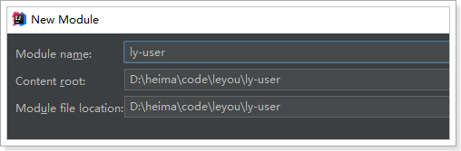
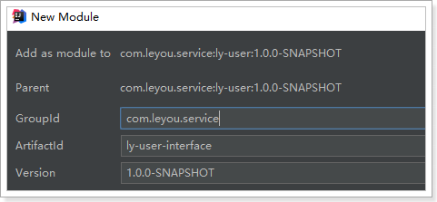
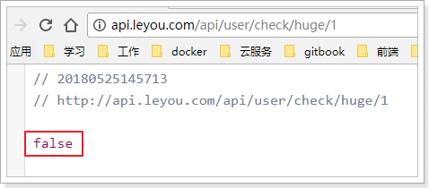
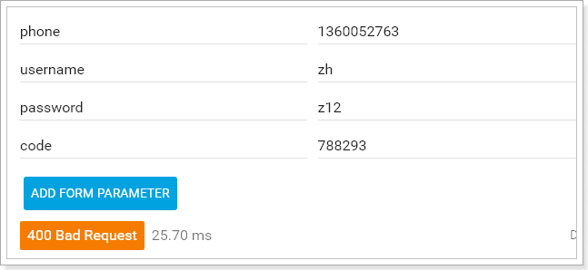
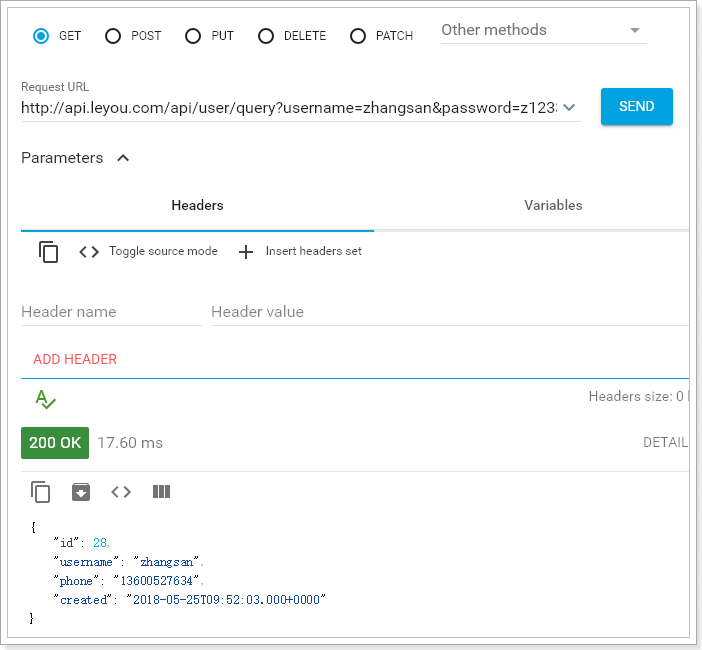

# 0.学习目标

- 了解面向接口开发方式
- 实现数据校验功能
- 实现短信发送功能
- 实现注册功能
- 实现根据用户名和密码查询用户功能


# 1.创建用户中心

用户搜索到自己心仪的商品，接下来就要去购买，但是购买必须先登录。所以接下来我们编写用户中心，实现用户的登录和注册功能。

用户中心的提供的服务：

- 用户的注册
- 用户登录
- 用户个人信息管理
- 用户地址管理
- 用户收藏管理
- 我的订单

这里我们暂时先实现基本的：`注册和登录`功能，其它功能大家可以自行补充完整。

因为用户中心的服务其它微服务也会调用，因此这里我们做聚合：

- ly-user：父工程，包含2个子工程：
  - ly-user-interface：实体及接口
  - ly-user-service：业务和服务

## 1.1.创建父module

创建

 

位置：

 

## 1.2.创建ly-user-interface

创建module：

 

 

pom：

```xml
<?xml version="1.0" encoding="UTF-8"?>
<project xmlns="http://maven.apache.org/POM/4.0.0"
         xmlns:xsi="http://www.w3.org/2001/XMLSchema-instance"
         xsi:schemaLocation="http://maven.apache.org/POM/4.0.0 http://maven.apache.org/xsd/maven-4.0.0.xsd">
    <parent>
        <artifactId>ly-user</artifactId>
        <groupId>com.leyou.service</groupId>
        <version>1.0.0-SNAPSHOT</version>
    </parent>
    <modelVersion>4.0.0</modelVersion>

    <groupId>com.leyou.service</groupId>
    <artifactId>ly-user-interface</artifactId>
    <version>1.0.0-SNAPSHOT</version>
</project>
```


## 1.3.创建ly-user-service

创建module

 

 

pom

```xml
<?xml version="1.0" encoding="UTF-8"?>
<project xmlns="http://maven.apache.org/POM/4.0.0"
         xmlns:xsi="http://www.w3.org/2001/XMLSchema-instance"
         xsi:schemaLocation="http://maven.apache.org/POM/4.0.0 http://maven.apache.org/xsd/maven-4.0.0.xsd">
    <parent>
        <artifactId>ly-user</artifactId>
        <groupId>com.leyou.service</groupId>
        <version>1.0.0-SNAPSHOT</version>
    </parent>
    <modelVersion>4.0.0</modelVersion>

    <groupId>com.leyou.service</groupId>
    <artifactId>ly-user-service</artifactId>
    <version>1.0.0-SNAPSHOT</version>

    <dependencies>
        <dependency>
            <groupId>org.springframework.boot</groupId>
            <artifactId>spring-boot-starter-web</artifactId>
        </dependency>
        <dependency>
            <groupId>org.springframework.cloud</groupId>
            <artifactId>spring-cloud-starter-netflix-eureka-client</artifactId>
        </dependency>
        <!-- 通用Mapper启动器 -->
        <dependency>
            <groupId>tk.mybatis</groupId>
            <artifactId>mapper-spring-boot-starter</artifactId>
        </dependency>
        <!-- mysql驱动 -->
        <dependency>
            <groupId>mysql</groupId>
            <artifactId>mysql-connector-java</artifactId>
        </dependency>
        <dependency>
            <groupId>com.leyou.service</groupId>
            <artifactId>ly-user-interface</artifactId>
            <version>${leyou.latest.version}</version>
        </dependency>
    </dependencies>
</project>
```


启动类

```java
@SpringBootApplication
@EnableDiscoveryClient
@MapperScan("com.leyou.user.mapper")
public class LyUserApplication {
    public static void main(String[] args) {
        SpringApplication.run(LyUserApplication.class,args);
    }
}
```


配置：

```yaml
server:
  port: 8085
spring:
  application:
    name: user-service
  datasource:
    url: jdbc:mysql://127.0.0.1:3306/heima
    username: root
    password: 123
    driver-class-name: com.mysql.jdbc.Driver
eureka:
  client:
    service-url:
      defaultZone: http://127.0.0.1:10086/eureka

mybatis:
  type-aliases-package: com.leyou.user.pojo
```


父工程ly-user的pom：

```xml
<?xml version="1.0" encoding="UTF-8"?>
<project xmlns="http://maven.apache.org/POM/4.0.0"
         xmlns:xsi="http://www.w3.org/2001/XMLSchema-instance"
         xsi:schemaLocation="http://maven.apache.org/POM/4.0.0 http://maven.apache.org/xsd/maven-4.0.0.xsd">
    <parent>
        <artifactId>leyou</artifactId>
        <groupId>com.leyou.parent</groupId>
        <version>1.0.0-SNAPSHOT</version>
    </parent>
    <modelVersion>4.0.0</modelVersion>

    <groupId>com.leyou.service</groupId>
    <artifactId>ly-user</artifactId>
    <version>1.0.0-SNAPSHOT</version>
    <modules>
        <module>ly-user-interface</module>
        <module>ly-user-service</module>
    </modules>
    <packaging>pom</packaging>
</project>
```


## 1.4.添加网关路由

我们修改`ly-api-gateway`，添加路由规则，对`ly-user-service`进行路由:

 


# 2.后台功能准备

## 2.1.接口文档

整个用户中心的开发，我们将模拟公司内面向接口的开发。因为在前后端分离的开发模式中，后端人员只需要对外提供接口，而不需要关心页面的实现。为了使前后端可以同时开发，必须让前端与后端基于相同的接口，声明每一个接口的路径、参数、返回值等属性。

现在假设项目经理已经设计好了接口文档，详见：《用户中心接口说明.md》


我们将根据文档直接编写后台功能，不关心页面实现。


## 2.2.数据结构

```mysql
CREATE TABLE `tb_user` (
  `id` bigint(20) NOT NULL AUTO_INCREMENT,
  `username` varchar(50) NOT NULL COMMENT '用户名',
  `password` varchar(32) NOT NULL COMMENT '密码，加密存储',
  `phone` varchar(20) DEFAULT NULL COMMENT '注册手机号',
  `created` datetime NOT NULL COMMENT '创建时间',
  `salt` varchar(32) NOT NULL COMMENT '密码加密的salt值',
  PRIMARY KEY (`id`),
  UNIQUE KEY `username` (`username`) USING BTREE
) ENGINE=InnoDB AUTO_INCREMENT=28 DEFAULT CHARSET=utf8 COMMENT='用户表';
```

数据结构比较简单，因为根据用户名查询的频率较高，所以我们给用户名创建了索引

## 2.3.基本代码

### 实体类

```java
@Table(name = "tb_user")
@Data
public class User {
    @Id
    @KeySql(useGeneratedKeys = true)
    private Long id;

    private String username;// 用户名

    @JsonIgnore
    private String password;// 密码

    private String phone;// 电话

    private Date created;// 创建时间

    @JsonIgnore
    private String salt;// 密码的盐值
}
```

注意：为了安全考虑。这里对password和salt添加了注解@JsonIgnore，这样在json序列化时，就不会把password和salt返回。


### mapper

```java
public interface UserMapper extends Mapper<User> {
}
```


### Service

```java
@Service
public class UserService {

    @Autowired
    private UserMapper userMapper;
}
```


# 3.数据验证功能

## 3.1.接口说明：


## 3.2.controller

因为有了接口，我们可以不关心页面，所有需要的东西都一清二楚：

- 请求方式：GET
- 请求路径：/check/{param}/{type}
- 请求参数：param,type
- 返回结果：true或false

```java
/**
  * 校验数据是否可用
  * @param data
  * @param type
  * @return
  */
@GetMapping("check/{data}/{type}")
public ResponseEntity<Boolean> checkUserData(@PathVariable("data") String data, @PathVariable(value = "type", defaultValue="1") Integer type) {
    return ResponseEntity.ok(userService.checkData(data, type));
}
```

## 3.3.Service

```java
public Boolean checkData(String data, Integer type) {
    // 查询条件
    User user = new User();
    switch (type) {
        case 1:
            user.setUsername(data);
            break;
        case 2:
            user.setPhone(data);
            break;
        default:
            throw new LyException(HttpStatus.BAD_REQUEST, "请求参数有误！");
    }
    // 查询是否存在
    return userMapper.selectCount(user) == 0;
}
```

## 3.4.测试

我们在数据库插入一条假数据：

 

然后在浏览器调用接口，测试：

 

 


# 4.发送短信功能

短信微服务已经准备好，我们就可以继续编写用户中心接口了。

## 4.1.接口说明


这里的业务逻辑是这样的：

- 1）我们接收页面发送来的手机号码
- 2）生成一个随机验证码
- 3）将验证码保存在服务端
- 4）发送短信，将验证码发送到用户手机


那么问题来了：验证码保存在哪里呢？

验证码有一定有效期，一般是5分钟，我们可以利用Redis的过期机制来保存。

## 4.3.controller

```java
/**
 * 发送手机验证码
 * @param phone
 * @return
 */
@PostMapping("code")
public ResponseEntity<Void> sendVerifyCode(String phone) {
    userService.sendVerifyCode(phone);
    return new ResponseEntity<>(HttpStatus.CREATED);
}
```

## 4.4.service

这里的逻辑会稍微复杂：

- 生成随机验证码
- 将验证码保存到Redis中，用来在注册的时候验证
- 发送验证码到`ly-sms-service`服务，发送短信

因此，我们需要引入Redis和AMQP：

```xml
<dependency>
    <groupId>org.springframework.boot</groupId>
    <artifactId>spring-boot-starter-data-redis</artifactId>
</dependency>
<dependency>
    <groupId>org.springframework.boot</groupId>
    <artifactId>spring-boot-starter-amqp</artifactId>
</dependency>
```

添加RabbitMQ和Redis配置：

```yaml
spring:
  redis:
    host: 192.168.56.101
  rabbitmq:
    host: 192.168.56.101
    username: leyou
    password: leyou
    virtual-host: /leyou
```


另外还要用到工具类，生成6位随机码，这个我们封装到了`ly-common`中，因此需要引入依赖：

```xml
<dependency>
    <groupId>com.leyou.common</groupId>
    <artifactId>ly-common</artifactId>
    <version>${leyou.latest.version}</version>
</dependency>
```

生成随机码的工具类NumberUtils中的一个方法：

```java
/**
 * 生成指定位数的随机数字
 * @param len 随机数的位数
 * @return 生成的随机数
 */
public static String generateCode(int len){
    len = Math.min(len, 8);
    int min = Double.valueOf(Math.pow(10, len - 1)).intValue();
    int num = new Random().nextInt(
        Double.valueOf(Math.pow(10, len + 1)).intValue() - 1) + min;
    return String.valueOf(num).substring(0,len);
}
```


Service代码：

```java
public void sendCode(String phone) {
    // 如果code已经存在，不发短信
    String key = KEY_PREFIX + phone;
    String code = redisTemplate.opsForValue().get(key);
    if(StringUtils.isNotBlank(code)){
        return;
    }

    // 校验手机号
    if (!phone.matches("^1[3456789]\\d{9}$")) {
        throw new LyException(HttpStatus.BAD_REQUEST, "手机号码不正确");
    }
    // 生成随即验证码
    code = NumberUtils.generateCode(6);

    // 保存验证码, 保存5分钟
    redisTemplate.opsForValue().set( key, code, 1, TimeUnit.MINUTES);

    // 发送mq，通知sms发送短信
    Map<String,String> msg = new HashMap<>();
    msg.put("phone", phone);
    msg.put("code", code);
    amqpTemplate.convertAndSend("ly.sms.exchange", "sms.verify.code", msg);
}
```

注意：要设置短信验证码在Redis的缓存时间为5分钟


## 4.5.测试

通过RestClient发送请求试试：

 

查看Redis中的数据：

 

查看短信：

 


# 5.注册功能

## 5.1.接口说明


## 5.2.controller

```java
/**
 * 注册
 * @param user
 * @param code
 * @return
 */
@PostMapping("register")
public ResponseEntity<Void> register(User user, @RequestParam("code") String code) {
    userService.register(user, code);
    return new ResponseEntity<>(HttpStatus.CREATED);
}
```

## 5.3.service

基本逻辑：

- 1）校验短信验证码
- 2）生成盐
- 3）对密码加密
- 4）写入数据库
- 5）删除Redis中的验证码

```java
public void register(User user, String code) {
    // 补充字段
    user.setId(null);
    user.setCreated(new Date());
    // 取出redis中的验证码
    String key = KEY_PREFIX + user.getPhone();
    String cacheCode = redisTemplate.opsForValue().get(key);
    // 校验验证码
    if (!StringUtils.equals(code, cacheCode)) {
        throw new LyException(HttpStatus.BAD_REQUEST, "验证码不正确");
    }
    // 生成盐
    String salt = CodecUtils.generateSalt();
    user.setSalt(salt);

    // 对密码加密
    user.setPassword(CodecUtils.md5Hex(user.getPassword(), salt));

    // 写入数据库
    int count = userMapper.insert(user);
    if( count != 1){
        throw new LyException(HttpStatus.BAD_REQUEST, "参数有误");
    }

    redisTemplate.delete(key);
}
```

## 5.4.测试

我们通过RestClient测试：


查看数据库：

 


## 5.5.服务端数据校验

刚才虽然实现了注册，但是服务端并没有进行数据校验，而前端的校验是很容易被有心人绕过的。所以我们必须在后台添加数据校验功能：

我们这里会使用Hibernate-Validator框架完成数据校验：

而SpringBoot的web启动器中已经集成了相关依赖：

 

### 5.5.1.什么是Hibernate Validator

Hibernate Validator是Hibernate提供的一个开源框架，使用注解方式非常方便的实现服务端的数据校验。

官网：http://hibernate.org/validator/


**hibernate Validator** 是 Bean Validation 的参考实现 。

Hibernate Validator 提供了 JSR 303 规范中所有内置 constraint（约束） 的实现，除此之外还有一些附加的 constraint。

在日常开发中，Hibernate Validator经常用来验证bean的字段，基于注解，方便快捷高效。

### 5.5.2.Bean校验的注解

常用注解如下：

| **Constraint**                                     | **详细信息**                                                 |
| -------------------------------------------------- | ------------------------------------------------------------ |
| **@Valid**                                         | 被注释的元素是一个对象，需要检查此对象的所有字段值           |
| **@Null**                                          | 被注释的元素必须为 null                                      |
| **@NotNull**                                       | 被注释的元素必须不为 null                                    |
| **@AssertTrue**                                    | 被注释的元素必须为 true                                      |
| **@AssertFalse**                                   | 被注释的元素必须为 false                                     |
| **@Min(value)**                                    | 被注释的元素必须是一个数字，其值必须大于等于指定的最小值     |
| **@Max(value)**                                    | 被注释的元素必须是一个数字，其值必须小于等于指定的最大值     |
| **@DecimalMin(value)**                             | 被注释的元素必须是一个数字，其值必须大于等于指定的最小值     |
| **@DecimalMax(value)**                             | 被注释的元素必须是一个数字，其值必须小于等于指定的最大值     |
| **@Size(max,   min)**                              | 被注释的元素的大小必须在指定的范围内                         |
| **@Digits   (integer, fraction)**                  | 被注释的元素必须是一个数字，其值必须在可接受的范围内         |
| **@Past**                                          | 被注释的元素必须是一个过去的日期                             |
| **@Future**                                        | 被注释的元素必须是一个将来的日期                             |
| **@Pattern(value)**                                | 被注释的元素必须符合指定的正则表达式                         |
| **@Email**                                         | 被注释的元素必须是电子邮箱地址                               |
| **@Length**                                        | 被注释的字符串的大小必须在指定的范围内                       |
| **@NotEmpty**                                      | 被注释的字符串的必须非空                                     |
| **@Range**                                         | 被注释的元素必须在合适的范围内                               |
| **@NotBlank**                                      | 被注释的字符串的必须非空                                     |
| **@URL(protocol=,host=,   port=,regexp=, flags=)** | 被注释的字符串必须是一个有效的url                            |
| **@CreditCardNumber**                              | 被注释的字符串必须通过Luhn校验算法，银行卡，信用卡等号码一般都用Luhn计算合法性 |

### 5.5.3.给User添加校验

我们在`ly-user-interface`中添加Hibernate-Validator依赖：

```xml
<dependency>
    <groupId>org.hibernate.validator</groupId>
    <artifactId>hibernate-validator</artifactId>
</dependency>
```


我们在User对象的部分属性上添加注解：

```java
@Table(name = "tb_user")
public class User {
    @Id
    @GeneratedValue(strategy = GenerationType.IDENTITY)
    private Long id;
    @Length(min = 4, max = 30, message = "用户名只能在4~30位之间")
    private String username;// 用户名

    @JsonIgnore
    @Length(min = 4, max = 30, message = "用户名只能在4~30位之间")
    private String password;// 密码

    @Pattern(regexp = "^1[35678]\\d{9}$", message = "手机号格式不正确")
    private String phone;// 电话

    private Date created;// 创建时间

    @JsonIgnore
    private String salt;// 密码的盐值
}
```


### 5.5.4.在controller上进行控制

在controller中只需要给User添加 @Valid注解即可。

 


### 5.5.5.测试

我们故意填错：

 

然后SpringMVC会自动返回错误信息：

 


# 6.根据用户名和密码查询用户

## 6.1.接口说明

### 功能说明

查询功能，根据参数中的用户名和密码查询指定用户

### 接口路径

```
GET /query
```

### 参数说明：

form表单格式

| 参数     | 说明                                     | 是否必须 | 数据类型 | 默认值 |
| -------- | ---------------------------------------- | -------- | -------- | ------ |
| username | 用户名，格式为4~30位字母、数字、下划线   | 是       | String   | 无     |
| password | 用户密码，格式为4~30位字母、数字、下划线 | 是       | String   | 无     |

### 返回结果：

用户的json格式数据

```json
{
    "id": 6572312,
    "username":"test",
    "phone":"13688886666",
    "created": 1342432424
}
```


状态码：

- 200：查询成功
- 400：用户名或密码错误
- 500：服务器内部异常，查询失败

## 6.2.controller

```java
/**
 * 根据用户名和密码查询用户
 * @param username
 * @param password
 * @return
 */
@GetMapping("query")
public ResponseEntity<User> queryUser(
    @RequestParam("username") String username,
    @RequestParam("password") String password
    ) {
        User user = this.userService.queryUser(username, password);
        if (user == null) {
            return ResponseEntity.status(HttpStatus.BAD_REQUEST).build();
        }
        return ResponseEntity.ok(user);
    }
```

## 6.3.service

```java
public User queryUser(String username, String password) {
    // 查询
    User record = new User();
    record.setUsername(username);
    User user = this.userMapper.selectOne(record);
    // 校验用户名
    if (user == null) {
        return null;
    }
    // 校验密码
    if (!user.getPassword().equals(CodecUtils.md5Hex(password, user.getSalt()))) {
        return null;
    }
    // 用户名密码都正确
    return user;
}
```

要注意，查询时也要对密码进行加密后判断是否一致。

## 6.4.测试

我们通过RestClient测试：

 

# 7.在注册页进行测试

在注册页填写信息：

 

提交发现页面自动跳转到了登录页，查看数据库：

 


