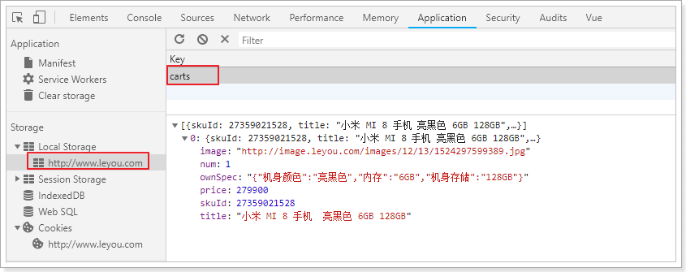
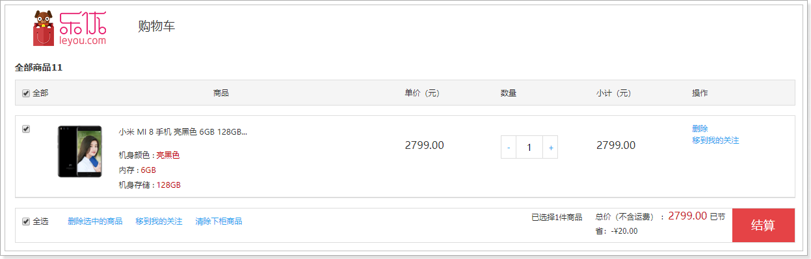
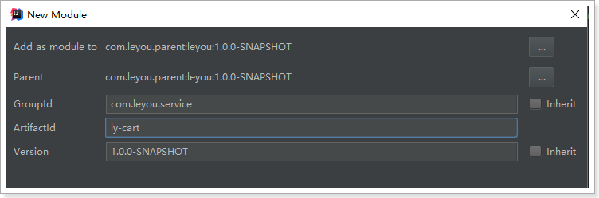

# 0.学习目标

- 了解购物车功能流程
- 实现未登录下购物车功能
- 实现已登录下购物车功能

# 1.购物车功能分析

## 1.1.需求

需求描述：

- 用户可以在登录状态下将商品添加到购物车
- 用户可以在未登录状态下将商品添加到购物车
- 用户可以使用购物车一起结算下单
- 用户可以查询自己的购物车
- 用户可以在购物车中可以修改购买商品的数量。
- 用户可以在购物车中删除商品。
- *在购物车中展示商品优惠信息*
- 提示购物车商品价格变化
- 对商品结算下单


## 1.2.业务分析

在需求描述中，不管用户是否登录，都需要实现加入购物车功能，那么已登录和未登录下，购物车数据应该存放在哪里呢？

> 未登录购物车

用户如果未登录，将数据保存在服务端存在一些问题：

- 无法确定用户身份，需要借助与客户端存储识别身份
- 服务端数据存储压力增加，而且可能是无效数据

那么我们应该用把数据保存在客户端，这样每个用户保存自己的数据，就不存在身份识别的问题了，而且也解决了服务端数据存储压力问题。

> 已登录购物车

用户登录时，数据保存在哪里呢？

大家首先想到的应该是数据库，不过购物车数据比较特殊，读和写都比较频繁，存储数据库压力会比较大。因此我们可以考虑存入Redis中。

不过大家可能会担心Redis存储空间问题，我们可以效仿淘宝，限制购物车最多只能添加99件商品，或者更少。


# 2.未登录购物车

## 2.1.数据结构

首先分析一下未登录购物车的数据结构。

我们看下页面展示需要什么数据：


因此每一个购物车信息，都是一个对象，包含：

```js
{
    skuId:2131241,
    title:"小米6",
    image:"",
    price:190000,
    num:1,
    ownSpec:"{"机身颜色":"陶瓷黑尊享版","内存":"6GB","机身存储":"128GB"}"
}
```

另外，购物车中不止一条数据，因此最终会是对象的数组。即：

```js
[
    {...},{...},{...}
]
```


## 2.2.web本地存储

知道了数据结构，下一个问题，就是如何保存购物车数据。前面我们分析过，可以使用Localstorage来实现。Localstorage是web本地存储的一种，那么，什么是web本地存储呢？

### 2.2.1.什么是web本地存储？


web本地存储主要有两种方式：

- LocalStorage：localStorage 方法存储的数据没有时间限制。第二天、第二周或下一年之后，数据依然可用。 
- SessionStorage：sessionStorage 方法针对一个 session 进行数据存储。当用户关闭浏览器窗口后，数据会被删除。 


### 2.2.2.LocalStorage的用法

语法非常简单：

 

```js
localStorage.setItem("key","value"); // 存储数据
localStorage.getItem("key"); // 获取数据
localStorage.removeItem("key"); // 删除数据
```

注意：**localStorage和SessionStorage都只能保存字符串**。

不过，在我们的common.js中，已经对localStorage进行了简单的封装：

 


示例：

 

## 2.3.添加购物车

购物车的前端js和页面都已经实现好了，我们在商品详情页面，点击加入购物车按钮：

 

即可将数据加入localstorage中：



同时，页面会跳转到购物车列表页面，不过，现在看不到任何商品：


## 2.4.查询购物车

> 业务分析

我们进入购物车列表页，会看到控制台记录了一次请求：

 

这其实是在渲染前，要查询sku信息。

可能大家会问，之前的购物车数据中，已经有了图片、价格等信息，为什么这里还要查询sku数据呢？

还记得之前我们的需求吗，我们要做价格对比，而且购物车中的商品很可能已经下架了，需要去查询并且做出判断，在页面中渲染。

> 商品sku查询接口

分析请求：

- 请求方式：Get
- 请求路径：/sku/list/ids
- 请求参数：ids，是购物车中多个sku的id以`,`分割的字符串
- 返回结果：sku的集合，里面需要有价格、库存，用来提示用户

代码：

controller：

```java
@GetMapping("sku/list/ids")
public ResponseEntity<List<Sku>> querySkuByIds(@RequestParam("ids")List<Long> ids){
    return ResponseEntity.ok(goodsService.querySkuByIds(ids));
}
```

Service：

```java
public List<Sku> querySkuByIds(List<Long> ids) {
        // 查询sku
        List<Sku> skus = skuMapper.selectByIdList(ids);
        if (CollectionUtils.isEmpty(skus)) {
            throw new LyException(HttpStatus.NOT_FOUND, "商品查询失败！");
        }
        // 填充库存
        fillStock(ids, skus);
        return skus;
    }

    private void fillStock(List<Long> ids, List<Sku> skus) {
      	// 查询库存
        List<Stock> stocks = stockMapper.selectByIdList(ids);
        if (CollectionUtils.isEmpty(stocks)) {
            throw new LyException(HttpStatus.NOT_FOUND, "库存查询失败！");
        }
        // 把库存转为map，key是skuId，值是库存
        Map<Long, Integer> stockMap = stocks.stream()
                .collect(Collectors.toMap(s -> s.getSkuId(), s -> s.getStock()));

        // 保存库存到sku
        for (Sku sku : skus) {
            sku.setStock(stockMap.get(sku.getId()));
        }
    }
```

刷新购物车页面，查看：




## 2.5.修改和删除购物车

页面已经实现，都是直接使用localstorage实现，离线即可完成，无需与后台服务端交互。


# 3.搭建购物车服务

接下来是已登录的购物车，我们需要创建独立微服务，实现购物车功能。

## 3.1.创建module




## 3.2.pom依赖

```xml
<?xml version="1.0" encoding="UTF-8"?>
<project xmlns="http://maven.apache.org/POM/4.0.0"
         xmlns:xsi="http://www.w3.org/2001/XMLSchema-instance"
         xsi:schemaLocation="http://maven.apache.org/POM/4.0.0 http://maven.apache.org/xsd/maven-4.0.0.xsd">
    <parent>
        <artifactId>leyou</artifactId>
        <groupId>com.leyou.parent</groupId>
        <version>1.0.0-SNAPSHOT</version>
    </parent>
    <modelVersion>4.0.0</modelVersion>

    <groupId>com.leyou.service</groupId>
    <artifactId>ly-cart</artifactId>
    <version>1.0.0-SNAPSHOT</version>

    <dependencies>
        <dependency>
            <groupId>org.springframework.boot</groupId>
            <artifactId>spring-boot-starter-web</artifactId>
        </dependency>
        <dependency>
            <groupId>org.springframework.cloud</groupId>
            <artifactId>spring-cloud-starter-netflix-eureka-client</artifactId>
        </dependency>
        <dependency>
            <groupId>org.springframework.boot</groupId>
            <artifactId>spring-boot-starter-data-redis</artifactId>
        </dependency>
    </dependencies>
</project>
```

## 3.3.配置文件

```yaml
server:
  port: 8088
spring:
  application:
    name: cart-service
  redis:
    host: 192.168.56.101
eureka:
  client:
    service-url:
      defaultZone: http://127.0.0.1:10086/eureka
```

## 3.4.启动类

```java
@SpringBootApplication
@EnableDiscoveryClient
public class LyCartApplication {

    public static void main(String[] args) {
        SpringApplication.run(LyCartApplication.class, args);
    }
}
```


# 4.已登录购物车

接下来，我们完成已登录购物车。

## 4.1.添加登录校验

购物车系统只负责登录状态的购物车处理，因此需要添加登录校验，我们通过JWT鉴权即可实现。

### 4.1.1.引入JWT相关依赖

我们引入之前写的鉴权工具：`ly-auth-common`

```xml
<dependency>
    <groupId>com.leyou.service</groupId>
    <artifactId>ly-auth-common</artifactId>
    <version>1.0.0-SNAPSHOT</version>
</dependency>
```

### 4.1.2.配置公钥

```yaml
ly:
  jwt:
    pubKeyPath: D:/heima/rsa/rsa.pub # 公钥地址
    cookieName: LY_TOKEN # cookie的名称
```

### 4.1.3.加载公钥

 

代码：

```java
@ConfigurationProperties(prefix = "ly.jwt")
public class JwtProperties {

    private String pubKeyPath;// 公钥

    private PublicKey publicKey; // 公钥

    private String cookieName;

    private static final Logger logger = LoggerFactory.getLogger(JwtProperties.class);

    @PostConstruct
    public void init(){
        try {
            // 获取公钥和私钥
            this.publicKey = RsaUtils.getPublicKey(pubKeyPath);
        } catch (Exception e) {
            logger.error("初始化公钥失败！", e);
            throw new RuntimeException();
        }
    }

    public String getPubKeyPath() {
        return pubKeyPath;
    }

    public void setPubKeyPath(String pubKeyPath) {
        this.pubKeyPath = pubKeyPath;
    }

    public PublicKey getPublicKey() {
        return publicKey;
    }

    public void setPublicKey(PublicKey publicKey) {
        this.publicKey = publicKey;
    }

    public String getCookieName() {
        return cookieName;
    }

    public void setCookieName(String cookieName) {
        this.cookieName = cookieName;
    }
}
```


### 4.1.4.编写过滤器

因为很多接口都需要进行登录，我们直接编写SpringMVC拦截器，进行统一登录校验。同时，我们还要把解析得到的用户信息保存起来，以便后续的接口可以使用。

 

代码：

```java
public class LoginInterceptor extends HandlerInterceptorAdapter {

    private JwtProperties jwtProperties;

    // 定义一个线程域，存放登录用户
    private static final ThreadLocal<UserInfo> tl = new ThreadLocal<>();

    public LoginInterceptor(JwtProperties jwtProperties) {
        this.jwtProperties = jwtProperties;
    }

    @Override
    public boolean preHandle(HttpServletRequest request, HttpServletResponse response, Object handler) throws Exception {
        // 查询token
        String token = CookieUtils.getCookieValue(request, "LY_TOKEN");
        if (StringUtils.isBlank(token)) {
            // 未登录,返回401
            response.setStatus(HttpStatus.UNAUTHORIZED.value());
            return false;
        }
        // 有token，查询用户信息
        try {
            // 解析成功，证明已经登录
            UserInfo user = JwtUtils.getInfoFromToken(token, jwtProperties.getPublicKey());
            // 放入线程域
            tl.set(user);
            return true;
        } catch (Exception e){
            // 抛出异常，证明未登录,返回401
            response.setStatus(HttpStatus.UNAUTHORIZED.value());
            return false;
        }

    }

    @Override
    public void afterCompletion(HttpServletRequest request, HttpServletResponse response, Object handler, Exception ex) throws Exception {
        tl.remove();
    }

    public static UserInfo getLoginUser() {
        return tl.get();
    }
}
```

注意：

- 这里我们使用了`ThreadLocal`来存储查询到的用户信息，线程内共享，因此请求到达`Controller`后可以共享User
- 并且对外提供了静态的方法：`getLoginUser()`来获取User信息


### 4.1.5.配置过滤器

配置SpringMVC，使过滤器生效：

 

```java
@Configuration
@EnableConfigurationProperties(JwtProperties.class)
public class MvcConfig implements WebMvcConfigurer {

    @Autowired
    private JwtProperties prop;

    @Override
    public void addInterceptors(InterceptorRegistry registry) {
        registry.addInterceptor(new LoginInterceptor(prop)).addPathPatterns("/**");
    }
}
```


## 4.2.后台购物车设计

### 数据结构设计

当用户登录时，我们需要把购物车数据保存到后台，可以选择保存在数据库。但是购物车是一个读写频率很高的数据。因此我们这里选择读写效率比较高的Redis作为购物车存储。

Redis有5种不同数据结构，这里选择哪一种比较合适呢？

- 首先不同用户应该有独立的购物车，因此购物车应该以用户的作为key来存储，Value是用户的所有购物车信息。这样看来基本的`k-v`结构就可以了。
- 但是，我们对购物车中的商品进行增、删、改操作，基本都需要根据商品id进行判断，为了方便后期处理，我们的购物车也应该是`k-v`结构，key是商品id，value才是这个商品的购物车信息。

综上所述，我们的购物车结构是一个双层Map：Map<String,Map<String,String>>

- 第一层Map，Key是用户id
- 第二层Map，Key是购物车中商品id，值是购物车数据

### 实体类

后台的购物车结构与前台是一样的：

```java
@Data
public class Cart {
    private Long skuId;// 商品id
    private String title;// 标题
    private String image;// 图片
    private Long price;// 加入购物车时的价格
    private Integer num;// 购买数量
    private String ownSpec;// 商品规格参数
}
```


## 4.3.添加商品到购物车

### 4.3.1.页面发起请求：

我们再次回到商品详情页，登录以后，点击加入购物车，发现控制台发起了请求：

 

这里发起的是Json格式数据。那么我们后台也要以json接收。

### 4.3.2.后台添加购物车

#### controller

先分析一下：

- 请求方式：新增，肯定是Post
- 请求路径：/cart ，这个其实是Zuul路由的路径，我们可以不管
- 请求参数：Json对象，包含购物车的所有属性，我们可以用购物车对象介绍
- 返回结果：无

```java
@RequestMapping
public class CartController {

    @Autowired
    private CartService cartService;

    /**
     * 添加购物车
     *
     * @return
     */
    @PostMapping
    public ResponseEntity<Void> addCart(@RequestBody Cart cart) {
        this.cartService.addCart(cart);
        return ResponseEntity.ok().build();
    }
}
```

#### Service

这里我们不访问数据库，而是直接操作Redis。基本思路：

- 先查询之前的购物车数据
- 判断要添加的商品是否存在
  - 存在：则直接修改数量后写回Redis
  - 不存在：新建一条数据，然后写入Redis

代码：

```java
@Service
public class CartService {

    @Autowired
    private StringRedisTemplate redisTemplate;

    static final String KEY_PREFIX = "ly:cart:uid:";

    static final Logger logger = LoggerFactory.getLogger(CartService.class);

    public void addCart(Cart cart) {
        // 获取当前用户
        UserInfo user = UserInterceptor.getUser();
        String key = KEY_PREFIX + user.getId();

        // 获取商品id
        String hashKey = cart.getSkuId().toString();
        // 获取数量
        int num = cart.getNum();

        // 获取hash操作的对象
        BoundHashOperations<String, Object, Object> hashOps = redisTemplate.boundHashOps(key);
        // 判断要添加的商品是否存在
        if(hashOps.hasKey(hashKey)){
            // 存在，修改数量
            cart = JsonUtils.toBean(hashOps.get(hashKey).toString(), Cart.class);
            cart.setNum(num + cart.getNum());
        }
        // 写入redis
        hashOps.put(hashKey, JsonUtils.toString(cart));
    }
}

```


### 4.3.3.结果：

 


## 4.4.查询购物车

### 4.4.1.页面发起请求

我们进入购物车列表页面，然后刷新页面，查看控制台的请求：

 

### 4.4.2.后台实现

请求分析：

- 请求方式：Get
- 请求路径：/list
- 请求参数：无
- 返回结果：当前用户的购物车集合


> Controller

```java
/**
 * 查询购物车列表
 *
 * @return
 */
@GetMapping
public ResponseEntity<List<Cart>> queryCartList() {
    List<Cart> carts = this.cartService.queryCartList();
    if (carts == null) {
        return ResponseEntity.status(HttpStatus.NOT_FOUND).body(null);
    }
    return ResponseEntity.ok(carts);
}
```

> Service

```java
public List<Cart> queryCartList() {
        // 获取登录用户
        UserInfo user = LoginInterceptor.getLoginUser();

        // 判断是否存在购物车
        String key = KEY_PREFIX + user.getId();
        if(!this.redisTemplate.hasKey(key)){
            // 不存在，直接返回
            return null;
        }
        BoundHashOperations<String, Object, Object> hashOps = this.redisTemplate.boundHashOps(key);
        List<Object> carts = hashOps.values();
        // 判断是否有数据
        if(CollectionUtils.isEmpty(carts)){
            return null;
        }
        // 查询购物车数据
        return carts.stream().map(o -> JsonUtils.toBean(o.toString(), Cart.class)).collect(Collectors.toList());
    }
```


### 4.4.3.测试


## 4.5.修改商品数量

### 4.5.1.页面发起请求


 

 

### 4.5.2.后台实现

> Controller

```java
@PutMapping
public ResponseEntity<Void> updateNum(@RequestParam("skuId") Long skuId, 
                                      @RequestParam("num") Integer num) {
    this.cartService.updateNum(skuId, num);
    return ResponseEntity.ok().build();
}
```

> Service

```java
public void updateNum(Long id, Integer num) {
    // 获取当前用户
    UserInfo user = UserInterceptor.getUser();
    String key = KEY_PREFIX + user.getId();

    // 获取hash操作的对象
    BoundHashOperations<String, Object, Object> hashOps = redisTemplate.boundHashOps(key);

    if(!hashOps.hasKey(id.toString())){
        throw new RuntimeException("购物车商品不存在，用户："+user.getId() +", 商品：" + id);
    }
    // 查询购物车商品
    Cart c = JsonUtils.toBean(hashOps.get(id.toString()).toString(), Cart.class);
    // 修改数量
    c.setNum(num);

    // 写回redis
    hashOps.put(id.toString(), JsonUtils.toString(c));
}
```

## 4.6.删除购物车商品

### 4.6.1.页面发起请求

 

### 4.6.2.后台实现

> Controller

```java
@DeleteMapping("{skuId}")
public ResponseEntity<Void> deleteCart(@PathVariable("skuId") String skuId) {
    this.cartService.deleteCart(skuId);
    return ResponseEntity.ok().build();
}
```


> Service

```java
public void deleteCart(String skuId) {
    // 获取登录用户
    UserInfo user = LoginInterceptor.getLoginUser();
    String key = KEY_PREFIX + user.getId();
    this.redisTemplate.opsForHash().delete(key, skuId);
}
```


# 5.登录后购物车合并(作业)

当跳转到购物车页面，查询购物车列表前，需要判断用户登录状态，

- 如果登录：
  - 首先检查用户的LocalStorage中是否有购物车信息，
  - 如果有，则提交到后台保存，
  - 清空LocalStorage
- 如果未登录，直接查询即可


