# 0.学习目标

- 微信支付下单
- 生成二维码
- 实现支付回调
- 实现支付状态查询


# 1.创建订单微服务

加入购物车后，自然就要完成下单，我们接下来创建订单微服务：

## 1.1.搭建服务

### 创建model

maven工程：


选择位置：


### 依赖


```xml
<?xml version="1.0" encoding="UTF-8"?>
<project xmlns="http://maven.apache.org/POM/4.0.0"
         xmlns:xsi="http://www.w3.org/2001/XMLSchema-instance"
         xsi:schemaLocation="http://maven.apache.org/POM/4.0.0 http://maven.apache.org/xsd/maven-4.0.0.xsd">
    <parent>
        <groupId>com.leyou.parent</groupId>
        <artifactId>leyou</artifactId>
        <version>1.0.0-SNAPSHOT</version>
    </parent>
    <modelVersion>4.0.0</modelVersion>

    <groupId>com.leyou.service</groupId>
    <artifactId>ly-order</artifactId>
    <version>1.0.0-SNAPSHOT</version>

    <dependencies>
        <dependency>
            <groupId>org.springframework.cloud</groupId>
            <artifactId>spring-cloud-starter-netflix-eureka-client</artifactId>
        </dependency>
        <dependency>
            <groupId>org.springframework.boot</groupId>
            <artifactId>spring-boot-starter-web</artifactId>
        </dependency>
        <!-- 通用Mapper启动器 -->
        <dependency>
            <groupId>tk.mybatis</groupId>
            <artifactId>mapper-spring-boot-starter</artifactId>
        </dependency>
        <!-- mysql驱动 -->
        <dependency>
            <groupId>mysql</groupId>
            <artifactId>mysql-connector-java</artifactId>
        </dependency>
        <dependency>
            <groupId>com.leyou.service</groupId>
            <artifactId>ly-item-interface</artifactId>
            <version>${leyou.latest.version}</version>
        </dependency>
        <dependency>
            <groupId>com.leyou.common</groupId>
            <artifactId>ly-common</artifactId>
            <version>${leyou.latest.version}</version>
        </dependency>
        <dependency>
            <groupId>com.leyou.service</groupId>
            <artifactId>ly-auth-common</artifactId>
            <version>${leyou.latest.version}</version>
        </dependency>
        <dependency>
            <groupId>org.springframework.cloud</groupId>
            <artifactId>spring-cloud-starter-openfeign</artifactId>
        </dependency>
        <dependency>
            <groupId>com.github.pagehelper</groupId>
            <artifactId>pagehelper-spring-boot-starter</artifactId>
        </dependency>
        <dependency>
            <groupId>com.github.wxpay</groupId>
            <artifactId>wxpay-sdk</artifactId>
            <version>0.0.3</version>
        </dependency>
    </dependencies>
</project>
```


### 配置文件

application.yaml:

```yaml
server:
  port: 8089
spring:
  application:
    name: order-service
  datasource:
    url: jdbc:mysql://127.0.0.1:3306/heima
    username: root
    password: 123
    driver-class-name: com.mysql.jdbc.Driver
  jackson:
    default-property-inclusion: non_null
eureka:
  client:
    service-url:
      defaultZone: http://127.0.0.1:10086/eureka
mybatis:
  type-aliases-package: com.leyou.order.pojo

```

### 启动类

```java
@SpringBootApplication
@EnableDiscoveryClient
@EnableFeignClients
@MapperScan("com.leyou.order.mapper")
public class LyOrderApplication {

    public static void main(String[] args) {
        SpringApplication.run(LyOrderApplication.class, args);
    }
}
```


## 1.2.用户登录校验

### 1.2.1.配置密钥

```yaml
ly:
  jwt:
    pubKeyPath: C:/lesson/idea-space/ssh/id_rsa.pub # 公钥地址
    cookieName: LY_TOKEN # cookie的名称
```


### 1.2.2.加载属性

```java
@Data
@Slf4j
@ConfigurationProperties(prefix = "ly.jwt")
public class JwtProperties {

    private String pubKeyPath;// 公钥

    private PublicKey publicKey; // 公钥

    private String cookieName;

    @PostConstruct
    public void init(){
        try {
            // 获取公钥和私钥
            this.publicKey = RsaUtils.getPublicKey(pubKeyPath);
        } catch (Exception e) {
            log.error("初始化公钥失败！", e);
            throw new RuntimeException();
        }
    }
}
```


### 1.2.3.拦截器

```java
public class LoginInterceptor extends HandlerInterceptorAdapter {

    private JwtProperties jwtProperties;

    // 定义一个线程域，存放登录用户
    private static final ThreadLocal<UserInfo> tl = new ThreadLocal<>();

    public LoginInterceptor(JwtProperties jwtProperties) {
        this.jwtProperties = jwtProperties;
    }

    @Override
    public boolean preHandle(HttpServletRequest request, HttpServletResponse response, Object handler) throws Exception {
        // 有token，查询用户信息
        try {
            // 解析成功，证明已经登录
            UserInfo user = JwtUtils.getInfoFromToken(token, jwtProperties.getPublicKey());
            // 放入线程域
            tl.set(user);
            return true;
        } catch (Exception e) {
            // 抛出异常，证明未登录或超时,返回401
            response.setStatus(HttpStatus.UNAUTHORIZED.value());
            return false;
        }
    }

    @Override
    public void afterCompletion(HttpServletRequest request, HttpServletResponse response, Object handler, Exception ex) throws Exception {
        tl.remove();
    }

    public static UserInfo getLoginUser() {
        return tl.get();
    }
}
```

## 1.3.数据结构

订单表：

```sql
CREATE TABLE `tb_order` (
  `order_id` bigint(20) NOT NULL COMMENT '订单id',
  `total_pay` bigint(20) NOT NULL COMMENT '总金额，单位为分',
  `actual_pay` bigint(20) NOT NULL COMMENT '实付金额。单位:分。如:20007，表示:200元7分',
  `promotion_ids` varchar(255) COLLATE utf8_bin DEFAULT '',
  `payment_type` tinyint(1) unsigned zerofill NOT NULL COMMENT '支付类型，1、在线支付，2、货到付款',
  `post_fee` bigint(20) NOT NULL COMMENT '邮费。单位:分。如:20007，表示:200元7分',
  `create_time` datetime DEFAULT NULL COMMENT '订单创建时间',
  `shipping_name` varchar(20) COLLATE utf8_bin DEFAULT NULL COMMENT '物流名称',
  `shipping_code` varchar(20) COLLATE utf8_bin DEFAULT NULL COMMENT '物流单号',
  `user_id` varchar(50) COLLATE utf8_bin NOT NULL COMMENT '用户id',
  `buyer_message` varchar(100) COLLATE utf8_bin DEFAULT NULL COMMENT '买家留言',
  `buyer_nick` varchar(50) COLLATE utf8_bin NOT NULL COMMENT '买家昵称',
  `buyer_rate` tinyint(1) DEFAULT NULL COMMENT '买家是否已经评价,0未评价，1已评价',
  `receiver_state` varchar(100) COLLATE utf8_bin DEFAULT '' COMMENT '收获地址（省）',
  `receiver_city` varchar(255) COLLATE utf8_bin DEFAULT '' COMMENT '收获地址（市）',
  `receiver_district` varchar(255) COLLATE utf8_bin DEFAULT '' COMMENT '收获地址（区/县）',
  `receiver_address` varchar(255) COLLATE utf8_bin DEFAULT '' COMMENT '收获地址（街道、住址等详细地址）',
  `receiver_mobile` varchar(12) COLLATE utf8_bin DEFAULT NULL COMMENT '收货人手机',
  `receiver_zip` varchar(15) COLLATE utf8_bin DEFAULT NULL COMMENT '收货人邮编',
  `receiver` varchar(50) COLLATE utf8_bin DEFAULT NULL COMMENT '收货人',
  `invoice_type` int(1) DEFAULT '0' COMMENT '发票类型(0无发票1普通发票，2电子发票，3增值税发票)',
  `source_type` int(1) DEFAULT '2' COMMENT '订单来源：1:app端，2：pc端，3：M端，4：微信端，5：手机qq端',
  PRIMARY KEY (`order_id`),
  KEY `create_time` (`create_time`),
  KEY `buyer_nick` (`buyer_nick`)
) ENGINE=InnoDB DEFAULT CHARSET=utf8 COLLATE=utf8_bin;
```


订单条目：

```sql
CREATE TABLE `tb_order_detail` (
  `id` bigint(20) NOT NULL AUTO_INCREMENT COMMENT '订单详情id ',
  `order_id` bigint(20) NOT NULL COMMENT '订单id',
  `sku_id` bigint(20) NOT NULL COMMENT 'sku商品id',
  `num` int(11) NOT NULL COMMENT '购买数量',
  `title` varchar(200) NOT NULL COMMENT '商品标题',
  `own_spec` varchar(1000) DEFAULT '' COMMENT '商品动态属性键值集',
  `price` bigint(20) NOT NULL COMMENT '价格,单位：分',
  `image` varchar(200) DEFAULT '' COMMENT '商品图片',
  PRIMARY KEY (`id`),
  KEY `key_order_id` (`order_id`) USING BTREE
) ENGINE=InnoDB DEFAULT CHARSET=utf8 COMMENT='订单详情表';

```

订单状态：

```sql
CREATE TABLE `tb_order_status` (
  `order_id` bigint(20) NOT NULL COMMENT '订单id',
  `status` int(1) DEFAULT NULL COMMENT '状态：1、未付款 2、已付款,未发货 3、已发货,未确认 4、交易成功 5、交易关闭 6、已评价',
  `create_time` datetime DEFAULT NULL COMMENT '订单创建时间',
  `payment_time` datetime DEFAULT NULL COMMENT '付款时间',
  `consign_time` datetime DEFAULT NULL COMMENT '发货时间',
  `end_time` datetime DEFAULT NULL COMMENT '交易完成时间',
  `close_time` datetime DEFAULT NULL COMMENT '交易关闭时间',
  `comment_time` datetime DEFAULT NULL ON UPDATE CURRENT_TIMESTAMP COMMENT '评价时间',
  PRIMARY KEY (`order_id`),
  KEY `status` (`status`) USING BTREE
) ENGINE=InnoDB DEFAULT CHARSET=utf8 COMMENT='订单状态表';


```

## 1.4.基本代码

### 实体类

Order:

```java
@Data
@Table(name = "tb_order")
public class Order {

    @Id
    private Long orderId;// id
    private Long totalPay;// 总金额
    private Long actualPay;// 实付金额
    private Integer paymentType; // 支付类型，1、在线支付，2、货到付款

    private String promotionIds; // 参与促销活动的id
    private Long postFee = 0L;// 邮费
    private Date createTime;// 创建时间
    private String shippingName;// 物流名称
    private String shippingCode;// 物流单号
    private Long userId;// 用户id
    private String buyerMessage;// 买家留言
    private String buyerNick;// 买家昵称
    private Boolean buyerRate;// 买家是否已经评价
    private String receiver; // 收货人全名
    private String receiverMobile; // 移动电话
    private String receiverState; // 省份
    private String receiverCity; // 城市
    private String receiverDistrict; // 区/县
    private String receiverAddress; // 收货地址，如：xx路xx号
    private String receiverZip; // 邮政编码,如：310001
    private Integer invoiceType = 0;// 发票类型，0无发票，1普通发票，2电子发票，3增值税发票
    private Integer sourceType = 1;// 订单来源 1:app端，2：pc端，3：M端，4：微信端，5：手机qq端

    @Transient
    private OrderStatus orderStatus;

    @Transient
    private List<OrderDetail> orderDetails;
}

```

OrderDetail：

```java
@Data
@Table(name = "tb_order_detail")
public class OrderDetail {

    @Id
    @KeySql(useGeneratedKeys = true)
    private Long id;

    private Long orderId;// 订单id

    private Long skuId;// 商品id

    private Integer num;// 商品购买数量

    private String title;// 商品标题

    private Long price;// 商品单价

    private String ownSpec;// 商品规格数据

    private String image;// 图片
}
```

OrderStatus：

```java
@Data
@Table(name = "tb_order_status")
public class OrderStatus {

    @Id
    private Long orderId;
    
    private Integer status;

    private Date createTime;// 创建时间

    private Date paymentTime;// 付款时间

    private Date consignTime;// 发货时间

    private Date endTime;// 交易结束时间

    private Date closeTime;// 交易关闭时间

    private Date commentTime;// 评价时间
}
```

### mapper

通用mapper和service略

### 订单状态枚举

此处我们为订单状态定义了枚举，方便订单状态的记录：

```java
public enum  OrderStatusEnum {
    INIT(1, "初始化，未付款"),
    PAY_UP(2, "已付款，未发货"),
    DELIVERED(3, "已发货，未确认"),
    CONFIRMED(4, "已确认,未评价"),
    CLOSED(5, "已关闭"),
    RATED(6, "已评价，交易结束")
    ;

    private Integer code;
    private String msg;

    OrderStatusEnum(Integer code, String msg) {
        this.code = code;
        this.msg = msg;
    }

    public Integer value(){
        return this.code;
    }

    public String msg(){
        return msg;
    }
}
```


# 2.订单结算页

在购物车页面，用户会点击`去结算`按钮:


随后就会进入订单结算页，展示用户正在购买的商品，并且需要用户选择收货人地址、付款方式等信息：


这个页面需要完成的功能如下：

- 收件人信息展示、选择
- 支付方式选择
- 商品清单展示


## 2.1.收货人信息（作业）


这里的收货人信息肯定是当前登录用户的收货地址。所以需要根据当前登录用户去查询，目前我们在页面是写的假数据：

 

大家可以在在后台提供地址的增删改查接口，然后页面加载时根据当前登录用户查询，而后赋值给addresses即可。

## 2.2.支付方式

支付方式有2种：

- 微信支付
- 货到付款

与我们订单数据中的`paymentType`关联：


所以我们可以在Vue实例中定义一个属性来记录支付方式：

 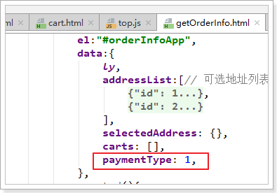

然后在页面渲染时与这个变量关联：


效果：

 

## 2.3.商品清单

商品清单是通过localstorage从购物车页面传递过来的，到了本页从localstorage取出并且记录在data中：


随后在页面渲染完成：

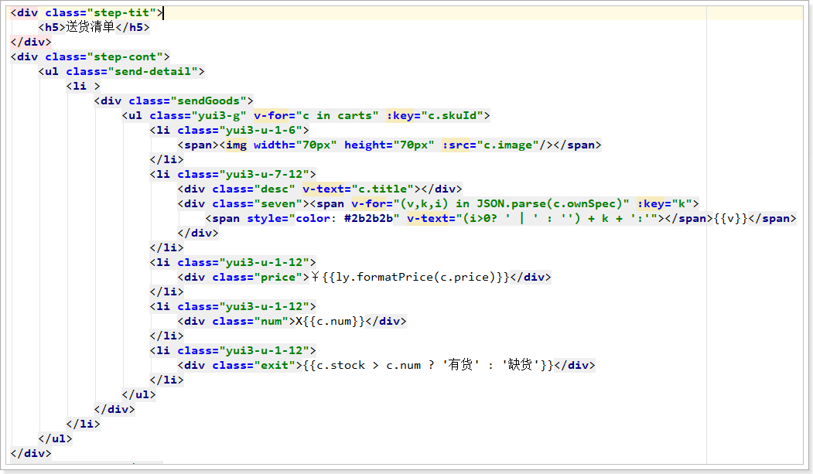

## 2.4.提交订单

当点击`提交订单`按钮，会看到控制台发起请求：

 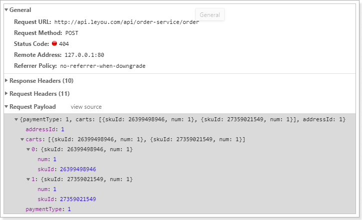

参数说明：

- addressId：收货人地址信息的id，需要去用户中心查询收货人地址
- carts：购物车中的商品数据，可以有多个对象
  - num：购物车中指定商品的购买数量
  - skuId：购物车中的某商品的id
- paymentType：付款方式：1 在线支付，2 货到付款

对应的JS代码：

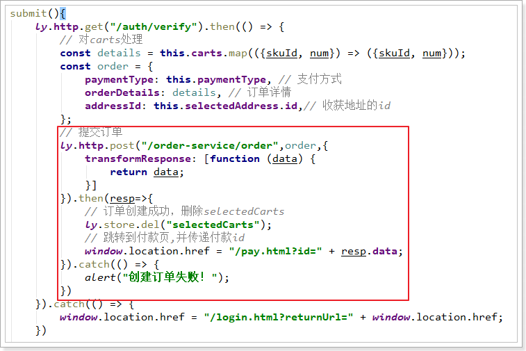

可以看到返回的提交订单成功，返回的应该是订单的编号id。


# 3.创建订单接口

订单信息共有3张表，内容很多，但是前台提交的数据却只很少，也就是说我们需要自己填充很多的数据。

## 3.1.Controller

请求分析：

- 请求方式：POST

- 请求路径：/order

- 请求参数：包含收货人地址id、付款方式、购物车商品数据集合的json内容，我们需要封装一个对象来接收：

  ```java
  @Data
  @AllArgsConstructor
  @NoArgsConstructor
  public class OrderDTO {
      @NotNull
      private Long addressId; // 收获人地址id
      @NotNull
      private Integer paymentType;// 付款类型
      @NotNull
      private List<CartDTO> carts;// 订单详情
  }
  ```

  其中的购物车数据再次封装对象：

  ```java
  @Data
  @NoArgsConstructor
  @AllArgsConstructor
  public class CartDTO {
      private Long skuId;// 商品skuId
      private Integer num;// 购买数量
  }
  ```

- 返回结果：订单id

具体代码：

```java
@RestController
public class OrderController {

    @Autowired
    private OrderService orderService;

    @PostMapping
    public ResponseEntity<Long> createOrder(@RequestBody @Valid OrderDTO orderDTO) {
        return ResponseEntity.status(HttpStatus.CREATED)
            .body(this.orderService.createOrder(orderDTO));
    }
}
```


## 3.2.Service

创建订单逻辑比较复杂，需要组装订单数据，基本步骤如下：

- 获取登录用户信息
- 生成订单编号，初始化订单基本信息
- 查询商品信息
- 封装OrderDetail信息
- 计算总金额、实付金额
- 保存订单状态信息
- 删除购物车中已购买商品
- 减库存

### 3.2.1.生成订单编号

> 订单id的特殊性

订单数据非常庞大，将来一定会做分库分表。那么这种情况下， 要保证id的唯一，就不能靠数据库自增，而是自己来实现算法，生成唯一id。

> 雪花算法

这里的订单id是通过一个工具类生成的：

 

而工具类所采用的生成id算法，是由Twitter公司开源的snowflake（雪花）算法。

> 简单原理

雪花算法会生成一个64位的二进制数据，为一个Long型。(转换成字符串后长度最多19) ，其基本结构：

 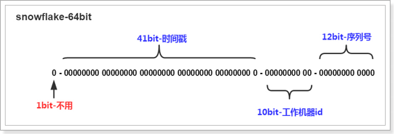

第一位：为未使用

第二部分：41位为毫秒级时间(41位的长度可以使用69年)

第三部分：5位datacenterId和5位workerId(10位的长度最多支持部署1024个节点）

第四部分：最后12位是毫秒内的计数（12位的计数顺序号支持每个节点每毫秒产生4096个ID序号）

snowflake生成的ID整体上按照时间自增排序，并且整个分布式系统内不会产生ID碰撞（由datacenter和workerId作区分），并且效率较高。经测试snowflake每秒能够产生26万个ID。

> 配置

为了保证不重复，我们在application.yaml中给每个部署的节点都配置机器id：

```yaml
ly:
  worker:
    workerId: 1
    dataCenterId: 1
```

加载属性：

```java
@Data
@ConfigurationProperties(prefix = "ly.worker")
public class IdWorkerProperties {

    private long workerId;// 当前机器id

    private long dataCenterId;// 序列号
}
```

编写配置类：

```java
@Configuration
@EnableConfigurationProperties(IdWorkerProperties.class)
public class IdWorkerConfig {

    @Bean
    public IdWorker idWorker(IdWorkerProperties prop) {
        return new IdWorker(prop.getWorkerId(), prop.getDataCenterId());
    }
}
```


### 3.2.2.查询sku的接口

创建订单过程中，肯定需要查询sku信息，因此我们需要在商品微服务提供根据skuId查询sku的接口：

在`ly-item-interface`的`GoodsApi`中添加接口：

```java
@GetMapping("sku/list/ids")
List<Sku> querySkuByIds(@RequestParam("ids")List<Long> ids);
```

在`ly-item-service`的`GoodsController`中编写业务：

```java
@GetMapping("sku/list/ids")
public ResponseEntity<List<Sku>> querySkuByIds(@RequestParam("ids")List<Long> ids){
    return ResponseEntity.ok(goodsService.querySkuByIds(ids));
}
```

service和mapper代码略

### 3.2.3.减库存接口

创建订单，肯定需要减库存，我们还要在商品微服务提供减库存接口

在`ly-item-interface`的`GoodsApi`中添加接口：

```java
@PostMapping("stock/decrease")
void decreaseStock(@RequestBody List<CartDTO> cartDTOS);
```

在`ly-item-service`的`GoodsController`中编写业务：

```java
@PostMapping("stock/decrease")
public ResponseEntity<Void> decreaseStock(@RequestBody List<CartDTO> cartDTOS){
    goodsService.decreaseStock(cartDTOS);
    return ResponseEntity.status(HttpStatus.NO_CONTENT).build();
}
```

在`ly-item-service`的`GoodsServicer`中编写业务

```java
@Transactional
public void decreaseStock(List<CartDTO> cartDTOS) {
    for (CartDTO cartDTO : cartDTOS) {
        int count = stockMapper.decreaseStock(cartDTO.getSkuId(), cartDTO.getNum());
        if(count != 1){
            throw new RuntimeException("库存不足");
        }
    }
}
```

此处采用了手写Sql在mapper中：

```java
@Update("UPDATE tb_stock SET stock = stock - #{num} WHERE sku_id = #{id} AND stock >= #{num}")
int decreaseStock(@Param("id") Long id, @Param("num") Integer num);
```

这里减库存并没有采用先查询库存，判断充足才减库存的方案，那样会有线程安全问题，当然可以通过加锁解决。不过我们此处为了效率，并没有使用悲观锁，而是对库存采用了乐观锁方案


### 3.2.4.准备物流假数据

我们前端页面传来的是addressId，我们需要根据id查询物流信息，但是因为还没做物流地址管理。所以我们准备一些假数据。

首先是实体类：

```java
package com.leyou.order.dto;

import lombok.Data;

@Data
public class AddressDTO {
    private Long id;
    private String name;// 收件人姓名
    private String phone;// 电话
    private String state;// 省份
    private String city;// 城市
    private String district;// 区
    private String address;// 街道地址
    private String  zipCode;// 邮编
    private Boolean isDefault;
}

```

然后是一个常量类：

```java
package com.leyou.constants;

import com.leyou.order.dto.AddressDTO;

import java.util.ArrayList;
import java.util.List;

public abstract class AddressConstants {
    public static final List<AddressDTO> addressList = new ArrayList<AddressDTO>(){
        {
            AddressDTO address = new AddressDTO();
            address.setId(1L);
            address.setAddress("航头镇航头路18号传智播客 3号楼");
            address.setCity("上海");
            address.setDistrict("浦东新区");
            address.setName("虎哥");
            address.setPhone("15800000000");
            address.setState("上海");
            address.setZipCode("210000");
            address.setIsDefault(true);
            add(address);

            AddressDTO address2 = new AddressDTO();
            address2.setId(2L);
            address2.setAddress("天堂路 3号楼");
            address2.setCity("北京");
            address2.setDistrict("朝阳区");
            address2.setName("张三");
            address2.setPhone("13600000000");
            address2.setState("北京");
            address2.setZipCode("100000");
            address2.setIsDefault(false);
            add(address2);
        }
    };

    public static AddressDTO findById(Long id){
        for (AddressDTO addressDTO : addressList) {
            if(addressDTO.getId() == id) return addressDTO;
        }
        return null;
    }
}

```


### 3.2.5.创建订单代码

完整代码如下：

```java
@Slf4j
@Service
public class OrderService {

    @Autowired
    private IdWorker idWorker;

    @Autowired
    private GoodsClient goodsClient;

    @Autowired
    private OrderMapper orderMapper;

    @Autowired
    private OrderDetailMapper detailMapper;

    @Autowired
    private OrderStatusMapper statusMapper;

    @Transactional
    public Long createOrder(OrderDTO orderDTO) {
        // 0.生成订单的id
        long orderId = idWorker.nextId();
        // 1、组织order数据
        Order order = new Order();
        // 1.1.订单基本数据
        order.setOrderId(orderId);
        order.setPaymentType(orderDTO.getPaymentType());
        order.setPostFee(0L);// TODO 调用物流无法，根据地址计算邮费
        order.setCreateTime(new Date());

        // 1.2.用户数据
        // 获取用户信息
        UserInfo user = LoginInterceptor.getUser();
        order.setUserId(user.getId());
        order.setBuyerNick(user.getUsername());
        order.setBuyerRate(false);

        // 1.3.收货人信息
        Long addressId = orderDTO.getAddressId();
        AddressDTO address = AddressConstants.findById(addressId);
        if(address == null){
            // 商品不存在，抛出异常
            throw new LyException(HttpStatus.BAD_REQUEST, "收获地址不存在");
        }
        order.setReceiver(address.getName());
        order.setReceiverState(address.getState());
        order.setReceiverCity(address.getCity());
        order.setReceiverDistrict(address.getDistrict());
        order.setReceiverAddress(address.getAddress());
        order.setReceiverZip(address.getZipCode());
        order.setReceiverMobile(address.getPhone());

        // 1.4.付款金额相关
        Map<Long, Integer> skuNumMap = orderDTO.getCarts()
                .stream().collect(Collectors.toMap(c -> c.getSkuId(), c -> c.getNum()));
        // 查询商品信息
        List<Sku> skus = goodsClient.querySkuListByIds(new ArrayList<>(skuNumMap.keySet()));
        if(CollectionUtils.isEmpty(skus)){
            // 商品不存在，抛出异常
            throw new LyException(HttpStatus.BAD_REQUEST, "商品不存在, 无法下单");
        }
        Long totalPay = 0L;

        // 2、组织OrderDetail数据
        List<OrderDetail> orderDetails = new ArrayList<>();
        for (Sku sku : skus) {
            Integer num = skuNumMap.get(sku.getId());
            totalPay += sku.getPrice() * num;
            // 组织detail
            OrderDetail detail = new OrderDetail();
            detail.setOrderId(orderId);
            detail.setOwnSpec(sku.getOwnSpec());
            detail.setTitle(sku.getTitle());
            detail.setPrice(sku.getPrice());
            detail.setSkuId(sku.getId());
            detail.setNum(num);
            detail.setImage(StringUtils.substringBefore(sku.getImages(), ","));
            orderDetails.add(detail);
        }
        order.setTotalPay(totalPay);
        order.setActualPay(totalPay + order.getPostFee());// TODO 还要减去优惠金额

        // 保存order
        orderMapper.insertSelective(order);

        // 保存detail
        detailMapper.insertList(orderDetails);

        // 3、组织OrderStatus数据
        OrderStatus status = new OrderStatus();
        status.setOrderId(orderId);
        status.setCreateTime(new Date());
        status.setStatus(OrderStatusEnum.INIT.value());

        statusMapper.insertSelective(status);

        // 4、减库存
        goodsClient.decreaseStock(orderDTO.getCarts());

        log.info("生成订单，订单编号：{}，用户id：{}", orderId, user.getId());
        return orderId;
    }
}
```


### 3.2.5.删除购物车中已经下单商品（作业）

这里删除购物车中商品，我们可以采用异步的MQ去完成，通过mq通知购物车系统，下单成功，可以删除商品了。在消息体中把sku的id传递。

## 3.3.测试

启动项目，在页面再次点击提交订单，发现提交成功，跳转到了支付页面：

 

查看数据库，发现订单已经生成：

订单


订单详情：


订单状态：

 


# 4.微信支付

## 4.1.介绍

微信支付官方文档：https://pay.weixin.qq.com/index.php/core/home/login?return_url=%2F


我们选择开发文档，而后进入选择页面：


选择扫码支付：


此处我们使用模式二来开发：

## 4.2.开发流程

模式二与模式一相比，流程更为简单，不依赖设置的回调支付URL。

商户后台系统先调用微信支付的统一下单接口，微信后台系统返回链接参数code_url；

商户后台系统将code_url值生成二维码图片，用户使用微信客户端扫码后发起支付。

注意：code_url有效期为2小时，过期后扫码不能再发起支付。 

流程图：

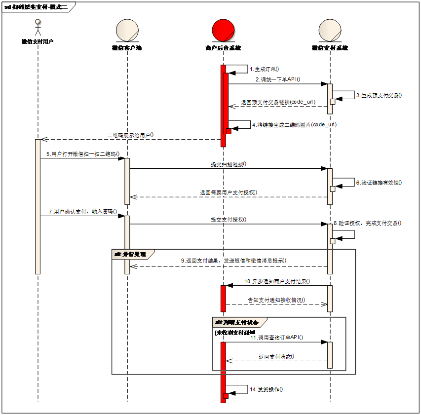

这里我们把商户（我们）要做的事情总结一下：

- 1、商户生成订单
- 2、商户调用微信下单接口，获取预交易的链接
- 3、商户将链接生成二维码图片，展示给用户；
- 4、支付结果通知：
  - 微信异步通知商户支付结果，商户告知微信支付接收情况
  - 商户如果没有收到通知，可以调用接口，查询支付状态
- 5、如果支付成功，发货，修改订单状态


在前面的业务中，我们已经完成了：

- 1、生成订单

接下来，我们需要做的是：

- 2、调用微信下单接口，生成链接。
- 3、根据链接生成二维码图片
- 4、支付成功后修改订单状态


## 4.3.下单并生成支付链接

### 4.3.1.API说明

在微信支付文档中，可以查询到下面的信息：

> 支付路径

URL地址：https://api.mch.weixin.qq.com/pay/unifiedorder


> 请求参数

| 字段名     | 变量名           | 必填 | 类型        | 示例值                                 | 描述                                                         |
| :--------- | ---------------- | ---- | ----------- | -------------------------------------- | ------------------------------------------------------------ |
| 公众账号ID | appid            | 是   | String(32)  | wxd678efh56                            | 微信支付分配的公众账号ID                                     |
| 商户号     | mch_id           | 是   | String(32)  | 1230000109                             | 微信支付分配的商户号                                         |
| 随机字符串 | nonce_str        | 是   | String(32)  | 5K8264ILT                              | 随机字符串，长度要求在32位以内。推荐[随机数生成算法](https://pay.weixin.qq.com/wiki/doc/api/native.php?chapter=4_3) |
| 签名       | sign             | 是   | String(32)  | C380BEC2B                              | 通过签名算法计算得出的签名值，详见[签名生成算法](https://pay.weixin.qq.com/wiki/doc/api/native.php?chapter=4_3) |
| 商品描述   | body             | 是   | String(128) | 乐优手机                               | 商品简单描述，该字段请按照规范传递，具体请见[参数规定](https://pay.weixin.qq.com/wiki/doc/api/native.php?chapter=4_2) |
| 商户订单号 | out_trade_no     | 是   | String(32)  | 20150806125                            | 商户系统内部订单号，要求32个字符内，只能是数字、大小写字母_-\|* 且在同一个商户号下唯一。详见[商户订单号](https://pay.weixin.qq.com/wiki/doc/api/native.php?chapter=4_2) |
| 标价金额   | total_fee        | 是   | Int         | 88                                     | 订单总金额，单位为分，详见[支付金额](https://pay.weixin.qq.com/wiki/doc/api/native.php?chapter=4_2) |
| 终端IP     | spbill_create_ip | 是   | String(16)  | 123.12.12.123                          | APP和网页支付提交用户端ip，Native支付填调用微信支付API的机器IP。 |
| 通知地址   | notify_url       | 是   | String(256) | http://www.weixin.qq.com/wxpay/pay.php | 异步接收微信支付结果通知的回调地址，通知url必须为外网可访问的url，不能携带参数。 |
| 交易类型   | trade_type       | 是   | String(16)  | JSAPI                                  | JSAPI 公众号支付；NATIVE 扫码支付；APP APP支付说明详见[参数规定](https://pay.weixin.qq.com/wiki/doc/api/native.php?chapter=4_2) |

其中，appid、mch_id、nonce_str、sign等都是可以提前配置，或者随即生成，可以统一设置。

但是其他参数都需要我们自己组织了。

虽然请求参数比较复杂，但官方已经提供了SDK，供我们使用：

我也已经在课前资料提供：

 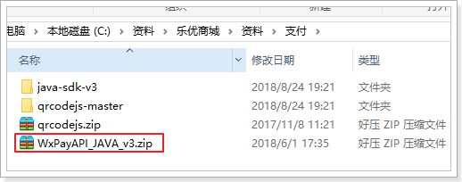


### 4.3.2.统一配置

在微信支付参数中，appid、mch_id可以提前配置，sign签名需要商户密钥我们需要提前配置，另外请求的超时时长等，所以微信SDK提供了统一配置类：

```java
public interface WXPayConfig {

    public String getAppID();// 获取 App ID

    public String getMchID();// 获取 Mch ID

    public String getKey();// 获取 API 密钥

    public InputStream getCertStream();// 获取商户证书内容(扫码支付不用设置)

    public int getHttpConnectTimeoutMs();// HTTP(S) 连接超时时间，单位毫秒

    public int getHttpReadTimeoutMs();// HTTP(S) 读数据超时时间，单位毫秒

}
```

我们将这些属性定义到application.yml中

```yaml
ly:
  pay:
    appID: wx8397f8696b538317
    mchID: 1473426802
    key: T6m9iK73b0kn9g5v426MKfHQH7X8rKwb
    httpConnectTimeoutMs: 1000
    httpReadTimeoutMs: 8000
```

编写自定义配置，读取属性：

```java
@Data
public class PayConfig implements WXPayConfig {

    private String appID; // 公众账号ID

    private String mchID; // 商户号

    private String key; // 生成签名的密钥

    private int httpConnectTimeoutMs; // 连接超时时间

    private int httpReadTimeoutMs;// 读取超时时间

    @Override
    public InputStream getCertStream() {
        return null;
    }
}
```

把PayConfig注册到Spring容器：

```java
@Configuration
public class PayConfiguration {

    @Bean
    @ConfigurationProperties(prefix = "ly.pay")
    public PayConfig payConfig(){
        return new PayConfig();
    }
}
```


### 4.3.3.回调url

参数中有一个非常重要的，叫做notify_url的：


基于上文的介绍我们知道，这个地址是在支付成功后的异步结果通知。官网介绍如下：

支付完成后，微信会把相关支付结果和用户信息发送给商户，商户需要接收处理，并返回应答。

所以，此处的地址必须是一个外网可访问地址，而且我们要定义好回调的处理接口。


#### 内网穿透

此处我们肯定不能写：http://api.leyou.com/api/order/，这个域名未经备案，是不被识别的。如何才能获取一个能够外网访问的域名呢？

我们可以通过内网穿透来实现，那么什么是内网穿透呢？


**简单来说内网穿透的目的是：让外网能访问你本地的应用，例如在外网打开你本地http://127.0.0.1指向的Web站点。**

在这里有一篇播客，详细介绍了几种内网穿透策略：[一分钟了解内网穿透](https://blog.csdn.net/zhangguo5/article/details/77848658?utm_source=5ibc.net&utm_medium=referral)


这里我们选择免费的，快捷的Natapp实现：[NATAPP官网](https://natapp.cn)

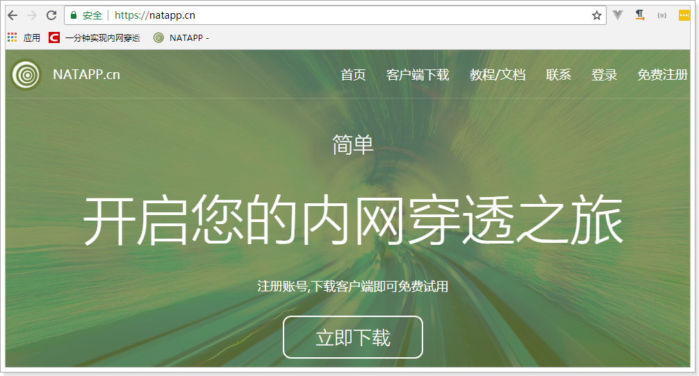

详细教程在这里：[一分钟的natapp快速新手教程](https://natapp.cn/article/natapp_newbie)

启动后的样子：

 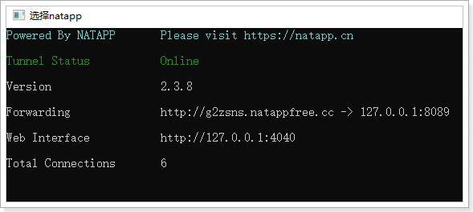

比如此处，我使用的natapp得到的域名是：http://g2zsns.natappfree.cc，并且我设置指向到`127.0.0.1:8089`位置，也就是我的订单微服务。


#### 配置

设置内网穿透地址到配置文件application.yml：

```yaml
ly:
  pay:
    appId: wx8397f8696b538317
    mchId: 1473426802
    key: T6m9iK73b0kn9g5v426MKfHQH7X8rKwb
    connectTimeoutMs: 5000
    readTimeoutMs: 10000
    notifyUrl: http://g2zsns.natappfree.cc/wxpay/notify
```

然后在PayConfig中添加属性：

```java
@Data
public class PayConfig implements WXPayConfig {

    private String appID; // 公众账号ID

    private String mchID; // 商户号

    private String key; // 生成签名的密钥

    private int httpConnectTimeoutMs; // 连接超时时间

    private int httpReadTimeoutMs;// 读取超时时间

    private String notifyUrl;// 下单通知回调地址

    @Override
    public InputStream getCertStream() {
        return null;
    }
}
```

### 4.3.4.支付工具类

微信的SDK提供了一个支付工具类：WXPay

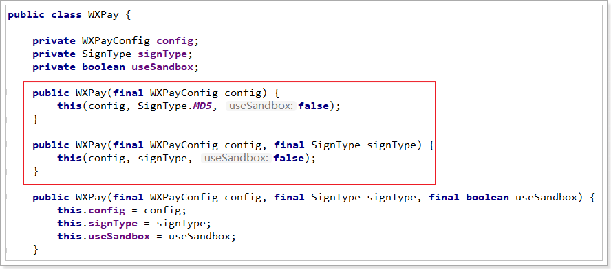

可以看到在构造函数中接收`WXPayConfig`实例，并记录在`config`变量中。

当我们发送请求时，可以调用下面的`fillRequestData`方法来把config中的appID、mchID等信息自动填充，并且利用我们给出的key和指定的算法自动完成签名：

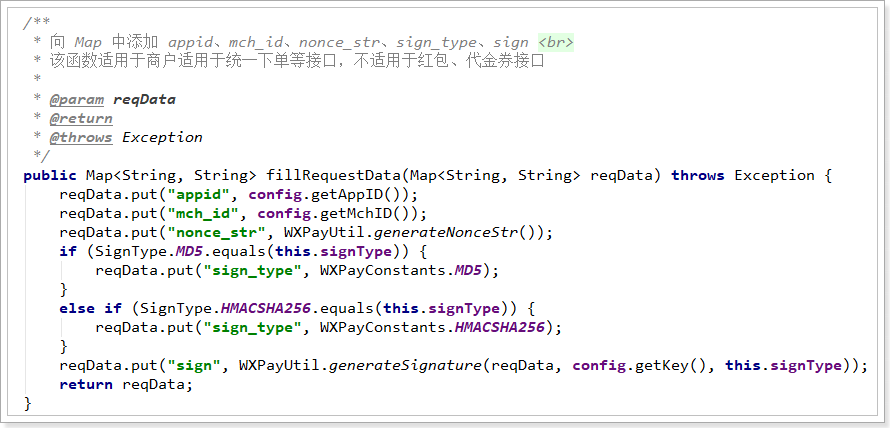


但是，除了这些基本信息，其他订单相关数据都需要我们自己来填充，结果也需要自己解析。

我们定义支付工具类，完成后续操作：

```java
@Slf4j
public class PayHelper {

    private WXPay wxPay;

    @Autowired
    private StringRedisTemplate redisTemplate;

    private PayConfig payConfig;

    public PayHelper(PayConfig payConfig) {
        // 使用微信官方提供的SDK工具，WxPay，并且把配置注入进去
        wxPay = new WXPay(payConfig);
        this.payConfig = payConfig;
    }

    public String createPayUrl(Long orderId, String description, Long totalPay) { 
        try {
            Map<String, String> data = new HashMap<>();
            // 商品描述
            data.put("body", description);
            // 订单号
            data.put("out_trade_no", orderId.toString());
            //货币
            data.put("fee_type", "CNY");
            //金额，单位是分
            data.put("total_fee", totalPay.toString());
            //调用微信支付的终端IP
            data.put("spbill_create_ip", "127.0.0.1");
            //回调地址
            data.put("notify_url", payConfig.getNotifyUrl());
            // 交易类型为扫码支付
            data.put("trade_type", "NATIVE");

            Map<String, String> result = this.wxPay.unifiedOrder(data);

            // 通信失败
            if (WXPayConstants.FAIL.equals(result.get("return_code"))) {
                log.error("【微信下单】与微信通信失败，错误信息：{}", result.get("return_msg"));
                return null;
            }

            // 下单失败
            String resultCode = result.get("result_code");
            if(WXPayConstants.FAIL.equals(resultCode)){
                log.error("【微信下单】创建预交易订单失败，错误码：{}，错误信息：{}",
                          result.get("err_code"), result.get("err_code_des"));
                return null;
            }
            // 校验签名
            isSignatureValid(result);

            // 下单成功，获取支付链接
            String url = result.get("code_url");
            return url;
        } catch (Exception e) {
            log.error("【微信下单】创建预交易订单异常失败", e);
            return null;
        }
    }

    public void isSignatureValid(Map<String, String> result) {
        // 校验签名
        try {
            boolean boo = WXPayUtil.isSignatureValid(result, payConfig.getKey(), WXPayConstants.SignType.HMACSHA256);
            boolean boo2 = WXPayUtil.isSignatureValid(result, payConfig.getKey(), WXPayConstants.SignType.MD5);
            if (!boo && !boo2) {
                throw new LyException(ExceptionEnum.WX_PAY_SIGN_INVALID);
            }
        } catch (Exception e) {
            log.error("【微信支付】校验签名失败，数据：{}", result);
            throw new LyException(ExceptionEnum.WX_PAY_SIGN_INVALID);
        }
    }
}
```

### 4.3.5. 优化支付请求

之前的支付工具有两个问题：

- 默认的支付链接有效期是2小时，有点长，我们可以定义短一些，30分钟

- 微信支付的链接每次都要去远程获取，麻烦，我们需要把url缓存
  - 使用Redis缓存URL，下次请求，直接去redis取出
- 微信SDK提供的默认采用的是JDK自带的HttpUrlConnection进行的http通信，采用传统BIO，效率较低。
  - 我们这里改用Spring自带的RestTemplate来实现。

引入okHttp的依赖：

```xml
<dependency>
    <groupId>com.squareup.okhttp3</groupId>
    <artifactId>okhttp</artifactId>
    <version>3.11.0</version>
</dependency>
```

在PayConfiguration类中注入RestTemplate：

```java
@Bean
public RestTemplate restTemplate(){
    return new RestTemplate(new OkHttp3ClientHttpRequestFactory());
}
```

然后修改支付工具类：

```java
public String createPayUrl(Long orderId, String description, Long totalPay) {

    // 从缓存中取出支付链接
    String key = "order:pay:url:" + orderId;
    try {
        String url = this.redisTemplate.opsForValue().get(key);
        if (StringUtils.isNotBlank(url)) {
            return url;
        }
    } catch (Exception e) {
        log.error("查询缓存付款链接异常,订单编号：{}", orderId, e);
    }

    try {
        Map<String, String> data = new HashMap<>();
        // 商品描述
        data.put("body", description);
        // 订单号
        data.put("out_trade_no", orderId.toString());
        //货币
        data.put("fee_type", "CNY");
        //金额，单位是分
        data.put("total_fee", totalPay.toString());
        //调用微信支付的终端IP
        data.put("spbill_create_ip", "127.0.0.1");
        //回调地址
        data.put("notify_url", payConfig.getNotifyUrl());
        // 交易类型为扫码支付
        data.put("trade_type", "NATIVE");

        // 填充请求参数，并签名，然后将请求数据处理成字节
        byte[] request = WXPayUtil.mapToXml(wxPay.fillRequestData(data)).getBytes("UTF-8");
        // 发起请求，并得到响应结果
        String xml = restTemplate.postForObject(WXPayConstants.UNIFIEDORDER_URL, request, String.class);
        // 将结果处理为map
        Map<String, String> result = WXPayUtil.xmlToMap(xml);

        // 通信失败
        if (WXPayConstants.FAIL.equals(result.get("return_code"))) {
            log.error("【微信下单】与微信通信失败，错误信息：{}", result.get("return_msg"));
            return null;
        }

        // 下单失败
        if (WXPayConstants.FAIL.equals(result.get("result_code"))) {
            log.error("【微信下单】创建预交易订单失败，错误码：{}，错误信息：{}",
                      result.get("err_code"), result.get("err_code_des"));
            return null;
        }

        // 校验签名
        isSignatureValid(result);
        
        // 下单成功，获取支付链接
        String url = result.get("code_url");

        // 将支付链接缓存，时间为2小时
        try {
            this.redisTemplate.opsForValue().set(key, url, 2, TimeUnit.HOURS);
        } catch (Exception e) {
            log.error("【微信下单】缓存付款链接异常,订单编号：{}", orderId, e);
        }
        return url;
    } catch (Exception e) {
        log.error("【微信下单】创建预交易订单异常失败", e);
        return null;
    }
    
    public void isSignatureValid(Map<String, String> result) {
        // 校验签名
        try {
            boolean boo = WXPayUtil.isSignatureValid(result, payConfig.getKey(), WXPayConstants.SignType.HMACSHA256);
            boolean boo2 = WXPayUtil.isSignatureValid(result, payConfig.getKey(), WXPayConstants.SignType.MD5);
            if (!boo && !boo2) {
                throw new LyException(ExceptionEnum.WX_PAY_SIGN_INVALID);
            }
        } catch (Exception e) {
            log.error("【微信支付】校验签名失败，数据：{}", result);
            throw new LyException(ExceptionEnum.WX_PAY_SIGN_INVALID);
        }
    }
}
```


### 4.3.6.生成支付链接接口

在订单支付页面，会向后台发起请求，查询支付的URL地址：

 

 

我们需要编写controller，来实现这个功能：

- 请求方式：GET
- 请求路径：/order/url/{id}
- 请求参数：id，订单的编号
- 返回结果：url地址

代码如下：

controller：

```java
@GetMapping("url/{id}")
public ResponseEntity<String> generateUrl(@PathVariable("id") Long orderId) {
    return ResponseEntity.ok(orderService.generateUrl(orderId));
}
```

service：

```java
@Autowired
private PayHelper payHelper;

public String generateUrl(Long orderId) {
    // 1、根据id查询订单
    Order order = queryById(orderId);
    // 2、判断订单状态，如果已支付，不再创建支付请求
    if (order.getOrderStatus().getStatus() != OrderStatusEnum.INIT.value()) {
        // 已支付或关闭，不再生成支付链接
        throw new LyException(ExceptionEnum.ORDER_STATUS_ERROR);
    }
    // 3、生成付款链接
    String url = payHelper.createPayUrl(orderId, "乐优商城测试", 1L);

    if (StringUtils.isBlank(url)) {
        throw new LyException(ExceptionEnum.CREATE_PAY_URL_ERROR);
    }
    return url;
}
```

页面响应结果：

 


## 4.4.记录支付状态

下单后，用户会尝试支付，我们也应该记录支付的状态信息，方便后期查询。

### 4.4.1.支付日志

我们新建一张表，来记录支付的状态信息：

```sql
CREATE TABLE `tb_pay_log` (
  `order_id` bigint(20) NOT NULL COMMENT '订单号',
  `total_fee` bigint(20) DEFAULT NULL COMMENT '支付金额（分）',
  `user_id` bigint(20) DEFAULT NULL COMMENT '用户ID',
  `transaction_id` varchar(32) DEFAULT NULL COMMENT '微信交易号码',
  `status` tinyint(1) DEFAULT NULL COMMENT '交易状态，1 未支付, 2已支付, 3 已退款, 4 支付错误, 5 已关闭',
  `pay_type` tinyint(1) DEFAULT NULL COMMENT '支付方式，1 微信支付, 2 货到付款',
  `bank_type` varchar(16) DEFAULT NULL COMMENT '银行类型',
  `create_time` datetime DEFAULT NULL COMMENT '创建时间',
  `pay_time` datetime DEFAULT NULL COMMENT '支付时间',
  `closed_time` datetime DEFAULT NULL COMMENT '关闭时间',
  `refund_time` datetime DEFAULT NULL COMMENT '退款时间',
  PRIMARY KEY (`order_id`)
) ENGINE=InnoDB DEFAULT CHARSET=utf8;
```


对应的实体类：

```java
@Data
@Table(name = "tb_pay_log")
public class PayLog {
    @Id
    private Long orderId;
    private Long totalFee;
    private Long userId;
    private String transactionId;
    private Integer status;
    private Integer payType;
    private String bankType;
    private Date createTime;
    private Date payTime;
    private Date refundTime;
    private Date closedTime;
}
```

支付状态枚举：

```java
public enum PayStatusEnum {

    NOT_PAY(1, "未支付"),
    SUCCESS(2, "支付成功"),
    REFUND(3, "已退款"),
    PAY_ERROR(4, "支付错误"),
    CLOSED(5, "已关闭");

    private Integer code;
    private String msg;

    PayStatusEnum(Integer code, String msg) {
        this.code = code;
        this.msg = msg;
    }

    public Integer value(){
        return this.code;
    }

    public String msg(){
        return msg;
    }
}
```


### 4.4.2.创建支付日志

定义service方法：

```java
@Service
public class PayLogService {

    @Autowired
    private PayLogMapper logMapper;

    public void createPayLog(Long orderId, Long actualPay){
        // 创建支付对象
        PayLog payLog = new PayLog();
        payLog.setOrderId(orderId);
        payLog.setPayType(1);
        payLog.setStatus(PayStatusEnum.NOT_PAY.value());
        payLog.setCreateTime(new Date());
        payLog.setTotalFee(actualPay);
        // 用户信息
        UserInfo user = LoginInterceptor.getUser();
        payLog.setUserId(user.getId());

        logMapper.insertSelective(payLog);
    }
}
```


在OrderService的生成支付链接的业务中添加创建日志逻辑：：

```java
@Autowired
private PayHelper payHelper;

public String generateUrl(Long orderId) {
    // 1、根据id查询订单
    Order order = queryById(orderId);
    // 2、判断订单状态，如果已支付，不再创建支付请求
    if (order.getOrderStatus().getStatus() != OrderStatusEnum.INIT.value()) {
        // 已支付或关闭，不再生成支付链接
        throw new LyException(ExceptionEnum.ORDER_STATUS_ERROR);
    }
    // 3、生成付款链接
    String url = payHelper.createPayUrl(orderId, "乐优商城测试", 1L);

    // 4、生成支付日志
    payLogService.createPayLog(orderId, order.getActualPay());

    if (StringUtils.isBlank(url)) {
        throw new LyException(ExceptionEnum.CREATE_PAY_URL_ERROR);
    }
    return url;
}
```


测试：


## 4.5.生成二维码

### 4.5.1.什么是二维码

二维码又称QR Code，QR全称Quick Response，是一个近几年来移动设备上超流行的一种编码方式，它比传统的Bar Code条形码能存更多的信息，也能表示更多的数据类型。

二维条码/二维码（2-dimensional bar code）是用某种特定的几何图形按一定规律在平面（二维方向上）分布的黑白相间的图形记录数据符号信息的；在代码编制上巧妙地利用构成计算机内部逻辑基础的“0”、“1”比特流的概念，使用若干个与二进制相对应的几何形体来表示文字数值信息，通过图象输入设备或光电扫描设备自动识读以实现信息自动处理：它具有条码技术的一些共性：每种码制有其特定的字符集；每个字符占有一定的宽度；具有一定的校验功能等。同时还具有对不同行的信息自动识别功能、及处理图形旋转变化点。

### 4.5.2.二维码优势

- 信息容量大, 可以容纳多达1850个大写字母或2710个数字或500多个汉字

- 应用范围广, 支持文字,声音,图片,指纹等等...

- 容错能力强, 即使图片出现部分破损也能使用

- 成本低, 容易制作

### 4.5.3.二维码容错级别

- L级（低） 7％的码字可以被恢复。

- M级（中） 15％的码字可以被恢复。

- Q级（四分）25％的码字可以被恢复。

- H级（高）30％ 的码字可以被恢复。

### 4.5.4.二维码生成插件qrious

qrious是一款基于HTML5 Canvas的纯JS二维码生成插件。通过qrious.js可以快速生成各种二维码，你可以控制二维码的尺寸颜色，还可以将生成的二维码进行Base64编码。[官网](https://github.com/davidshimjs/qrcodejs)

qrious.js二维码插件的可用配置参数如下：

| 参数       | 类型   | 默认值      | 描述                               |
| ---------- | ------ | ----------- | ---------------------------------- |
| background | String | "white"     | 二维码的背景颜色。                 |
| foreground | String | "black"     | 二维码的前景颜色。                 |
| level      | String | "L"         | 二维码的误差校正级别(L, M, Q, H)。 |
| mime       | String | "image/png" | 二维码输出为图片时的MIME类型。     |
| size       | Number | 100         | 二维码的尺寸，单位像素。           |
| value      | String | ""          | 需要编码为二维码的值               |

课前资料中给出的案例可以直接生成二维码：

 


### 4.5.5.生成二维码

我们把课前资料中的这个js脚本引入到项目中：

 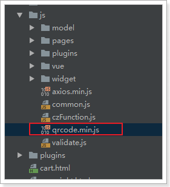

然后在页面引用：

 


页面定义一个div，用于展示二维码：

 

然后获取到付款链接后，根据链接生成二维码：

 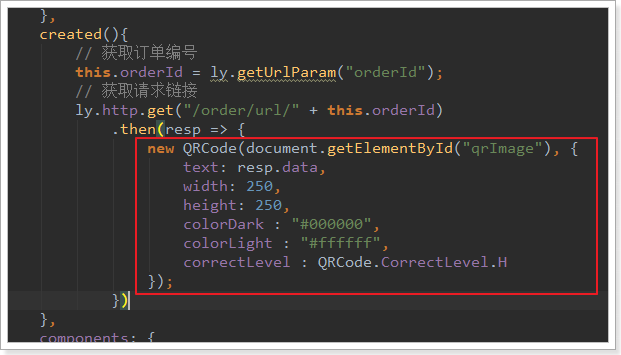

```js
// 判断登录状态
ly.http.get("/auth/verify").then(() => {
    // 获取订单编号
    this.orderId = ly.getUrlParam("orderId");
    // 查询付款金额
    ly.http.get("/order-service/order/" + id).then(resp => {
        this.order = resp.data;
    })
    // 获取请求链接
    ly.http.get("/order/url/" + this.orderId)
        .then(resp => {
            new QRCode(document.getElementById("qrImage"), {
                text: resp.data,
                width: 250,
                height: 250,
                colorDark: "#000000",
                colorLight: "#ffffff",
                correctLevel: QRCode.CorrectLevel.H
            });
        })
}).catch(() => {
    // 未登录，跳转至登录页
    location.href = "/login.html?returnUrl=" + location.href;
})
```


刷新页面，查看效果：

 

此时，客户用手机扫描二维码，可以看到付款页面。


### 4.5.6.查询订单接口

二维码页面需要展示订单信息，页面加载时，就会发起请求，查询订单信息：

 

因此我们应该提供查询订单接口：

- 请求方式：Get
- 请求路径：/order/{id}
- 请求参数：路径占位符的id
- 返回结果：订单对象的json结构，包含订单状态，订单详情


controller：

```java
    @GetMapping("{id}")
    public ResponseEntity<Order> queryOrderById(@PathVariable("id") Long orderId){
        return ResponseEntity.ok(orderService.queryOrderById(orderId));
    }
```


service：

```java
public Order queryOrderById(Long orderId) {
        // 查询订单
        Order order = orderMapper.selectByPrimaryKey(orderId);
        // 查询订单详情
        OrderDetail detail = new OrderDetail();
        detail.setOrderId(orderId);
        List<OrderDetail> details = detailMapper.select(detail);
        order.setOrderDetails(details);
        // 订单状态
        OrderStatus orderStatus = statusMapper.selectByPrimaryKey(orderId);
        order.setOrderStatus(orderStatus);
        return order;
    }
```


## 4.6.异步回调

支付以后，我们后台需要修改订单状态。我们怎么得知有没有修改成功呢？

### 4.6.1.官方API

还记得刚才下单时填写的`notify_url`吗？来看官网介绍：

> 应用场景

支付完成后，微信会把相关支付结果和用户信息发送给商户，商户需要接收处理，并返回应答。

对后台通知交互时，如果微信收到商户的应答不是成功或超时，微信认为通知失败，微信会通过一定的策略定期重新发起通知，尽可能提高通知的成功率，但微信不保证通知最终能成功。 （通知频率为15/15/30/180/1800/1800/1800/1800/3600，单位：秒）

**注意：同样的通知可能会多次发送给商户系统。商户系统必须能够正确处理重复的通知。**

推荐的做法是，当收到通知进行处理时，首先检查对应业务数据的状态，判断该通知是否已经处理过，如果没有处理过再进行处理，如果处理过直接返回结果成功。在对业务数据进行状态检查和处理之前，要采用数据锁进行并发控制，以避免函数重入造成的数据混乱。

**特别提醒：商户系统对于支付结果通知的内容一定要做`签名验证,并校验返回的订单金额是否与商户侧的订单金额一致`，防止数据泄漏导致出现“假通知”，造成资金损失。**


支付完成后，微信服务会自动向`notify_url`地址发起POST请求，请求参数是xml格式：

| 字段名     | 变量名      | 必填 | 类型        | 示例值  | 描述                                                         |
| ---------- | ----------- | ---- | ----------- | ------- | ------------------------------------------------------------ |
| 返回状态码 | return_code | 是   | String(16)  | SUCCESS | SUCCESS/FAIL此字段是通信标识，非交易标识，交易是否成功需要查看trade_state来判断 |
| 返回信息   | return_msg  | 是   | String(128) | OK      | 当return_code为FAIL时返回信息为错误原因 ，例如签名失败参数格式校验错误 |

通信成功，会返回下面信息：

| 签名           | sign           | 是   | String(32)  | C380BEC2BFD.. | 名，详见[签名算法](https://pay.weixin.qq.com/wiki/doc/api/native.php?chapter=4_3) |
| -------------- | -------------- | ---- | ----------- | ------------- | ------------------------------------------------------------ |
| 签名类型       | sign_type      | 否   | String(32)  | HMAC-SHA256   | 签名类型，目前支持HMAC-SHA256和MD5，默认为MD5                |
| 业务结果       | result_code    | 是   | String(16)  | SUCCESS       | SUCCESS/FAIL                                                 |
| 错误代码       | err_code       | 否   | String(32)  | SYSTEMERROR   | 错误返回的信息描述                                           |
| 错误代码描述   | err_code_des   | 否   | String(128) | 系统错误      | 错误返回的信息描述                                           |
| 用户标识       | openid         | 是   | String(128) | wxd930ea54f   | 用户在商户appid下的唯一标识                                  |
| 交易类型       | trade_type     | 是   | String(16)  | JSAPI         | JSAPI、NATIVE、APP                                           |
| 订单金额       | total_fee      | 是   | Int         | 100           | 订单总金额，单位为分                                         |
| 现金支付金额   | cash_fee       | 是   | Int         | 100           | 现金支付金额订单现金支付金额，详见[支付金额](https://pay.weixin.qq.com/wiki/doc/api/native.php?chapter=4_2) |
| 微信支付订单号 | transaction_id | 是   | String(32)  | 121775250120  | 微信支付订单号                                               |
| 商户订单号     | out_trade_no   | 是   | String(32)  | 12123212112   | 商户系统内部订单号，要求32个字符内，只能是数字、大小写字母_-\|*@ ，且在同一个商户号下唯一。 |

我们需要返回给微信的结果：

```xml
<xml>
  <return_code><![CDATA[SUCCESS]]></return_code>
  <return_msg><![CDATA[OK]]></return_msg>
</xml>
```


### 4.6.2.编写回调接口

先分析接口需要的四个数据：

- 请求方式：官方文档虽然没有明说，但是测试得出是POST请求
- 请求路径：我们之前指定的notify_url的路径是：/wxpay/notify
- 请求参数：应该是xml格式数据
- 返回结果：也是xml，表明是否成功

因为要接收xml格式数据，因此我们需要引入解析xml的依赖：

```xml
<dependency>
    <groupId>com.fasterxml.jackson.dataformat</groupId>
    <artifactId>jackson-dataformat-xml</artifactId>
    <version>2.9.6</version>
</dependency>
```

然后编写controller：

```java
@Slf4j
@RestController
public class PayNotifyController {


    @Autowired
    private OrderService orderService;

    @PostMapping("/wxpay/notify")
    public ResponseEntity<String> payNotify(@RequestBody Map<String,String> msg){
        // 处理回调结果
        orderService.handleNotify(msg);
        // 没有异常，则返回成功
        String result = "<xml>\n" +
                "  <return_code><![CDATA[SUCCESS]]></return_code>\n" +
                "  <return_msg><![CDATA[OK]]></return_msg>\n" +
                "</xml>";
        return ResponseEntity.ok(result);
    }
}
```

service：

```java
    @Transactional
    public void handleNotify(Map<String, String> msg) {
        payHelper.handleNotify(msg);
    }
```


这里因为有跟支付相关的数据解析，我们也放到PayHelper中：

```java
public void handleNotify(Map<String,String> msg){
    // 1、校验签名
    isSignatureValid(msg);
    // 2、校验金额
    // 2.1.解析数据
    String totalFee = msg.get("total_fee");
    String outTradeNo = msg.get("out_trade_no");
    String transactionId = msg.get("transaction_id");
    String bankType = msg.get("bank_type");
    if (StringUtils.isBlank(outTradeNo) || StringUtils.isBlank(totalFee)
        || StringUtils.isBlank(transactionId) || StringUtils.isBlank(bankType)) {
        log.error("【微信支付回调】支付回调返回数据不正确");
        throw new LyException(ExceptionEnum.WX_PAY_NOTIFY_PARAM_ERROR);
    }
    // 2.2.查询订单
    Order order = orderMapper.selectByPrimaryKey(Long.valueOf(outTradeNo));
    // 2.3.校验金额，此处因为我们支付的都是1，所以写死了，应该与订单中的对比
    if (1L != Long.valueOf(totalFee)) {
        log.error("【微信支付回调】支付回调返回数据不正确");
        throw new LyException(ExceptionEnum.WX_PAY_NOTIFY_PARAM_ERROR);
    }

    // 判断支付状态
    OrderStatus status = statusMapper.selectByPrimaryKey(order.getOrderId());
    if (status.getStatus() != OrderStatusEnum.INIT.value()) {
        // 如果不是未支付状态，则都认为支付成功！
        return;
    }

    // 3、修改支付日志状态
    PayLog payLog = payLogMapper.selectByPrimaryKey(order.getOrderId());
    // 只有未支付订单才需要修改
    if (payLog.getStatus() == PayStatusEnum.NOT_PAY.value()) {
        payLog.setOrderId(order.getOrderId());
        payLog.setStatus(PayStatusEnum.SUCCESS.value());
        payLog.setTransactionId(transactionId);
        payLog.setBankType(bankType);
        payLog.setPayTime(new Date());
        payLogMapper.updateByPrimaryKeySelective(payLog);
    }

    // 4、修改订单状态
    OrderStatus orderStatus = new OrderStatus();
    orderStatus.setOrderId(order.getOrderId());
    orderStatus.setPaymentTime(new Date());
    orderStatus.setStatus(OrderStatusEnum.PAY_UP.value());
    statusMapper.updateByPrimaryKeySelective(orderStatus);
}

```


## 4.7.支付状态查询

当用户扫码支付成功，会自动调用回调接口，从而修改订单状态，完成订单支付。

但是，页面上并不知道支付是否成功。怎么办？


### 4.7.1.页面查询支付状态

因为不知道用户什么时候会支付，也不知道支付有没有成功，因此页面会采用定时任务，不断查询订单支付的状态：

```js
// 开启定时任务，查询付款状态
const taskId = setInterval(() => {
    ly.http.get("/order/status/" + this.orderId)
        .then(resp => {
        let i = resp.data;
        if (i === 1) {
            // 付款成功
            clearInterval(taskId);
            // 跳转到付款成功页
            location.href = "/paysuccess.html?orderId=" + this.orderId;
        } else if (i === 2) {
            // 付款失败
            clearInterval(taskId);
            // 跳转到付款失败页
            location.href = "/payfail.html";
        }.catch((e) => {
            alert("支付状态查询失败，请刷新页面重试。");
            clearInterval(taskId);
        })
    })
}, 5000);
```


每隔5秒就会查询一次。


### 4.7.2.微信查询支付状态接口

#### 应用场景

该接口提供所有微信支付订单的查询，商户可以通过查询订单接口主动查询订单状态，完成下一步的业务逻辑。

需要调用查询接口的情况：

1. ◆ 当商户后台、网络、服务器等出现异常，商户系统最终未接收到支付通知；
2. ◆ 调用支付接口后，返回系统错误或未知交易状态情况；
3. ◆ 调用刷卡支付API，返回USERPAYING的状态；
4. ◆ 调用关单或撤销接口API之前，需确认支付状态；

#### 接口链接

https://api.mch.weixin.qq.com/pay/orderquery

#### 是否需要证书

不需要

请求参数

| 字段名     | 变量名         | 必填       | 类型           | 示例值                       | 描述                                                         |
| ---------- | -------------- | ---------- | -------------- | ---------------------------- | ------------------------------------------------------------ |
| 微信订单号 | transaction_id | 二选一     | String(32)     | 1009660380201506130728806387 | 微信的订单号，建议优先使用                                   |
| 商户订单号 | out_trade_no   | String(32) | 20150806125346 | 商户系统内部订单号           |                                                              |
| 随机字符串 | nonce_str      | 是         | String(32)     | C380BEC2BFD727A4B684         | 随机字符串，不长于32位。推荐[随机数生成算法](https://pay.weixin.qq.com/wiki/doc/api/native.php?chapter=4_3) |
| 签名       | sign           | 是         | String(32)     | 5K8264ILTKCH16CQ25           | 通过签名算法计算得出的签名值，[详见签名生成算法](https://pay.weixin.qq.com/wiki/doc/api/native.php?chapter=4_3) |

举例如下：

```xml
<xml>
   <appid>wx2421b1c4370ec43b</appid>
   <mch_id>10000100</mch_id>
   <nonce_str>ec2316275641faa3aacf3cc599e8730f</nonce_str>
   <transaction_id>1008450740201411110005820873</transaction_id>
   <sign>FDD167FAA73459FD921B144BAF4F4CA2</sign>
</xml>
```


#### 返回结果

返回结果中，比较重要的是状态信息：

通信状态：


查询状态：


支付状态：


### 4.7.3.工具类

我们查询完成后，把支付交易状态分为3种情况：

- 0，通信失败或未支付，需要重新查询。
- 1，支付成功
- 2，支付失败

我们定义一个枚举来表示：

```java
public enum PayState {
    NOT_PAY(0),SUCCESS(1),FAIL(2);

    PayState(int value) {
        this.value = value;
    }

    int value;

    public int getValue() {
        return value;
    }
}
```


然后在工具类PayHelper中添加查询逻辑：

```java
public PayState queryPayState(Long orderId) {
    Map<String, String> data = new HashMap<>();
    // 订单号
    data.put("out_trade_no", orderId.toString());
    try {
        Map<String, String> result = this.wxPay.orderQuery(data);
        // 链接失败
        if (result == null || WXPayConstants.FAIL.equals(result.get("return_code"))) {
            // 未查询到结果或链接失败，认为是未付款
            log.info("【支付状态查询】链接微信服务失败，订单编号：{}", orderId);
            return PayState.NOT_PAY;
        }
        // 查询失败
        if (WXPayConstants.FAIL.equals(result.get("result_code"))) {
            log.error("【支付状态查询】查询微信订单支付状态失败，错误码：{}，错误信息：{}",
                      result.get("err_code"), result.get("err_code_des"));
            return PayState.NOT_PAY;
        }

        // 校验签名
        isSignatureValid(result);


        String state = result.get("trade_state");
        if ("SUCCESS".equals(state)) {
            // 修改支付状态等信息
            handleNotify(result);

            // success，则认为付款成功
            return PayState.SUCCESS;
        } else if (StringUtils.equals("USERPAYING", state) || StringUtils.equals("NOTPAY", state)) {
            // 未付款或正在付款，都认为是未付款
            return PayState.NOT_PAY;
        } else {
            // 其它状态认为是付款失败
            return PayState.FAIL;
        }
    } catch (Exception e) {
        log.error("查询订单状态异常", e);
        return PayState.NOT_PAY;
    }
}
```


### 4.7.4.后台编写查询接口

controller：

```java
@GetMapping("state/{id}")
public ResponseEntity<Integer> queryPayState(@PathVariable("id") Long orderId) {
    return ResponseEntity.ok(orderService.queryPayStatus(orderId));
}
```

service：

```java
public Integer queryPayStatus(Long orderId) {
    // 优先去支付日志表中查询状态。
    PayLog payLog = payLogMapper.selectByPrimaryKey(orderId);

    if (payLog == null || PayStatusEnum.NOT_PAY.value() == payLog.getStatus()) {
        // 如果是未支付，则去调用微信查询支付状态接口
        return payHelper.queryPayState(orderId).getValue();
    }

    if (PayStatusEnum.SUCCESS.value() == payLog.getStatus()) {
        // 如果已经成功，返回1，代表支付成功
        return PayState.SUCCESS.getValue();
    }

    // 如果是其它状态，则认为支付失败，返回2
    return PayState.FAIL.getValue();
}
```


